

 

<h3>Universidad Peruana de Ciencias Aplicadas</h3>
 
<strong>Facultad de Ingeniería</strong> 
<strong>Carrera: Ingeniería de Software</strong> 
 
<strong>Periodo:</strong> 2026-02 
<strong>Codigo del curso:</strong> 1ASI0572 
<strong>Nombre del curso:</strong> Desarrollo de Soluciones IoT 
<strong>NRC:</strong> 8725 
 
<strong>Nombre del profesor:</strong> Marco Antonio Leon Baca 
 
 <strong>*Informe de Trabajo Final*</strong>  
 
<strong>Nombre del startup: </strong>PrimeCore Group 
<strong>Nombre del producto: </strong>SafeCore 

### Relación de Integrantes

| Apellidos y Nombres                        |   Código     |
|:-------------------------------------------:|:------------:|
| Taquiri Calderón, Jhunior Giussepe          | U20221C576   |
| Lagos Rivera, Kael Valentino                | U202210104   |
| Gonzalez Custodio, Carlos Alberto           | U202020230   |
| Tasayco Almonacid, Rafael Augusto           | U20231F226   |
| Tasayco Osorio, Raúl Hiroshi                | U202319415   |
| Inga Hernandez, Ayrton Damian               | U201924756   |
| Huaman De La Cruz, Jean Pool                | U20201E781   |

<strong> Setiembre 2026</strong> 

# Project Report Collaboration Insights

**AV1:**
_[Captura de analíticos de colaboración/commits en GitHub — assets/ProjectCollaboration/av1.png]_

# Registro de Versiones del Informe

| Versión | Fecha      | Autor        | Descripción de modificación                   |
|---------|------------|--------------|-----------------------------------------------|
| 1.0     | _[dd/mm/aaaa]_ | _[Nombre]_ | _[Descripción de lo realizado]_ |
| | | | |

## Contenido

- [Project Report Collaboration Insights](#project-report-collaboration-insights)
- [Registro de Versiones del Informe](#registro-de-versiones-del-informe)
- [Contenido](#contenido)
- [Student Outcome](#student-outcome)
- [Capítulo I: Introducción](#capítulo-i-introducción)
  - [1.1. Startup Profile](#11-startup-profile)
    - [1.1.1. Descripción de la Startup](#111-descripción-de-la-startup)
    - [1.1.2. Perfiles de integrantes del equipo](#112-perfiles-de-integrantes-del-equipo)
  - [1.2. Solution Profile](#12-solution-profile)
    - [1.2.1. Antecedentes y problemática](#121-antecedentes-y-problemática)
    - [1.2.2. Lean UX Process](#122-lean-ux-process)
      - [1.2.2.1. Lean UX Problem Statements](#1221-lean-ux-problem-statements)
      - [1.2.2.2. Lean UX Assumptions](#1222-lean-ux-assumptions)
      - [1.2.2.3. Lean UX Hypothesis Statements](#1223-lean-ux-hypothesis-statements)
      - [1.2.2.4. Lean UX Canvas](#1224-lean-ux-canvas)
  - [1.3. Segmentos objetivo](#13-segmentos-objetivo)
- [Capítulo II: Requirements Elicitation & Analysis](#capítulo-ii-requirements-elicitation--analysis)
  - [2.1. Competidores](#21-competidores)
    - [2.1.1. Análisis competitivo](#211-análisis-competitivo)
    - [2.1.2. Estrategias y tácticas frente a competidores](#212-estrategias-y-tácticas-frente-a-competidores)
  - [2.2. Entrevistas](#22-entrevistas)
    - [2.2.1. Diseño de entrevistas](#221-diseño-de-entrevistas)
    - [2.2.2. Registro de entrevistas](#222-registro-de-entrevistas)
    - [2.2.3. Análisis de entrevistas](#223-análisis-de-entrevistas)
  - [2.3. Needfinding](#23-needfinding)
    - [2.3.1. User Personas](#231-user-personas)
    - [2.3.2. User Task Matrix](#232-user-task-matrix)
    - [2.3.3. User Journey Mapping](#233-user-journey-mapping)
    - [2.3.4. Empathy Mapping](#234-empathy-mapping)
  - [2.4. Big Picture EventStorming](#24-big-picture-eventstorming)
  - [2.5. Ubiquitous Language](#25-ubiquitous-language)
- [Capítulo III: Requirements Specification](#capítulo-iii-requirements-specification)
  - [3.1. User Stories](#31-user-stories)
  - [3.2. Impact Mapping](#32-impact-mapping)
  - [3.3. Product Backlog](#33-product-backlog)
- [Capítulo IV: Solution Software Design](#capítulo-iv-solution-software-design)
  - [4.1. Strategic-Level Domain-Driven Design](#41-strategic-level-domain-driven-design)
    - [4.1.1. Design-Level EventStorming](#411-design-level-eventstorming)
      - [4.1.1.1. Candidate Context Discovery](#4111-candidate-context-discovery)
      - [4.1.1.2. Domain Message Flows Modeling](#4112-domain-message-flows-modeling)
      - [4.1.1.3. Bounded Context Canvases](#4113-bounded-context-canvases)
    - [4.1.2. Context Mapping](#412-context-mapping)
    - [4.1.3. Software Architecture](#413-software-architecture)
      - [4.1.3.1. Software Architecture System Landscape Diagram](#4131-software-architecture-system-landscape-diagram)
      - [4.1.3.2. Software Architecture Context Level Diagrams](#4132-software-architecture-context-level-diagrams)
      - [4.1.3.3. Software Architecture Container Level Diagrams](#4133-software-architecture-container-level-diagrams)
      - [4.1.3.4. Software Architecture Deployment Diagrams](#4134-software-architecture-deployment-diagrams)
  - [4.2. Tactical-Level Domain-Driven Design](#42-tactical-level-domain-driven-design)
    - [4.2.X. Bounded Context: `<Nombre>`](#42x-bounded-context-nombre)
      - [4.2.X.1. Domain Layer](#42x1-domain-layer)
      - [4.2.X.2. Interface Layer](#42x2-interface-layer)
      - [4.2.X.3. Application Layer](#42x3-application-layer)
      - [4.2.X.4. Infrastructure Layer](#42x4-infrastructure-layer)
      - [4.2.X.5. Bounded Context Software Architecture Component Level Diagrams](#42x5-bounded-context-software-architecture-component-level-diagrams)
      - [4.2.X.6. Bounded Context Software Architecture Code Level Diagrams](#42x6-bounded-context-software-architecture-code-level-diagrams)
        - [4.2.X.6.1. Bounded Context Domain Layer Class Diagrams](#42x61-bounded-context-domain-layer-class-diagrams)
        - [4.2.X.6.2. Bounded Context Database Design Diagram](#42x62-bounded-context-database-design-diagram)
- [Conclusiones](#conclusiones)
- [Bibliografía](#bibliografía)
- [Anexos](#anexos)

## Student Outcome
 
El curso contribuye al cumplimiento del Student Outcome ABET: **ABET – EAC - Student Outcome 5** 
 
**Criterio:** La capacidad de funcionar efectivamente en un equipo cuyos miembros juntos proporcionan liderazgo, crean un entorno de colaboración e inclusivo, establecen objetivos, planifican tareas y cumplen objetivos. 
 
En el siguiente cuadro se describe las acciones realizadas y enunciados de conclusiones por parte del grupo, que permiten sustentar el haber alcanzado el logro del **ABET – EAC - Student Outcome 5**. 
 
| Criterio específico | Acciones realizadas | Conclusiones | 
|---|---|---| 
| **Trabaja en equipo para proporcionar liderazgo en forma conjunta** | **Taquiri, Giuseppe** AV1: Desarrolló y documentó el diseño estratégico de la solución, trabajando en EventStorming, Candidate Context Discovery, Domain Message Flows Modeling, incorporando Domain Storytelling, Bounded Context Canvases con sus 6 pasos de elaboración y Context Mapping mediante las Opciones 1, 2 y 3.  **Lagos Rivera, Kael Valentino** AV1:   **Gonzalez Custodio, Carlos Alberto** AV1:   **Tasayco Almonacid, Rafael Augusto** AV1:   **Tasayco Osorio, Raúl Hiroshi** AV1:   **Inga Hernandez, Ayrton Damian** AV1:   **Huaman De La Cruz, Jean Pool** AV1: | La participación conjunta de los integrantes permitió distribuir responsabilidades y desarrollar diferentes actividades del trabajo final. La elaboración de los artefactos de diseño permitió coordinar aportes individuales dentro de una estructura común y avanzar en el desarrollo de la solución IoT.   | 
| **Crea un entorno colaborativo e inclusivo, establece metas, planifica tareas y cumple objetivos.** | **Taquiri, Giuseppe** AV1: Participó en la elaboración y documentación del diseño de la solución, contribuyendo al desarrollo de EventStorming, Domain Storytelling, Bounded Context Canvases y Context Mapping.  **Lagos Rivera, Kael Valentino** AV1:   **Gonzalez Custodio, Carlos Alberto** AV1:   **Tasayco Almonacid, Rafael Augusto** AV1:   **Tasayco Osorio, Raúl Hiroshi** AV1:   **Inga Hernandez, Ayrton Damian** AV1:   **Huaman De La Cruz, Jean Pool** AV1: | El trabajo realizado de manera colaborativa permitió organizar las actividades del equipo y contribuir al cumplimiento de los objetivos establecidos para el trabajo final. Los aportes de los integrantes se integraron en el informe y permitieron avanzar progresivamente en el desarrollo de la solución.   |

# Capítulo I: Introducción

## 1.1. Startup Profile

### 1.1.1. Descripción de la Startup

PrimeCore Group es una startup tecnológica peruana especializada en el desarrollo de soluciones innovadoras basadas en Internet de las Cosas (IoT) para la gestión inteligente de emergencias y la protección de infraestructuras críticas. Nuestra propuesta de valor se centra en transformar edificios, complejos residenciales y comerciales en entornos resilientes, capaces de responder de forma autónoma y eficiente ante desastres naturales y riesgos secundarios.

En un contexto donde los desastres naturales, como sismos e incendios, representan una amenaza constante para la vida y los bienes en el Perú, PrimeCore Group busca llenar un vacío en el mercado: la falta de sistemas integrados que no solo alerten, sino que también actúen de manera autónoma para proteger a las personas y reducir los daños colaterales. Esta amenaza no es teórica: según cifras oficiales del Instituto Geofísico del Perú (IGP), el país registró 835 temblores durante el 2025, superando los 798 sismos reportados en 2024, y el análisis de eventos de magnitud 6 o superior muestra una actividad sostenida en el tiempo 21 casos entre 2016 y 2020 y 23 entre 2021 y 2025, lo que confirma que el territorio peruano se encuentra en un estado de exposición sísmica permanente debido a su ubicación en el Cinturón de Fuego del Pacífico (Arce, 2026). A esta exposición geográfica se suma una vulnerabilidad estructural crítica: de acuerdo con una especialista del Instituto Nacional de Defensa Civil (INDECI), la mayoría de las viviendas y edificaciones en el país son autoconstruidas, lo que constituye uno de los principales factores que agravan el impacto de un sismo de gran magnitud, junto con el tipo de suelo y la calidad de los materiales empleados (Mendoza Talledo, 2026).

El riesgo de incendios sigue un patrón similar de vulnerabilidad estructural. De acuerdo con el Cuerpo General de Bomberos Voluntarios del Perú, el 70% de los incendios en el país tiene como origen fallas eléctricas, un problema prevenible pero persistente, asociado a instalaciones antiguas, desgastadas o instaladas sin supervisión profesional (Wesler, s.f.). Este panorama se agrava porque, según el Programa Casa Segura, más del 60% de las viviendas peruanas tiene más de 20 años de antigüedad, muchas de ellas con instalaciones eléctricas que ya superaron su vida útil estimada y que no cumplen con los estándares de seguridad actuales (Wesler, s.f.). A esto se suman la autoconstrucción sin supervisión técnica y la sobrecarga de tomacorrientes como factores recurrentes que elevan el riesgo de cortocircuitos y sobrecalentamiento en hogares, oficinas y comercios. Esta combinación de alta frecuencia sísmica, infraestructura eléctrica vulnerable y baja preparación estructural es precisamente el vacío que SafeCore busca cubrir: SafeCore no es una simple alarma; es un "guardián digital" que, en los segundos críticos posteriores a un evento, abre rutas de evacuación, activa iluminación de emergencia, corta riesgos eléctricos y combate focos de incendio antes de que se propaguen.

SafeCore se presenta como una respuesta concreta y realista a los riesgos sísmicos y de incendio que enfrentan las edificaciones urbanas en el Perú. No pretende cubrir todo el espectro de la gestión de riesgos, sino centrarse en la detección temprana de amenazas, la evacuación automatizada y la contención inicial de incendios en los segundos críticos tras un evento. Este enfoque especializado busca generar un impacto directo en la protección de vidas, con una implementación gradual, escalable y adaptable a distintos tipos de infraestructura.

#### Misión

Brindar soluciones tecnológicas integrales y confiables que protejan vidas y bienes ante desastres naturales y riesgos secundarios, mediante sistemas autónomos basados en IoT que permitan una respuesta inmediata, eficiente y coordinada, contribuyendo a la construcción de ciudades más seguras y resilientes en el Perú y Latinoamérica.

#### Visión

Consolidarnos como la empresa líder en Latinoamérica en soluciones inteligentes de protección y gestión de emergencias para infraestructuras urbanas, reconocida por nuestra innovación, calidad y compromiso con la seguridad de las personas, transformando los edificios del mañana en entornos autónomos y preparados para cualquier eventualidad.

### 1.1.2. Perfiles de integrantes del equipo

| Foto | Alumno | Descripción|
|---|---|---|
| | Taquiri Calderón, Jhunior Giussepe | Soy estudiante del séptimo ciclo de Ingeniería de Software en la UPC. Tengo experiencia en C++, Python, Java y SQL, además de conocimientos en desarrollo frontend, backend y aplicaciones móviles. Me considero una persona responsable, organizada y comprometida, con facilidad para trabajar en equipo y con interés en seguir aprendiendo. Mis expectativas para el curso de Desarrollo de Soluciones IoT son fortalecer mis conocimientos sobre dispositivos, conectividad y desarrollo de soluciones IoT, aplicando mis habilidades de programación para crear soluciones orientadas a problemas reales. |
|  | Lagos Rivera, Kael Valentino | Me llamo Kael Lagos, estudio en la UPC de Monterrico. Tengo muchas ganas de aprender, me considero una persona responsable que busca aprender de sus errores cada vez que puede y también me considero alguien que se centra en los detalles. Me comprometo a ayudar a mis compañeros para la elaboración de nuestro trabajo que nos pueda asegurar una buena nota al final. |
|  | Gonzalez Custodio, Carlos Alberto | Mi nombre es Carlos Alberto Gonzalez Custodio, estudio Ingeniería de Software en la UPC. Me considero una persona en proceso de aprendizaje en cuanto a la programación se refiere. Me encanta desarrollar aplicaciones web o móviles y espero especializarme en el área de Frontend. |
|  | Tasayco Almonacid, Rafael Augusto | Soy estudiante de la carrera de Ingeniería de Software y actualmente estoy cursando el septimo ciclo de mi carrera universitaria. Entre mis hobbies se encuentran jugar básquet, disfrutar de los videojuegos y escuchar música en mis momentos libres. Cuando culmine mis estudios, me encantaría especializarme y concentrarme en el campo de la ciberseguridad, un área que me apasiona y en la que deseo desarrollarme profesionalmente. |
|  | Tasayco Osorio, Raúl Hiroshi | Soy estudiante de Ingeniería de Software en la Universidad Peruana de Ciencias Aplicadas (UPC), con experiencia en C++, Python, SQL, Angular, TypeScript, HTML y CSS, además de conocimientos en buenas prácticas de desarrollo, estructuras de datos y bases de datos. He participado en proyectos universitarios y en proyectos desarrollados en entornos reales, fortaleciendo mis habilidades de desarrollo frontend y backend, trabajo en equipo y resolución de problemas. Me caracterizo por ser responsable, comprometido y orientado al aprendizaje continuo. |
| Imagen aqui| Inga Hernandez, Ayrton Damian | Descripción aqui |
| Imagen aqui| Huaman De La Cruz, Jean Pool| Descripción aqui |

## 1.2. Solution Profile

### 1.2.1. Antecedentes y problemática

En Lima Metropolitana y las principales ciudades de la región andina, la alta vulnerabilidad de las infraestructuras ante emergencias sísmicas e incendios representa una problemática crítica y en constante aumento. En el Perú, una vivienda promedio presenta un alto riesgo estructural debido a que gran parte de las edificaciones son autoconstruidas y más del 60% supera los 20 años de antigüedad. Esta situación se agrava por el deterioro de las instalaciones eléctricas, responsables del 70% de los incendios urbanos en el país.

Además, la región ha entrado en un periodo de intensa actividad geodinámica. Durante el año 2026, la placa de Nazca y la placa de Suramérica han generado eventos de gran magnitud en la franja andina, destacando los potentes sismos registrados en Venezuela (magnitudes 7.2 y 7.5 en junio), el devastador terremoto en el occidente de Colombia (magnitud 7.4 en agosto) y el sismo registrado en Ayacucho, Perú (magnitud 7.2 en agosto). Estos eventos evidencian que el riesgo no es una amenaza teórica, sino una realidad recurrente para la que las edificaciones no están preparadas.

Paralelamente, aunque en el Perú existen protocolos de Defensa Civil y normativas de seguridad, la mayoría de los inmuebles solo cuenta con sistemas de alarma pasivos (detectores de humo ruidosos o luces de emergencia manuales). Estos dispositivos dependen enteramente de la reacción humana, la cual suele bloquearse o verse imposibilitada durante los segundos críticos posteriores a un movimiento telúrico o al inicio de un amago de incendio.

Por ello, resulta necesario implementar soluciones tecnológicas basadas en el Internet de las Cosas (IoT) que no solo detecten la amenaza en tiempo real, sino que actúen de manera autónoma para desbloquear vías de evacuación, cortar suministros de riesgo y contener daños antes de que sea demasiado tarde.

#### Análisis 5W2H

- Who (¿Quién?)

Los principales actores afectados son los residentes de complejos residenciales, administradores de edificios comerciales e industriales y personal de oficinas en zonas urbanas. Estos segmentos enfrentan pérdidas de vidas humanas, lesiones graves y severos daños patrimoniales debido a la falta de respuesta automatizada durante emergencias. En los hogares, el impacto es la pérdida irreparable de familiares y bienes; en las empresas y comercios, se traduce en la paralización de operaciones, responsabilidades legales y costos millonarios de reconstrucción.

- What (¿Qué?)

El problema central radica en la falta de sistemas de respuesta activa y autónoma en edificaciones ante desastres naturales y sus riesgos secundarios (como colapsos, cortocircuitos e incendios). Actualmente, los inmuebles cuentan con alarmas convencionales que solo alertan del peligro, dejando la mitigación y la evacuación en manos de la acción humana. En momentos de pánico, colapso de energía o fallas en las comunicaciones, la respuesta manual resulta ineficaz, lo que propicia que amagos de incendio se conviertan en siniestros fatales.

- Where (¿Dónde?)

El epicentro de esta problemática se concentra en las zonas urbanas de Lima Metropolitana y principales ciudades del Perú, extendiéndose a la región andina (Colombia, Ecuador y Venezuela). Lima se ubica sobre el Cinturón de Fuego del Pacífico, con un silencio sísmico acumulado de más de 250 años y un parque inmobiliario masivamente dominado por la autoconstrucción e instalaciones eléctricas obsoletas. Esta combinación de alta densidad poblacional y fragilidad estructural convierte a las ciudades peruanas en un escenario altamente crítico para la gestión de riesgos.

- When (¿Cuándo?)

La urgencia de atender este problema se enmarca en el contexto actual del año 2026. El incremento sostenido de la actividad sísmica en la región —confirmado por eventos de gran impacto en países vecinos como Venezuela y Colombia, sumados a más de 800 sismos reportados por el IGP en territorio peruano durante el último año— demuestra que la ventana de preparación se agota. Esperar a que ocurra un evento de gran escala sin infraestructura inteligente instalada significará pérdidas irreparables.

- Why (¿Por qué?)

La causa del problema radica en una doble vulnerabilidad: por un lado, estructural y eléctrica, debido a décadas de autoconstrucción sin supervisión técnica y redes eléctricas desactualizadas que superaron su vida útil; por otro lado, tecnológica, debido a que el mercado depende de sistemas de seguridad pasivos. Resolver este problema mediante automatización no solo salva vidas humanas al garantizar rutas de escape despejadas e iluminadas, sino que evita la destrucción total de la infraestructura al cortar la energía antes de que un cortocircuito desencadene un incendio.

- How (¿Cómo?)

La solución se plantea mediante SafeCore, una plataforma IoT integral desarrollada por PrimeCore Group. El sistema conecta sensores de aceleración/sismo, temperatura y gas con un nodo central de procesamiento Edge Computing capaz de operar de forma autónoma (offline). Ante un evento sísmico o amago de incendio, SafeCore ejecuta de inmediato protocolos de actuación: activa cerrojos magnéticos para liberar puertas de evacuación, enciende iluminación auxiliar, interrumpe el flujo eléctrico mediante relés inteligentes y activa sistemas locales de supresión de incendios.

- How Much (¿Cuánto?)

En términos económicos y sociales, el impacto de no contar con prevención autónoma es devastador. Según estimaciones del Cuerpo General de Bomberos, un incendio estructural promedio en Lima puede generar pérdidas materiales de entre S/ 50,000 y S/ 300,000 en pequeñas empresas y viviendas, sin contar las indemnizaciones e interrupción de negocios. Además, un sismo de gran magnitud en Lima podría afectar a más del 70% de las viviendas, con costos de reconstrucción que superan los miles de millones de soles. La implementación de SafeCore reduce significativamente este riesgo, protegiendo inversiones patrimoniales y mitigando costos millonarios en daños colaterales.

### 1.2.2. Lean UX Process

#### 1.2.2.1. Lean UX Problem Statements

Nuestro proyecto ataca la vulnerabilidad física y la falta de respuesta inmediata en infraestructuras urbanas frente a sismos e incendios en el Perú y la región andina, enfocándose en complejos residenciales, edificios comerciales y oficinas que sufren el impacto de pérdidas materiales y riesgos humanos debido a instalaciones obsoletas y la falta de mitigación autónoma. Hemos detectado que el principal punto de dolor es la dependencia de la reacción humana en momentos de pánico: las alarmas tradicionales notifican el peligro, pero no actúan para proteger el entorno ni habilitar la evacuación en los segundos críticos posteriores a un evento.

Existe una brecha crítica en el mercado local por la ausencia de sistemas integrados que combinen la Detección Temprana con la Actuación Autónoma In situ (Edge Computing). Nuestra estrategia consiste en transformar las edificaciones en entornos resilientes mediante la integración de un ecosistema IoT (SafeCore) que libera rutas de evacuación, interrumpe el suministro eléctrico para prevenir cortocircuitos y contiene amagos de incendio de forma automática sin depender de la conectividad a Internet ni de la red de energía comercial.

#### 1.2.2.2. Lean UX Assumptions

Al iniciar este proyecto, hemos definido las siguientes hipótesis críticas que requieren validación mediante experimentación y trabajo de campo:

- Valoración de la respuesta autónoma: Postulamos que los administradores de edificaciones y propietarios valoran más una solución que ejecute acciones físicas automáticas de mitigación (desbloqueo de accesos, corte eléctrico) que un sistema pasivo que únicamente emita señales sonoras o alertas en el celular.

- Viabilidad económica de la inversión en resiliencia: Suponemos una disposición de compra y pago de suscripción/mantenimiento hacia el hardware y software IoT, condicionada a la reducción directa del riesgo de pérdidas patrimoniales y al cumplimiento de normativas de seguridad de Defensa Civil (INDECI).

- Priorización de la continuidad operativa en empresas: Asumimos que para los administradores de edificios comerciales e industriales, la prevención de riesgos secundarios (como incendios derivados de sismos) es un pilar fundamental en su plan de continuidad del negocio y en la reducción de costos de primas de seguros.

- Confianza en la ejecución offline (Edge Computing): Creemos que la adopción tecnológica se ve favorecida por la garantía de que el sistema opere de forma local y autónoma con baterías de respaldo, liberando al usuario del temor a fallas de red o cortes de energía durante una emergencia real.

#### 1.2.2.3. Lean UX Hypothesis Statements

A partir de la base de nuestros supuestos iniciales, hemos definido las siguientes hipótesis experimentales que orientarán las fases de prueba:

- Impacto en los Tiempos de Evacuación y Mitigación: Postulamos que la automatización de apertura de rutas de evacuación e iluminación auxiliar permitirá a las edificaciones reducir los tiempos de evacuación segura en un 30%. Validaremos esta hipótesis si, tras realizar simulación de simulacros en un piloto con 5 edificios, el 80% de los ocupantes logra despejar las zonas de riesgo en menos de 90 segundos.
  
- Engagement y Confianza en el Dashboard de Gestión: Proponemos que la visualización del estado de los sensores (batería, integridad de circuito, estado de relés) y las alertas preventivas es el principal motor de uso para los administradores de infraestructura. El éxito se medirá cuando el 70% de los administradores piloto consulte el panel de control semanalmente y realice las pruebas de diagnóstico del sistema.

- Adopción de Funcionalidades de Control y Prueba Preventiva: Sostenemos que el uso recurrente y la percepción de seguridad por parte de los usuarios depende de herramientas de prueba directa, como el simulador de corte eléctrico y la apertura manual/remota de accesos desde la aplicación móvil. Consideraremos validada esta premisa si más del 60% de los usuarios activos interactúa con el módulo de pruebas de emergencia al menos una vez al mes.

#### 1.2.2.4. Lean UX Canvas

  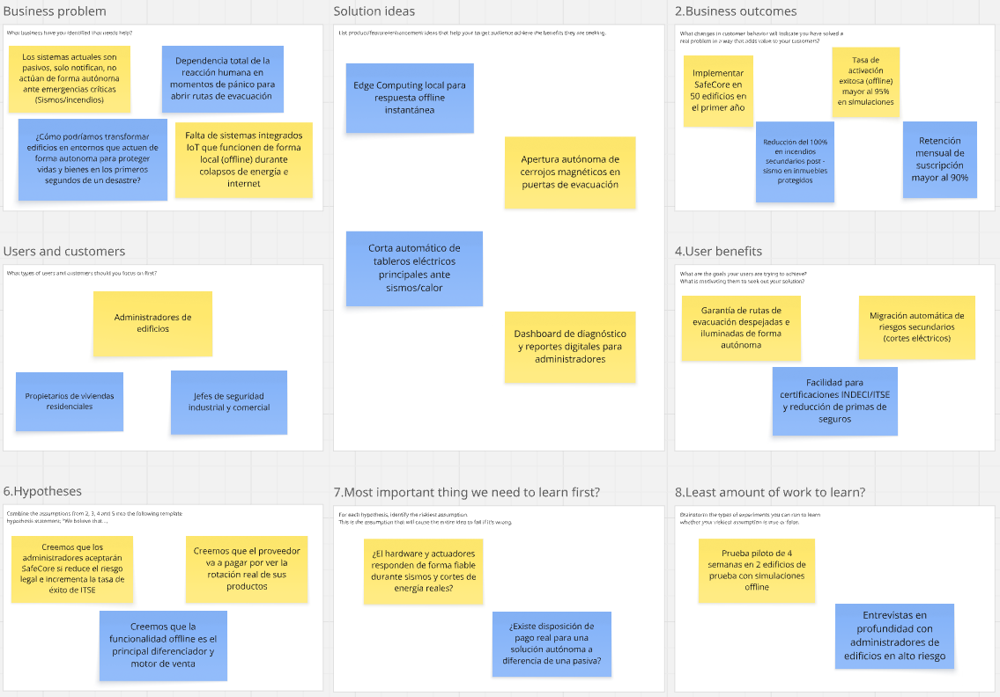

## 1.3. Segmentos objetivo

### Empresas inmobiliarias en Lima

En Lima Metropolitana, las empresas inmobiliarias y constructoras constituyen un segmento B2B clave, ya que la capital concentra cerca del 50% de la oferta inmobiliaria y proyectos de edificación formal a nivel nacional (CAPECO, 2023). Estas organizaciones abarcan desarrolladoras residenciales y comerciales de mediana y gran escala, las cuales operan bajo normativas estrictas de seguridad e infraestructura (INDECI, 2022).

La mayoría de estas empresas gestiona proyectos multifamiliares de más de 5 pisos o complejos de oficinas que albergan a múltiples familias y trabajadores, donde la instalación de sistemas de seguridad en fase de obra nueva reduce los costos operativos frente a remodelaciones posteriores (CAPECO, 2023). Además, el cumplimiento de las Inspecciones Técnicas de Seguridad en Edificaciones (ITSE) representa un requisito obligatorio para su habilitación (MINAM, 2022).

En términos económicos y de mercado, la integración de tecnología de automatización y respuesta autónoma ante emergencias es utilizada como un diferencial comercial ("edificio inteligente y seguro"), permitiendo incrementar el valor por metro cuadrado y acelerar la velocidad de ventas (Ipsos, 2023). Asimismo, la compra en volumen por proyecto garantiza una alta escalabilidad comercial para los proveedores de tecnología IoT.

### Dueños de vivienda unifamiliar en Lima

En Lima Metropolitana, los propietarios de viviendas unifamiliares representan un segmento B2C de alta relevancia, dado que cerca del 60% de los inmuebles residenciales en la capital corresponden a casas independientes (INEI, 2022). Dentro de este grupo, las familias pertenecientes a los niveles socioeconómicos B y C destacan por su capacidad de inversión en la mejora y protección de su infraestructura propia (Ipsos, 2022; APEIM, 2023).

El jefe de hogar en este segmento suele ser un adulto de mediana edad, entre 40 y 60 años, con un nivel educativo superior al promedio y a cargo de hogares compuestas por 3.5 a 4 integrantes (INEI, 2022; APEIM, 2022). Al ser propietarios directos del inmueble, la toma de decisiones de compra no depende de juntas de propietarios, lo que agiliza el proceso de adquisición frente a emergencias físicas o fallas eléctricas (Ipsos, 2023).

En cuanto a la infraestructura física y eléctrica, estos hogares cuentan con tableros de distribución independientes cuyo consumo continuo y riesgo de cortocircuito post-símico motivan la adopción de protección autónoma (Osinergmin, 2023). La prevención de incendios secundarios y el resguardo de la integridad familiar justifican la inversión directa en dispositivos de seguridad activa para el hogar.

# Capítulo II: Requirements Elicitation & Analysis

## 2.1. Competidores

En esta sección se analiza el panorama competitivo del mercado de sistemas de seguridad y respuesta ante emergencias, identificando las principales soluciones existentes y evaluando sus fortalezas, debilidades, oportunidades y amenazas en relación con SafeCore. Este análisis permite definir estrategias y tácticas diferenciadas que posicionen a SafeCore de manera efectiva en el mercado.

### 2.1.1. Análisis competitivo

<table border="1" cellpadding="6" cellspacing="0" style="border-collapse:collapse; width:100%; font-family:Arial, sans-serif;">
  <thead>
    <tr>
      <th colspan="6" scope="col" style="background:#f2f2f2;"><strong>Competitive Analysis Landscape</strong></th>
    </tr>
    <tr>
      <th colspan="2" rowspan="2" scope="row">¿Por qué realizar este análisis?</th>
      <td colspan="4" style="">
        <strong>Escriba en el recuadro la pregunta que busca responder o el objetivo de este análisis.</strong>
      </td>
    </tr>
    <tr>
      <td colspan="4" style="">
        El objetivo del análisis es obtener una perspectiva clara sobre qué brechas estratégicas existen en el mercado que otras soluciones no estén abarcando, obteniendo así un factor diferenciador de nicho que permita posicionar a SafeCore como la solución idónea para edificaciones residenciales y comerciales en Perú y la región andina.
      </td>
    </tr>
    <tr>
      <th colspan="2" scope="row">(En la cabecera colocar por cada competidor nombre y logo)</th>
      <th scope="column" style="width:20%; text-align:center;">
        SafeCore 
        
      </th>
      <th scope="column" style="width:20%; text-align:center;">
        Honeywell Notifier 
        
      </th>
      <th scope="column" style="width:20%; text-align:center;">
        Ajax Systems 
        
      </th>
      <th scope="column" style="width:20%; text-align:center;">
        Nest Protect + Ring Alarm 
        
      </th>
    </tr>
  </thead>
  <tbody>
    <tr>
      <th scope="row" rowspan="2">Perfil</th>
      <th scope="row">Overview</th>
      <td>Startup peruana de tecnología IoT enfocada en la protección autónoma de edificaciones ante sismos e incendios mediante un ecosistema de sensores y actuación local (Edge Computing).</td>
      <td>Sistema de detección y alarma contra incendios de nivel corporativo, con más de 30 años en el mercado, enfocado en cumplimiento normativo para grandes edificaciones comerciales e industriales.</td>
      <td>Plataforma de seguridad IoT (alarmas, sensores de humo/fuga y automatización) con fuerte presencia europea y expansión en LATAM, enfocada en facilidad de instalación inalámbrica.</td>
      <td>Ecosistema de dispositivos inteligentes para el hogar (detector de humo/CO y sistema de alarma) orientado al consumidor final, con enfoque en simplicidad e integración con el hogar inteligente.</td>
    </tr>
    <tr>
      <th scope="row">Ventaja competitiva</th>
      <td>Actuación física autónoma offline (Edge Computing) que libera accesos, corta energía y contiene incendios sin depender de la red eléctrica ni de Internet, adaptado a la realidad estructural peruana.</td>
      <td>Robustez normativa, confiabilidad y soporte técnico consolidado exigido en certificaciones ITSE e inspecciones de Defensa Civil.</td>
      <td>Rapidez de instalación inalámbrica y app centralizada intuitiva, con buena reputación en el segmento residencial de gama media-alta.</td>
      <td>Diseño atractivo, ecosistema de hogar inteligente ya masificado y fuerte reconocimiento de marca a nivel consumidor.</td>
    </tr>
    <tr>
      <th scope="row" rowspan="2">Perfil de Marketing</th>
      <th scope="row">Mercado Objetivo</th>
      <td>Empresas inmobiliarias/constructoras y dueños de vivienda unifamiliar en Lima y ciudades principales del Perú; no enfocado en mercado enterprise</td>
      <td>Edificios corporativos, industriales y centros comerciales de gran escala con requerimientos normativos estrictos</td>
      <td>Hogares y pequeños negocios de nivel socioeconómico medio-alto que buscan seguridad y automatización sin instalación compleja</td>
      <td>Consumidores individuales de hogares inteligentes, principalmente en mercados desarrollados (EE.UU., Europa)</td>
    </tr>
    <tr>
      <th scope="row">Estrategias de Marketing</th>
      <td>Marketing digital móvil-first (redes sociales, WhatsApp) dirigido a administradores de edificios y jefes de hogar; alianzas con constructoras y aseguradoras</td>
      <td>Marketing B2B directo, participación en licitaciones y certificaciones técnicas; reputación basada en cumplimiento normativo</td>
      <td>Marketing por experiencia de usuario y facilidad de instalación "hazlo tú mismo"; fuerte presencia en distribuidores retail</td>
      <td>Marketing de marca y ecosistema; integración con asistentes de voz y otros dispositivos smart home</td>
    </tr>
    <tr>
      <th scope="row" rowspan="3">Perfil de Productos</th>
      <th scope="row">Productos y servicios</th>
      <td>Sensores de sismo, temperatura y gas; nodo central Edge Computing; cerrojos magnéticos automáticos; corte eléctrico por relés inteligentes; supresión local de incendios; dashboard de monitoreo</td>
      <td>Paneles de detección de incendios, sensores de humo/calor industriales, sistemas de rociadores y notificación por voz, servicio de mantenimiento certificado</td>
      <td>Sensores de humo/fuga de gas, sirenas, cerraduras inteligentes, cámaras, hub central con app móvil</td>
      <td>Detector de humo/monóxido de carbono, sistema de alarma modular (sensores de puerta/ventana, movimiento), monitoreo profesional opcional</td>
    </tr>
    <tr>
      <th scope="row">Precios y costos</th>
      <td>Suscripción de bajo costo (hardware + mantenimiento, menor a $300 instalación básica residencial)</td>
      <td>Inversión alta por proyecto (miles de dólares), según tamaño de edificación y normativa aplicable</td>
      <td>Kit inicial desde $150 – $400; suscripción opcional de monitoreo mensual</td>
      <td>Dispositivos desde $115 (Nest Protect); sistema Ring Alarm desde $200; monitoreo mensual opcional (~$20/mes)</td>
    </tr>
    <tr>
      <th scope="row">Canales de distribución</th>
      <td>Venta directa B2B a constructoras; venta directa/online B2C; app móvil y plataforma web</td>
      <td>Venta directa a través de integradores certificados e instaladores autorizados</td>
      <td>E-commerce, retail físico y distribuidores autorizados en LATAM</td>
      <td>Retail (Amazon, tiendas físicas) y venta online directa</td>
    </tr>
    <tr>
      <th scope="row" rowspan="5">Análisis SWOT</th>
      <th scope="col" colspan="5" style=" text-align:left;">
        Realice esto para su startup y sus competidores. Sus fortalezas deberían apoyar sus oportunidades y contribuir a lo que ustedes definen como su posible ventaja competitiva.
      </th>
    </tr>
    <tr>
      <th scope="row">Fortalezas</th>
      <td>Actuación autónoma offline; bajo costo relativo; adaptación al contexto estructural peruano (autoconstrucción, redes eléctricas antiguas); enfoque dual sismo-incendio</td>
      <td>Confiabilidad normativa consolidada; soporte técnico especializado; alta precisión en detección industrial</td>
      <td>Instalación rápida e inalámbrica; buena experiencia de usuario; catálogo amplio de dispositivos</td>
      <td>Marca reconocida; integración con ecosistema smart home; alta adopción de consumidor</td>
    </tr>
    <tr>
      <th scope="row">Debilidades</th>
      <td>Marca nueva y baja confianza inicial; recursos limitados (startup); cobertura geográfica aún reducida</td>
      <td>Alto costo de implementación; complejidad de instalación; poco adaptado a vivienda unifamiliar</td>
      <td>Enfoque en detección y alerta, sin actuación física autónoma (no corta energía ni libera accesos)</td>
      <td>Depende de conectividad a Internet y energía comercial; sin actuación física ante sismos ni corte eléctrico de emergencia</td>
    </tr>
    <tr>
      <th scope="row">Oportunidades</th>
      <td>Vacío de mercado en sistemas de actuación autónoma ante sismos; alta actividad sísmica regional; crecimiento de adopción IoT en LATAM</td>
      <td>Crecimiento de edificaciones corporativas que requieren cumplimiento normativo</td>
      <td>Creciente interés en automatización del hogar en Perú</td>
      <td>Expansión de mercado smart home en LATAM</td>
    </tr>
    <tr>
      <th scope="row">Amenazas</th>
      <td>Entrada de competidores globales con mayor capital; resistencia al cambio tecnológico en usuarios tradicionales</td>
      <td>Soluciones más económicas y ágiles orientadas a PYMEs y hogares</td>
      <td>Soluciones con actuación física autónoma (como SafeCore) que ofrezcan mayor valor ante emergencias reales</td>
      <td>Dependencia de infraestructura de red que falla justamente durante sismos o incendios, restando confiabilidad</td>
    </tr>
  </tbody>
</table>

### 2.1.2. Estrategias y tácticas frente a competidores

**1. Estrategia de Confianza mediante Demostración Real**
Generar confianza inicial mostrando la actuación física autónoma de SafeCore en simulacros reales, reduciendo el escepticismo hacia una marca nueva.

Tácticas:
- Realizar simulacros piloto grabados en video con edificios aliados y publicarlos como evidencia.
- Ofrecer demostraciones en vivo del corte eléctrico y liberación de accesos ante administradores e inmobiliarias.

**2. Estrategia de Accesibilidad frente a Soluciones Enterprise**
Posicionar a SafeCore como una alternativa más accesible que sistemas corporativos como Honeywell Notifier, sin sacrificar la actuación autónoma.

Tácticas:
- Diseñar planes escalonados según tamaño de edificación (vivienda unifamiliar, multifamiliar, comercial).
- Publicar comparativas abiertas frente a competidores, destacando el diferencial de actuación física offline.

**3. Estrategia de Diferenciación por Actuación Autónoma Offline**
Comunicar de forma clara que, a diferencia de Ajax Systems y Nest Protect/Ring Alarm (enfocados en detección y alerta), SafeCore actúa físicamente sin depender de Internet ni energía comercial.

Tácticas:
- Crear contenido educativo que explique por qué la conectividad falla justamente durante sismos e incendios.
- Certificar y comunicar el respaldo de baterías y funcionamiento Edge Computing como pilar de marketing.

**4. Estrategia de Adaptación al Contexto Peruano**
Diferenciar a SafeCore construyendo una solución pensada para la autoconstrucción y la infraestructura eléctrica envejecida típica del Perú.

Tácticas:
- Desarrollar contenidos de capacitación con casos de uso de edificaciones peruanas reales.
- Generar alianzas con INDECI, municipalidades y aseguradoras locales para reforzar cumplimiento normativo y confianza.
- Usar un lenguaje cercano y campañas alineadas a la realidad sísmica del país.

## 2.2. Entrevistas

### 2.2.1. Diseño de entrevistas

## Preguntas de entrevista

## Segmento 1: Empresas inmobiliarias en Lima

1. ¿Cómo gestionan actualmente la seguridad y prevención de emergencias en sus proyectos inmobiliarios?

2. ¿Qué riesgos consideran más importantes dentro de sus edificaciones?

3. ¿Qué dificultades encuentran actualmente durante un sismo, incendio o falla eléctrica?

4. ¿Qué sistemas o dispositivos utilizan actualmente para detectar estas situaciones?

5. ¿Cómo se realiza actualmente la evacuación de las personas durante una emergencia?

6. ¿Qué acciones consideran importantes que un sistema pueda realizar automáticamente durante una emergencia?

7. ¿Qué tan importante es que el sistema pueda funcionar sin Internet o energía eléctrica?

8. ¿Qué información necesitarían visualizar para conocer el estado de seguridad de una edificación?

9. ¿Cómo prefieren recibir alertas sobre una emergencia o una falla del sistema?

10. ¿Qué características debería tener una solución tecnológica para que consideren implementarla en sus proyectos?

## Segmento 2: Dueños de vivienda unifamiliar en Lima

1. ¿Qué medidas de seguridad tienes actualmente en tu vivienda ante un sismo o incendio?

2. ¿Qué riesgos relacionados con sismos, incendios o fallas eléctricas te preocupan más?

3. ¿Has tenido alguna experiencia con una emergencia en tu vivienda? ¿Qué ocurrió?

4. ¿Qué dificultades encuentras actualmente para responder ante una emergencia?

5. ¿Qué dispositivos o sistemas utilizas actualmente para proteger tu vivienda?

6. ¿Qué acciones te gustaría que un sistema pudiera realizar automáticamente durante una emergencia?

7. ¿Qué tan importante sería para ti que el sistema funcione sin Internet o energía eléctrica?

8. ¿Qué información te gustaría consultar desde una aplicación sobre la seguridad de tu vivienda?

9. ¿Cómo prefieres recibir una alerta cuando se detecte una emergencia?

10. ¿Qué características debería tener una solución tecnológica para que confíes en utilizarla en tu vivienda?

### 2.2.2. Registro de entrevistas

## Segmento 1: Empresas inmobiliarias en Lima

## Entrevista 1 — Yvon Cerrón

| **Campo** | **Información** |
|:---|:---|
| **Fotografía** | 

 |
| **Entrevistado** | Yvon Cerrón |
| **Edad** | 22 años |
| **Distrito** | Surquillo |
| **Ocupación / Cargo** | Estudiante de Ingeniería Civil y trabajadora en una empresa inmobiliaria |
| **Fecha de entrevista** | 10/09/2026 |
| **Duración** | 08:35 min |
| **Inicio en el video** | 00:00:00 |
| **Video de la entrevista** | [Ver entrevista](https://stream.microsoft.com/) |

### Entrevista 2

| Campo | Información |
|---|---|
| **Fotografía** |  |
| Entrevistado | [Freddy Torre] |
| Edad | [30] |
| Distrito | [Surco] |
| Ocupación / Cargo | [Médico] |
| Fecha | 17/09/2026 |
| Duración | 10:10 min |
| Inicio en el video | 00:00 |
| Link del video | [Ver entrevista](https://www.youtube.com/watch?v=LSnkTj_Xj1Q) |

### Entrevista 3

| Campo | Información |
|---|---|
| **Fotografía** |  |
| Entrevistado | [Nombre y apellido] |
| Edad | [Edad] |
| Distrito | [Distrito] |
| Ocupación / Cargo | [Cargo del entrevistado] |
| Fecha | 12/09/2026 |
| Duración | 09:48 min |
| Inicio en el video | 18:47 |
| Link del video | [Ver entrevista](https://stream.microsoft.com/) |

## Segmento 2: Dueños de vivienda unifamiliar en Lima

### Entrevista 1
## Entrevista 1 — Yvon Cerrón

| **Campo** | **Información** |
|---|---|
| **Fotografía** |  |
| **Entrevistado** | Yvon Cerrón |
| **Edad** | 22 años |
| **Distrito** | Surquillo |
| **Ocupación / Cargo** | Estudiante de Ingeniería Civil y trabajadora en una empresa inmobiliaria |
| **Fecha de entrevista** | 10/09/2026 |
| **Duración** | 08:35 min |
| **Inicio en el video** | 00:00:00 |
| **Video de la entrevista** | [Ver entrevista](https://stream.microsoft.com/) |

### Entrevista 2

| Campo | Información |
|---|---|
| **Fotografía** | 

 |
| Entrevistado | Nicol Fernández Quispe |
| Edad | 26 |
| Distrito | Comas |
| Ocupación / Cargo | Interna de Medicina |
| Fecha | 19/09/2026 |
| Duración | 05:23 min |
| Inicio en el video | 00:00 |
| Link del video | [Ver entrevista](https://upcedupe-my.sharepoint.com/:v:/g/personal/u202020230_upc_edu_pe/IQAMiALSVBD2ToSk2_OyQghBAdWTTDU2Zpr9GbpsPVucuq4?nav=eyJyZWZlcnJhbEluZm8iOnsicmVmZXJyYWxBcHAiOiJPbmVEcml2ZUZvckJ1c2luZXNzIiwicmVmZXJyYWxBcHBQbGF0Zm9ybSI6IldlYiIsInJlZmVycmFsTW9kZSI6InZpZXciLCJyZWZlcnJhbFZpZXciOiJNeUZpbGVzTGlua0NvcHkifX0&e=SQIJFe) |

### Entrevista 3

| Campo | Información |
|---|---|
| **Fotografía** |  |
| Entrevistado | [Nombre y apellido] |
| Edad | [Edad] |
| Distrito | [Distrito] |
| Ocupación | [Ocupación] |
| Fecha | 15/09/2026 |
| Duración | 09:05 min |
| Inicio en el video | 44:52 |
| Link del video | [Ver entrevista](https://stream.microsoft.com/) |

### **2.2.3. Análisis de entrevistas**

## **Segmento 1: Empresas inmobiliarias en Lima**

### **Entrevistado 1: Yvon Cerrón (Enfoque en seguridad y prevención de emergencias)**

* **Perfil**

    * Yvon, 22 años, residente de Surquillo.
    * Estudiante de Ingeniería Civil.
    * Actualmente trabaja en una empresa inmobiliaria, donde participa en actividades relacionadas con proyectos y edificaciones.
    * Su experiencia le permite conocer de cerca procesos de seguridad, mantenimiento y gestión en proyectos inmobiliarios.

* **Insights clave**

    * La seguridad y prevención de emergencias se gestionan mediante protocolos de emergencia, señalización, rutas de evacuación, extintores, alarmas, simulacros e inspecciones periódicas.
    * Los principales riesgos identificados son los sismos, incendios, fallas eléctricas y fugas de gas o agua.
    * Durante una emergencia, es importante disponer de información inmediata sobre lo que ocurre en las diferentes zonas de la edificación.
    * La solución debería mantener sus funciones críticas durante una pérdida de Internet o energía eléctrica.
    * La información de seguridad debería visualizarse de manera centralizada y permitir conocer rápidamente el estado de la edificación.

* **Problemas y frustraciones**

    * Dificultad para obtener información inmediata sobre lo que ocurre en las diferentes zonas de la edificación durante una emergencia.
    * Dificultad para coordinar la evacuación cuando existe una gran cantidad de personas.
    * Necesidad de verificar rápidamente si alguna zona presenta un problema.
    * En algunos casos, la información relacionada con la seguridad todavía se controla de manera manual.
    * Una emergencia puede afectar la conectividad o el suministro eléctrico, dificultando el funcionamiento de los sistemas.

* **Necesidades**

    * Contar con información en tiempo real sobre el estado de los sensores y alarmas.
    * Identificar rápidamente la ubicación de una emergencia y las zonas afectadas.
    * Visualizar en un solo lugar información como temperatura, presencia de humo, estado eléctrico y estado de las rutas de evacuación.
    * Recibir alertas inmediatas mediante diferentes medios, como alarmas locales y notificaciones en el celular.
    * Diferenciar las alertas según el nivel de gravedad y la zona afectada.
    * Mantener las funciones críticas del sistema mediante mecanismos de respaldo, como baterías.
    * Contar con una solución confiable, fácil de utilizar, escalable, compatible con sistemas existentes y fácil de mantener.

* **Oportunidades para SafeCore**

    * **Monitoreo centralizado:** permitir visualizar en un solo lugar el estado de sensores, alarmas, temperatura, humo, estado eléctrico, zonas afectadas y rutas de evacuación.

    * **Detección y respuesta automática:** detectar situaciones de emergencia, activar alarmas, enviar notificaciones, identificar la zona afectada y activar dispositivos como luces de emergencia o sistemas de control.

    * **Alertas multicanal:** enviar alertas mediante alarmas locales y notificaciones al celular, diferenciando los mensajes según la gravedad de la emergencia y la zona afectada.

    * **Funcionamiento ante pérdida de conectividad o energía:** incorporar mecanismos de respaldo, como baterías, y mantener las funciones críticas de manera local durante una emergencia.

    * **Historial de eventos:** registrar los eventos ocurridos para permitir revisar posteriormente qué sucedió durante una emergencia.

    * **Compatibilidad y escalabilidad:** diseñar una solución que pueda integrarse con sistemas existentes y adaptarse a diferentes tipos de edificaciones.
---

#### **Entrevistado 2: [Nombre y apellido] (Enfoque en [tema principal])**

* **Perfil**

    * [Descripción del perfil del entrevistado.]

* **Insights clave**

    * [Insight principal.]

    * [Segundo insight.]

* **Problemas y frustraciones**

    * [Problema identificado.]

    * [Otra frustración identificada.]

* **Necesidades**

    * [Necesidad identificada.]

    * [Segunda necesidad identificada.]

* **Oportunidades para SafeCore**

    * **[Nombre de oportunidad]:** [Descripción.]

    * **[Nombre de oportunidad]:** [Descripción.]

---

#### **Entrevistado 3: [Nombre y apellido] (Enfoque en [tema principal])**

* **Perfil**

    * [Descripción del perfil del entrevistado.]

* **Insights clave**

    * [Insight principal.]

    * [Segundo insight.]

* **Problemas y frustraciones**

    * [Problema identificado.]

    * [Otra frustración identificada.]

* **Necesidades**

    * [Necesidad identificada.]

    * [Segunda necesidad identificada.]

* **Oportunidades para SafeCore**

    * **[Nombre de oportunidad]:** [Descripción.]

    * **[Nombre de oportunidad]:** [Descripción.]

---

**Segmento 2: Dueños de vivienda unifamiliar en Lima**

#### **Entrevistado 1: [Nombre y apellido] (Enfoque en [tema principal])**

* **Perfil**

    * [Describir brevemente al entrevistado: edad, distrito, ocupación y características relevantes relacionadas con el segmento.]

* **Insights clave**

    * [Insight principal obtenido de la entrevista.]

    * [Segundo insight relevante obtenido de la entrevista.]

* **Problemas y frustraciones**

    * [Problema o dificultad identificada.]

    * [Otra frustración relacionada con la seguridad del hogar.]

* **Necesidades**

    * [Necesidad identificada.]

    * [Segunda necesidad identificada.]

* **Oportunidades para SafeCore**

    * **[Nombre de oportunidad]:** [Explicar cómo SafeCore podría responder a la necesidad.]

    * **[Nombre de oportunidad]:** [Explicar otra funcionalidad o característica.]

---

#### **Entrevistado 2: Nicol Fernández Quispe (Enfoque en dueños de vivienda unifamiliar en Lima)**

* **Perfil**

    * Residente en el distrito de La Molina. Vive en una vivienda unifamiliar de dos pisos junto a su esposo y sus dos hijos. Suele salir varias veces, por lo que no siempre hay alguien presente en el hogar. Ya cuenta con un sistema básico de cámaras de seguridad conectado a una aplicación móvil, lo que indica cierta familiaridad con soluciones tecnológicas domésticas.

* **Insights clave**

    * La preocupación principal no es la falta de dispositivos de seguridad, sino la falta de reacción a tiempo: sin nadie en casa, la familia se entera de una emergencia solo al llegar, cuando ya puede ser tarde.

    * Existe una experiencia previa real con una falla eléctrica que casi se convierte en incendio, lo cual hace que la amenaza no sea percibida como abstracta sino como algo que ya ocurrió y puede repetirse.

* **Problemas y frustraciones**

    * Ausencia de automatización: no existe ningún mecanismo que actúe por sí solo (cortar la luz, cerrar el gas, activar alarmas) cuando la familia no está presente o no reacciona a tiempo.

    * Incertidumbre sobre qué hacer primero durante una emergencia, incluso cuando la familia sí está en casa, lo que genera pérdida de tiempo valioso en los primeros segundos críticos.

* **Necesidades**

    * Un sistema que actúe de forma autónoma ante una emergencia (corte eléctrico focalizado, señalización de rutas o zonas seguras), sin depender de que alguien esté presente para reaccionar.

    * Un sistema de alertas resiliente, que funcione incluso sin electricidad ni conexión a Internet, ya que ambos servicios suelen fallar justamente durante sismos o incendios.

* **Oportunidades para SafeCore**

    * **Multicanalidad de alertas**: Combinar aviso en el celular, llamada/SMS y alarma física local, para cubrir el riesgo de que la familia no revise el celular a tiempo, especialmente cuando hay menores en casa sin dispositivo propio.

    * **Operación autónoma vía Edge Computing**: Reforzar como diferenciador clave que las acciones críticas (cortar suministro, activar señalización) se ejecuten localmente sin depender de Internet ni energía externa, atacando directamente la mayor preocupación expresada por este segmento.

---

#### **Entrevistado 3: [Nombre y apellido] (Enfoque en [tema principal])**

* **Perfil**

    * [Descripción del perfil del entrevistado.]

* **Insights clave**

    * [Insight principal.]

    * [Segundo insight.]

* **Problemas y frustraciones**

    * [Problema identificado.]

    * [Otra frustración identificada.]

* **Necesidades**

    * [Necesidad identificada.]

    * [Segunda necesidad identificada.]

* **Oportunidades para SafeCore**

    * **[Nombre de oportunidad]:** [Descripción.]

    * **[Nombre de oportunidad]:** [Descripción.]

## 2.3. Needfinding

En esta sección se consolida el análisis de las necesidades de los usuarios a partir de la información recopilada en las entrevistas. Se presentan los User Personas, el User Task Matrix, el User Journey Mapping, el Empathy Mapping, el Big Picture EventStorming y el Ubiquitous Language del dominio, herramientas que permiten construir una comprensión profunda del contexto y las motivaciones de los usuarios de SafeCore.

### 2.3.1. User Personas

Los user persona que se muestran a continuación, fueron realizados a partir de la información recopilada de la sección de entrevistas. Estos nos ayudarán a describir de forma general nuestros segmentos objetivo.

**Persona 1: Carlos Espinoza** _(Empresas inmobiliarias en Lima)_

**Persona 2: Rosa Mendoza** _(Dueños de vivienda unifamiliar en Lima)_

### 2.3.2. User Task Matrix

En esta sección se presenta el user task matrix de los segmentos objetivo, con el fin de identificar la frecuencia de las actividades realizadas por los usuarios, y de esta manera se refleja la importancia de determinadas tareas.

| Task | Empresas Inmobiliarias — Frecuencia | Empresas Inmobiliarias — Importancia | Dueños de Vivienda Unifamiliar — Frecuencia | Dueños de Vivienda Unifamiliar — Importancia |
|---|---|---|---|---|
| Investigar proveedores de seguridad | Baja | Alta | Baja | Alta |
| Comparar precios y funcionalidades | Media | Alta | Media | Alta |
| Coordinar instalación del sistema | Baja | Alta | Baja | Alta |
| Monitorear estado del sistema (batería, sensores, relés) | Alta | Alta | Media | Alta |
| Recibir y atender alertas de emergencia | Baja | Alta | Baja | Alta |
| Realizar pruebas de diagnóstico/simulacro | Media | Alta | Baja | Media |
| Gestionar mantenimiento del sistema | Media | Alta | Baja | Media |
| Reportar cumplimiento normativo (ITSE/INDECI) | Alta | Alta | Baja | Baja |
| Consultar historial de eventos/alertas | Media | Media | Baja | Media |
| Administrar accesos y usuarios de la app | Media | Media | Baja | Baja |
| Gestionar múltiples propiedades/edificios | Alta | Alta | Baja | Baja |

En base al User Task Matrix presentado, podemos destacar las siguientes tareas con mayor frecuencia e importancia para cada segmento de usuarios:

**Empresas Inmobiliarias:**

- Monitorear estado del sistema (batería, sensores, relés)
  - Explicación: Al administrar múltiples edificaciones, la supervisión constante del sistema es clave para garantizar que todas las propiedades estén protegidas.
- Gestionar múltiples propiedades/edificios
  - Explicación: La escalabilidad y visibilidad centralizada es fundamental para su rol de administrador de varios proyectos.

**Dueños de Vivienda Unifamiliar:**

- Monitorear estado del sistema (batería, sensores, relés)
  - Explicación: Necesitan confiar en que el sistema está operativo en todo momento, ya que no siempre están en casa.
- Comparar precios y funcionalidades
  - Explicación: Al ser una decisión de compra personal, evalúan cuidadosamente el costo-beneficio antes de invertir en su hogar.

### 2.3.3. User Journey Mapping

En esta sección se presentan los User Journey Mapping de los segmentos objetivos, que realizamos con el fin de dar a entender cómo se siente nuestro usuario en cada momento, detallando cada paso que realiza y las emociones que experimenta.

**Journey Map 1: Carlos Espinoza** _(Empresas inmobiliarias en Lima)_

**Journey Map 2: Rosa Mendoza** _(Dueños de vivienda unifamiliar en Lima)_

### 2.3.4. Empathy Mapping

En esta sección mostramos los empathy mapping de los segmentos objetivos realizados con la información recopilada de componentes anteriores.

**Empathy Map 1: Carlos Espinoza** _(Empresas inmobiliarias en Lima)_

**Empathy Map 2: Rosa Mendoza** _(Dueños de vivienda unifamiliar en Lima)_

## 2.4. Big Picture EventStorming

_[...]_

## 2.5. Ubiquitous Language

_[...]_

# Capítulo III: Requirements Specification

## 3.1. User Stories

## Tabla de Epics

| Epic ID | Título                              | Descripción                                                                                                                  |
| ------- | ----------------------------------- | ---------------------------------------------------------------------------------------------------------------------------- |
| E1      | Gestión de Usuarios y Perfiles      | Administración de cuentas, autenticación y roles (administrador de edificio, propietario de vivienda, residente).             |
| E2      | Monitoreo de Sensores IoT           | Visualización en tiempo real del estado de sensores sísmicos, de temperatura, gas y batería de respaldo.                     |
| E3      | Actuación Autónoma de Emergencia    | Ejecución automática de protocolos offline: liberación de accesos, corte eléctrico, iluminación de emergencia y contención de incendios. |
| E4      | Dashboard de Gestión                | Panel centralizado para administradores con estado del sistema, historial de eventos y pruebas de diagnóstico.               |
| E5      | Alertas y Notificaciones            | Envío de alertas en tiempo real (app, SMS, push) ante sismos, amagos de incendio o fallas del sistema.                       |
| E6      | Funcionamiento Offline (Edge)       | Capacidad del nodo central de operar de forma autónoma sin Internet ni energía comercial mediante Edge Computing y baterías. |
| E7      | Pruebas y Simulacros                | Módulo para realizar pruebas manuales y simulacros de emergencia desde la app o dashboard.                                   |
| E8      | Landing Page e Información Comercial| Presentación de la propuesta de valor de SafeCore, beneficios, casos de uso y canales de contacto/compra.                    |
| E9      | Infraestructura Técnica Base        | Configuración de arquitectura móvil, backend, comunicación con nodos Edge y seguridad de la plataforma.                      |

## Tabla de User Stories

| US ID | Título                              | Descripción                                                                                                                                                                                       | Criterios de Aceptación (Gherkin)                                                                                                                                                                                                                                                                                                                                                                                          | Epic Relacionada |
| ----- | ----------------------------------- | ------------------------------------------------------------------------------------------------------------------------------------------------------------------------------------------------- | -------------------------------------------------------------------------------------------------------------------------------------------------------------------------------------------------------------------------------------------------------------------------------------------------------------------------------------------------------------------------------------------------------------------------- | ---------------- |
| US1   | Registro de administrador           | Como administrador de edificio, quiero registrarme con correo o celular para gestionar uno o varios inmuebles en SafeCore.                                                                         | Scenario 1: Given un administrador no registrado When ingresa datos válidos Then el sistema crea la cuenta y confirma el registro. Scenario 2: Given datos inválidos When intenta registrarse Then el sistema rechaza y muestra el motivo.                                                                                                                                                                             | E1               |
| US2   | Creación de perfiles de inmueble    | Como administrador, quiero agregar varios edificios o viviendas bajo mi cuenta para gestionarlos de forma centralizada.                                                                            | Scenario 1: Given un administrador autenticado When agrega un nuevo inmueble Then el sistema lo vincula a su cuenta. Scenario 2: Given se excede el límite de inmuebles When intenta agregar otro Then el sistema rechaza con mensaje.                                                                                                                                                                                   | E1               |
| US3   | Visualización de estado de sensores | Como administrador, quiero ver en tiempo real el estado de los sensores sísmicos, de temperatura, gas y batería de cada inmueble.                                                                  | Scenario 1: Given un administrador autenticado When ingresa al dashboard Then visualiza el estado actual de todos los sensores. Scenario 2: Given un sensor offline When el sistema lo detecta Then muestra alerta visual de desconexión.                                                                                                                                                                                 | E2               |
| US4   | Detección automática de sismo       | Como sistema, quiero detectar un movimiento sísmico por encima del umbral configurado y activar el protocolo de emergencia de forma autónoma.                                                      | Scenario 1: Given un sismo superior al umbral When el sensor lo registra Then el nodo Edge ejecuta el protocolo completo offline. Scenario 2: Given un sismo menor al umbral When se detecta Then el sistema solo registra el evento sin actuar.                                                                                                                                                                          | E3               |
| US5   | Liberación automática de accesos    | Como sistema, quiero abrir cerrojos magnéticos de puertas de evacuación automáticamente ante una emergencia sísmica o de incendio.                                                                 | Scenario 1: Given un evento de emergencia When se activa el protocolo Then los cerrojos magnéticos se liberan en menos de 3 segundos. Scenario 2: Given el sistema en modo prueba When se ejecuta simulacro Then los accesos se liberan y se registran.                                                                                                                                                                    | E3               |
| US6   | Corte eléctrico de emergencia       | Como sistema, quiero interrumpir el suministro eléctrico mediante relés inteligentes para evitar cortocircuitos e incendios secundarios.                                                           | Scenario 1: Given un sismo o detección de gas When se activa el protocolo Then los relés cortan la energía en las zonas configuradas. Scenario 2: Given el sistema offline When ocurre el evento Then el corte se ejecuta localmente sin depender de Internet.                                                                                                                                                            | E3               |
| US7   | Activación de iluminación auxiliar  | Como sistema, quiero encender iluminación de emergencia automáticamente cuando se detecte un evento crítico.                                                                                      | Scenario 1: Given un evento de emergencia When se activa el protocolo Then las luces de emergencia se encienden de inmediato. Scenario 2: Given falla de energía comercial When el sistema detecta el evento Then las luces se alimentan desde la batería de respaldo.                                                                                                                                                     | E3               |
| US8   | Contención inicial de incendio      | Como sistema, quiero activar sistemas locales de supresión (extintores automáticos o rociadores de zona) ante detección de temperatura o gas elevada.                                              | Scenario 1: Given temperatura o gas por encima del umbral When se detecta Then se activa la contención local en la zona afectada. Scenario 2: Given el sistema en modo offline When ocurre el evento Then la contención se ejecuta sin conexión a la nube.                                                                                                                                                                 | E3               |
| US9   | Dashboard de monitoreo              | Como administrador, quiero consultar un panel centralizado con el estado de sensores, historial de eventos y estado de baterías.                                                                   | Scenario 1: Given un administrador autenticado When ingresa al dashboard Then visualiza el estado general del sistema. Scenario 2: Given un evento reciente When consulta el historial Then se muestran fecha, tipo de evento y acciones ejecutadas.                                                                                                                                                                       | E4               |
| US10  | Alerta push de emergencia           | Como residente o administrador, quiero recibir una notificación push inmediata cuando se active un protocolo de emergencia.                                                                       | Scenario 1: Given un evento crítico When el sistema lo detecta Then envía push notification a todos los usuarios vinculados. Scenario 2: Given el dispositivo sin Internet When ocurre el evento Then la alerta se envía por SMS de respaldo (si está configurado).                                                                                                                                                        | E5               |
| US11  | Alerta de falla del sistema         | Como administrador, quiero recibir una alerta cuando un sensor, batería o relé presente falla o bajo nivel de carga.                                                                               | Scenario 1: Given batería por debajo del 20% When el sistema lo detecta Then envía alerta preventiva al administrador. Scenario 2: Given un sensor desconectado When se detecta la falla Then se genera notificación y se registra en el dashboard.                                                                                                                                                                        | E5               |
| US12  | Funcionamiento offline              | Como usuario, quiero que el sistema continúe protegiendo el inmueble aunque no haya Internet ni energía comercial.                                                                                 | Scenario 1: Given pérdida de Internet y energía When ocurre un sismo Then el nodo Edge ejecuta el protocolo completo con batería de respaldo. Scenario 2: Given el sistema offline When el usuario intenta acciones que requieren nube Then se informa que solo están disponibles las funciones locales.                                                                                                                    | E6               |
| US13  | Ejecución de simulacro              | Como administrador, quiero lanzar un simulacro completo desde la app o dashboard para verificar que todos los actuadores funcionan correctamente.                                                  | Scenario 1: Given un administrador autenticado When inicia un simulacro Then se liberan accesos, se activa iluminación y se registra el resultado. Scenario 2: Given un simulacro en curso When finaliza Then el sistema genera un reporte de éxito o fallas detectadas.                                                                                                                                                   | E7               |
| US14  | Prueba individual de actuadores     | Como administrador, quiero probar de forma individual el corte eléctrico, la liberación de puertas o la iluminación desde la app.                                                                  | Scenario 1: Given un administrador autenticado When selecciona “Probar corte eléctrico” Then el relé se activa y se confirma la acción. Scenario 2: Given el sistema en modo prueba When se ejecuta una acción Then se registra en el historial sin generar alerta real a residentes.                                                                                                                                     | E7               |
| US15  | Información de beneficios           | Como visitante, quiero ver en la landing page los beneficios principales de SafeCore (actuación autónoma, offline, protección sísmica e incendio).                                                 | Scenario 1: Given un visitante accede a la landing When navega a la sección de beneficios Then visualiza la propuesta de valor clara. Scenario 2: Given un visitante explora la página When busca casos de uso Then encuentra ejemplos de edificios residenciales y comerciales.                                                                                                                                          | E8               |
| US16  | Acceso a descarga / contacto        | Como visitante, quiero encontrar fácilmente los canales para solicitar una demo o contactar a ventas desde la landing page.                                                                        | Scenario 1: Given un visitante en la landing When hace clic en “Solicitar demo” Then se muestra un formulario de contacto. Scenario 2: Given un visitante registrado When hace clic en “Ingresar” Then es redirigido al login de la plataforma.                                                                                                                                                                           | E8               |
| US17  | API de autenticación                | Como developer, quiero consumir un endpoint de autenticación para validar credenciales de administradores y residentes.                                                                            | Scenario 1: Given credenciales válidas When se envía al endpoint de login Then el sistema responde con un token JWT. Scenario 2: Given credenciales inválidas When se procesa Then el sistema devuelve error 401 Unauthorized.                                                                                                                                                                                            | E9               |
| US18  | API de eventos de emergencia        | Como developer, quiero consumir un endpoint para registrar y consultar eventos de emergencia detectados por los nodos Edge.                                                                        | Scenario 1: Given un evento válido enviado por el nodo When se procesa Then el sistema lo almacena y notifica. Scenario 2: Given una consulta con ID de evento válido When se procesa Then el sistema devuelve el detalle completo del evento.                                                                                                                                                                             | E9               |
| US19  | Configuración de umbrales           | Como administrador, quiero configurar los umbrales de activación de sismo, temperatura y gas según las características de mi edificio.                                                             | Scenario 1: Given un administrador autenticado When modifica un umbral y guarda Then el nodo Edge actualiza la configuración. Scenario 2: Given un umbral inválido When intenta guardarlo Then el sistema rechaza y muestra el rango permitido.                                                                                                                                                                           | E2               |
| US20  | Historial de eventos                | Como administrador, quiero consultar el historial completo de eventos (sismos, incendios, fallas y pruebas) de mis inmuebles.                                                                      | Scenario 1: Given un administrador autenticado When accede al historial Then visualiza la lista ordenada por fecha. Scenario 2: Given filtros de fecha o tipo de evento When los aplica Then el sistema muestra solo los resultados correspondientes.                                                                                                                                                                     | E4               |
| US21  | Notificación de mantenimiento       | Como administrador, quiero recibir recordatorios cuando un componente del sistema requiera mantenimiento preventivo.                                                                               | Scenario 1: Given un sensor o batería próximo a su vida útil When el sistema lo detecta Then envía notificación de mantenimiento. Scenario 2: Given el administrador confirma el mantenimiento When lo registra Then el contador de vida útil se reinicia.                                                                                                                                                                 | E5               |

---
## 3.2. Impact Mapping

## 3.3. Product Backlog

| Order | US ID | Título                              | Descripción                                                                                                                                           | Story Points |
| ----- | ----- | ----------------------------------- | ----------------------------------------------------------------------------------------------------------------------------------------------------- | ------------ |
| 1     | US15  | Información de beneficios           | Como visitante, quiero ver en la landing page los beneficios principales de SafeCore (actuación autónoma, offline, protección sísmica e incendio).    | 3            |
| 2     | US16  | Acceso a descarga / contacto        | Como visitante, quiero encontrar fácilmente los canales para solicitar una demo o contactar a ventas desde la landing page.                           | 2            |
| 3     | US1   | Registro de administrador           | Como administrador de edificio, quiero registrarme con correo o celular para gestionar uno o varios inmuebles en SafeCore.                            | 5            |
| 4     | US2   | Creación de perfiles de inmueble    | Como administrador, quiero agregar varios edificios o viviendas bajo mi cuenta para gestionarlos de forma centralizada.                               | 3            |
| 5     | US17  | API de autenticación                | Como developer, quiero consumir un endpoint de autenticación para validar credenciales de administradores y residentes.                               | 5            |
| 6     | US3   | Visualización de estado de sensores | Como administrador, quiero ver en tiempo real el estado de los sensores sísmicos, de temperatura, gas y batería de cada inmueble.                     | 5            |
| 7     | US19  | Configuración de umbrales           | Como administrador, quiero configurar los umbrales de activación de sismo, temperatura y gas según las características de mi edificio.                | 3            |
| 8     | US4   | Detección automática de sismo       | Como sistema, quiero detectar un movimiento sísmico por encima del umbral configurado y activar el protocolo de emergencia de forma autónoma.         | 8            |
| 9     | US5   | Liberación automática de accesos    | Como sistema, quiero abrir cerrojos magnéticos de puertas de evacuación automáticamente ante una emergencia sísmica o de incendio.                    | 5            |
| 10    | US6   | Corte eléctrico de emergencia       | Como sistema, quiero interrumpir el suministro eléctrico mediante relés inteligentes para evitar cortocircuitos e incendios secundarios.              | 5            |
| 11    | US7   | Activación de iluminación auxiliar  | Como sistema, quiero encender iluminación de emergencia automáticamente cuando se detecte un evento crítico.                                         | 3            |
| 12    | US8   | Contención inicial de incendio      | Como sistema, quiero activar sistemas locales de supresión ante detección de temperatura o gas elevada.                                               | 8            |
| 13    | US12  | Funcionamiento offline              | Como usuario, quiero que el sistema continúe protegiendo el inmueble aunque no haya Internet ni energía comercial.                                    | 8            |
| 14    | US9   | Dashboard de monitoreo              | Como administrador, quiero consultar un panel centralizado con el estado de sensores, historial de eventos y estado de baterías.                      | 5            |
| 15    | US20  | Historial de eventos                | Como administrador, quiero consultar el historial completo de eventos de mis inmuebles.                                                               | 3            |
| 16    | US10  | Alerta push de emergencia           | Como residente o administrador, quiero recibir una notificación push inmediata cuando se active un protocolo de emergencia.                           | 5            |
| 17    | US11  | Alerta de falla del sistema         | Como administrador, quiero recibir una alerta cuando un sensor, batería o relé presente falla o bajo nivel de carga.                                  | 3            |
| 18    | US13  | Ejecución de simulacro              | Como administrador, quiero lanzar un simulacro completo desde la app o dashboard para verificar que todos los actuadores funcionan.                   | 5            |
| 19    | US14  | Prueba individual de actuadores     | Como administrador, quiero probar de forma individual el corte eléctrico, la liberación de puertas o la iluminación desde la app.                     | 3            |
| 20    | US18  | API de eventos de emergencia        | Como developer, quiero consumir un endpoint para registrar y consultar eventos de emergencia detectados por los nodos Edge.                           | 5            |
| 21    | US21  | Notificación de mantenimiento       | Como administrador, quiero recibir recordatorios cuando un componente del sistema requiera mantenimiento preventivo.                                  | 2            |

# Capítulo IV: Solution Software Design

## 4.1. Strategic-Level Domain-Driven Design

### 4.1.1. Design-Level EventStorming

# Capítulo IV: Solution Software Design

## 4.1. Strategic-Level Domain-Driven Design

### 4.1.1. Design-Level EventStorming

En esta sección se presenta el **Design-Level EventStorming** realizado para la solución **SafeCore**. El objetivo de esta actividad es identificar y organizar los principales elementos del dominio, tales como actores, comandos, eventos de dominio, políticas, sistemas externos, modelos de lectura y componentes IoT.

A partir del análisis realizado se modelaron los principales flujos de negocio relacionados con la detección y atención de situaciones de riesgo, así como las actividades de monitoreo, gestión de usuarios y administración de dispositivos IoT.

Los flujos identificados permiten representar el comportamiento de SafeCore ante diferentes escenarios, como **riesgo sísmico, incendio y fuga de gas**, además de los procesos de **notificación y escalamiento, monitoreo y gestión, registro y autenticación, y gestión de dispositivos IoT**.

El resultado de este EventStorming constituye la base para las siguientes actividades del diseño estratégico, principalmente la identificación de los **Bounded Contexts**, el modelado de los flujos de mensajes y la elaboración de los **Bounded Context Canvases**.

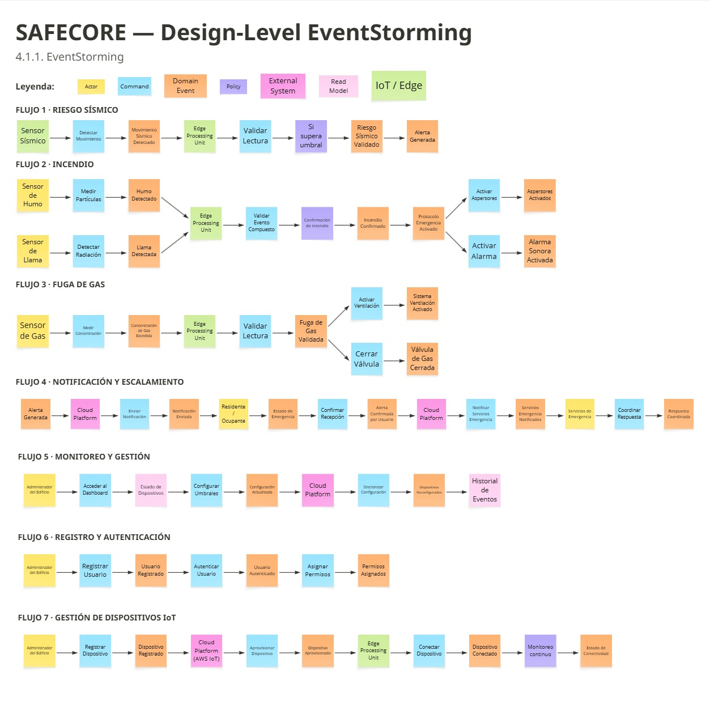

**Figura 4.1. Design-Level EventStorming de SafeCore.**

#### 4.1.1.1. Candidate Context Discovery

#### 4.1.1.1. Candidate Context Discovery

A partir del **Design-Level EventStorming** se realizó el proceso de **Candidate Context Discovery** para identificar los posibles límites de los **Bounded Contexts** de SafeCore.

Para este proceso se revisaron los eventos de dominio identificados y se agruparon de acuerdo con las responsabilidades que representan dentro de la solución. Se utilizaron las técnicas **Start with Simple**, **Start with Value** y **Look for Pivotal Events**, con el propósito de identificar agrupaciones de eventos que presentaran responsabilidades relacionadas.

Como resultado del análisis se identificaron siete **Bounded Contexts** candidatos:

1. **Identity & Access:** responsable del registro, autenticación y gestión de permisos de los usuarios.
2. **Device Management:** responsable del registro, aprovisionamiento y gestión del ciclo de vida de los dispositivos IoT.
3. **Sensor Data Ingestion:** responsable de la captura y procesamiento inicial de los datos provenientes de los sensores.
4. **Risk Detection:** responsable del análisis, validación y detección de condiciones de riesgo.
5. **Emergency Response:** responsable de la ejecución de protocolos de emergencia y acciones mediante actuadores.
6. **Notification:** responsable de la gestión de notificaciones, confirmaciones y coordinación de respuestas.
7. **Monitoring & Configuration:** responsable del monitoreo, configuración y gestión del historial de eventos.

Durante el análisis también se identificaron eventos relevantes para establecer los límites entre responsabilidades, como **Movimiento Detectado**, **Humo Detectado**, **Llama Detectada**, **Concentración de Gas Excedida**, **Alerta Generada**, **Protocolo Emergencia Activado** y **Alerta Confirmada por Usuario**.

El resultado de este proceso constituye una primera propuesta de **Bounded Contexts** que será utilizada como entrada para el **Domain Message Flows Modeling** y posteriormente para la elaboración de los **Bounded Context Canvases**.

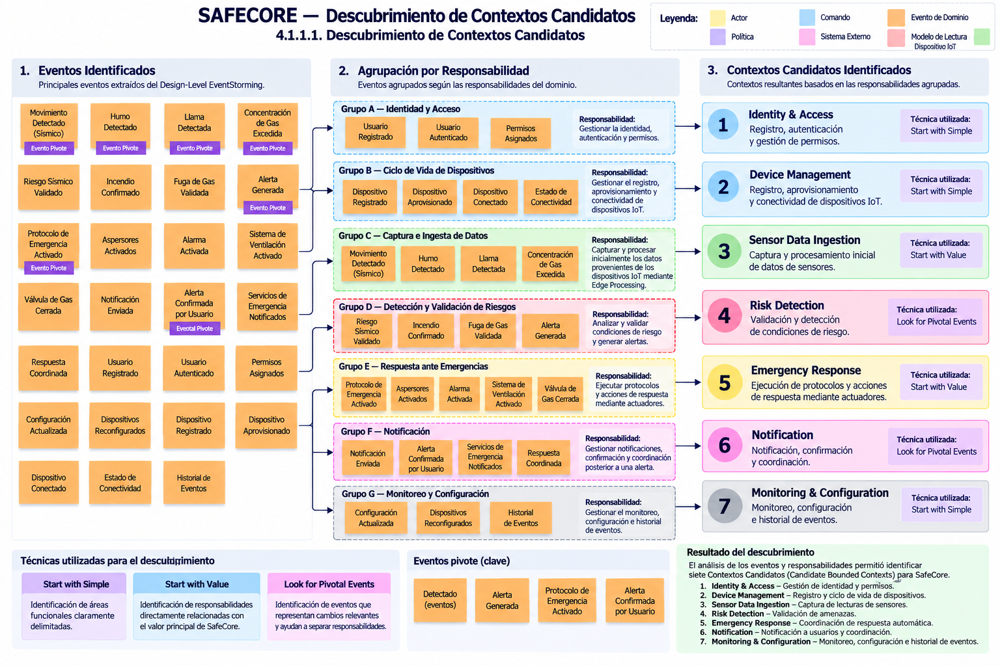

**Figura 4.1.1.1. Candidate Context Discovery de SafeCore.**

#### 4.1.1.2. Domain Message Flows Modeling

A partir de los **Bounded Contexts** candidatos identificados en la actividad anterior, se realizó el **Domain Message Flows Modeling** con el objetivo de representar cómo los comandos y eventos de dominio atraviesan los diferentes Bounded Contexts de SafeCore.

Para este modelado se analizaron tres escenarios principales de operación de la solución:

- **Escenario 1 - Detección de riesgo sísmico:** el Sensor Sísmico envía una lectura al contexto **Sensor Data Ingestion**, donde se registra el evento de movimiento sísmico detectado. Posteriormente, **Risk Detection** valida la condición y genera una alerta. Esta alerta es procesada por **Notification**, que permite notificar al residente u ocupante y comunicar la situación a los servicios de emergencia. Finalmente, **Emergency Response** ejecuta el protocolo de emergencia correspondiente mediante los actuadores.

- **Escenario 2 - Detección de incendio:** los sensores de humo y llama envían sus respectivas lecturas a **Sensor Data Ingestion**. Los eventos detectados son procesados por **Risk Detection**, donde se valida la condición y se genera el evento de incendio confirmado. Posteriormente, **Notification** gestiona la comunicación con el residente u ocupante y los servicios de emergencia, mientras que **Emergency Response** ejecuta las acciones correspondientes mediante los actuadores.

- **Escenario 3 - Detección de fuga de gas:** el Sensor de Gas envía la lectura de concentración al contexto **Sensor Data Ingestion**. Luego, **Risk Detection** procesa la información y genera el evento de fuga de gas validada. El contexto **Notification** gestiona la comunicación y **Emergency Response** ejecuta las acciones de respuesta, incluyendo la activación del sistema de ventilación y el cierre de la válvula de gas.

Los flujos permiten identificar la interacción entre los principales **Bounded Contexts** involucrados en la detección y atención de situaciones de emergencia. Asimismo, permiten visualizar los mensajes intercambiados, diferenciando comandos, eventos de dominio y consultas.

Este modelado sirve como base para analizar las dependencias entre contextos y definir posteriormente las relaciones estructurales mediante el **Context Mapping**.

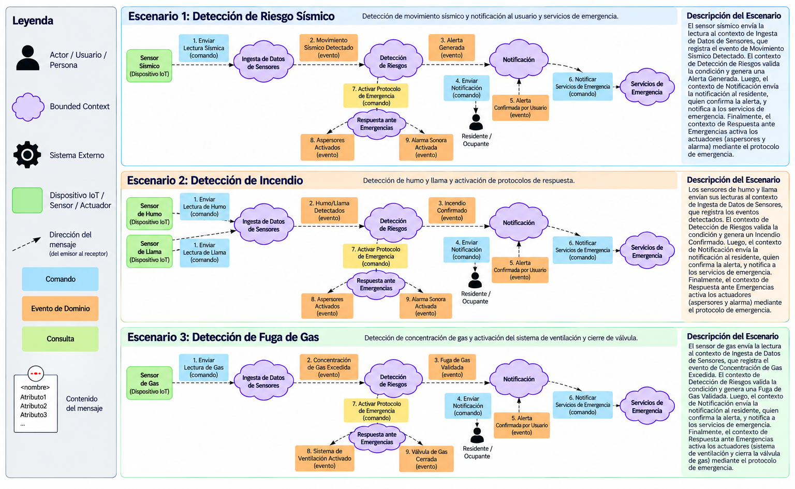

**Figura 4.1.1.2. Domain Message Flows Modeling de SafeCore.**

#### 4.1.1.3. Bounded Context Canvases

A partir de los **Bounded Contexts** identificados durante el **Candidate Context Discovery**, se elaboraron los **Bounded Context Canvases** con el propósito de definir con mayor precisión las responsabilidades, propósito, lenguaje ubicuo, decisiones de negocio y comunicaciones de cada contexto.

Para la elaboración de cada Canvas se siguió un proceso iterativo compuesto por las siguientes actividades:

1. **Context Overview Definition:** definición del propósito, alcance y responsabilidad principal de cada Bounded Context.
2. **Business Rules Distillation & Ubiquitous Language Capture:** identificación de las principales reglas de negocio y términos del lenguaje ubicuo asociados al contexto.
3. **Capability Analysis:** identificación de las capacidades necesarias para cumplir con la responsabilidad del contexto.
4. **Capability Layering:** organización de las capacidades en diferentes niveles cuando resulta aplicable.
5. **Dependencies Capture:** identificación de las dependencias y comunicaciones con otros Bounded Contexts o sistemas externos.
6. **Design Critique:** revisión del diseño para verificar la claridad de los límites, responsabilidades, reglas y dependencias del contexto.

Los Bounded Contexts analizados son:

- **Identity & Access**
- **Device Management**
- **Sensor Data Ingestion**
- **Risk Detection**
- **Emergency Response**
- **Notification**
- **Monitoring & Configuration**

Cada Canvas permite representar de manera individual los límites y responsabilidades de cada Bounded Context, sirviendo como base para el posterior análisis de las relaciones entre contextos mediante el **Context Mapping**.

##### Identity & Access

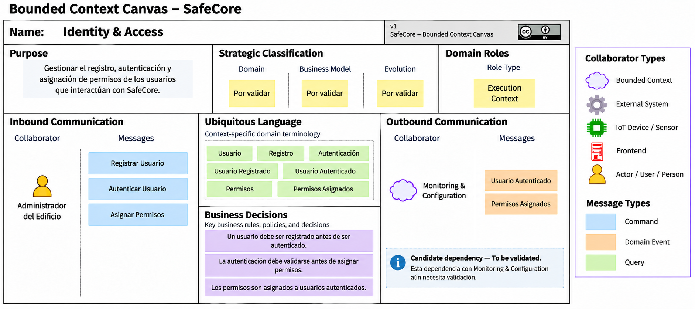

**Figura 4.1.1.3-1. Bounded Context Canvas - Identity & Access.**

##### Device Management

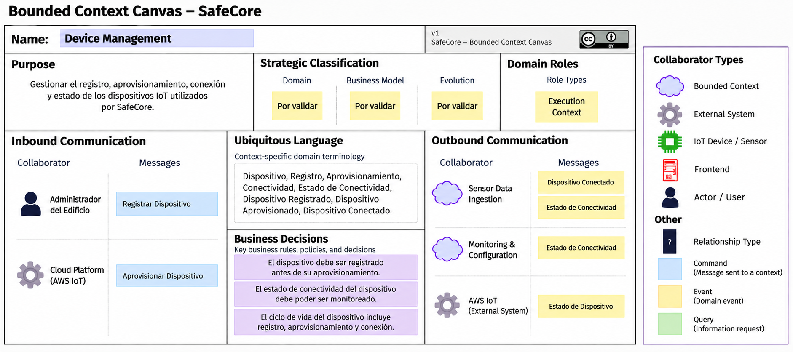

**Figura 4.1.1.3-2. Bounded Context Canvas - Device Management.**

##### Sensor Data Ingestion

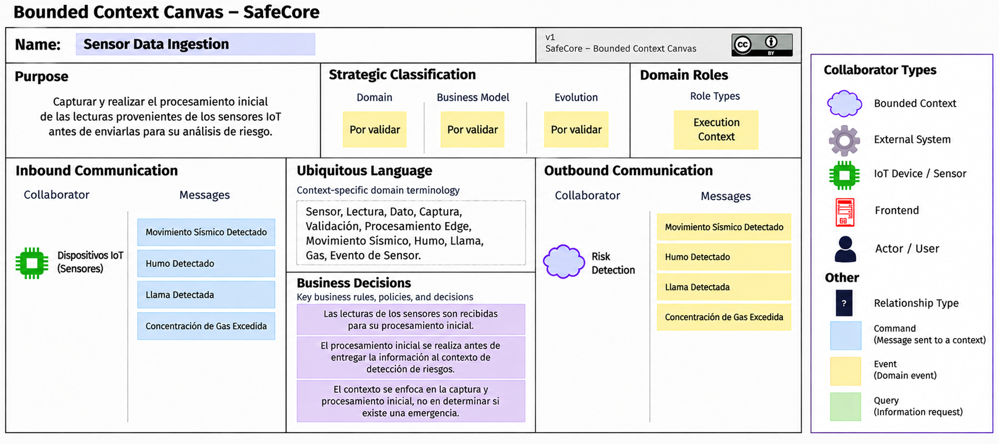

**Figura 4.1.1.3-3. Bounded Context Canvas - Sensor Data Ingestion.**

##### Risk Detection

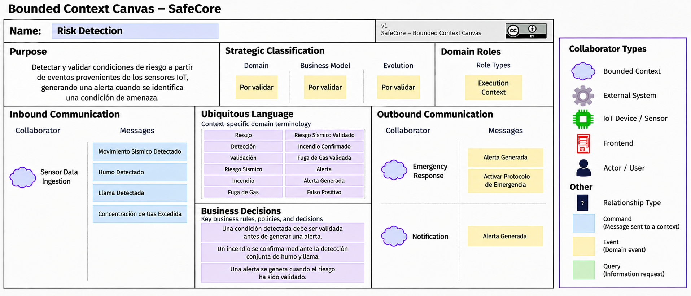

**Figura 4.1.1.3-4. Bounded Context Canvas - Risk Detection.**

##### Emergency Response

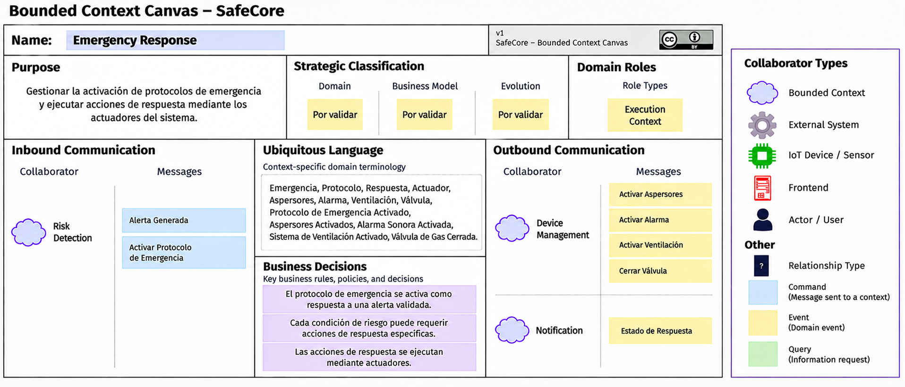

**Figura 4.1.1.3-5. Bounded Context Canvas - Emergency Response.**

##### Notification

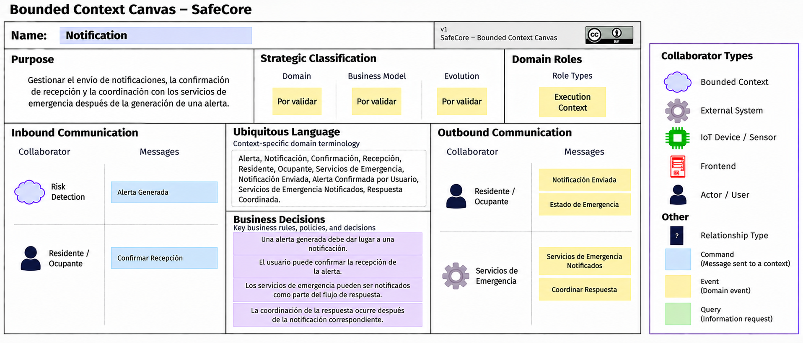

**Figura 4.1.1.3-6. Bounded Context Canvas - Notification.**

##### Monitoring & Configuration

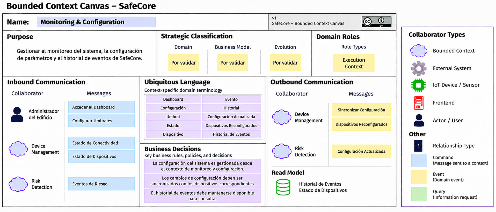

**Figura 4.1.1.3-7. Bounded Context Canvas - Monitoring & Configuration.**

Los siete Canvas constituyen la base para la siguiente actividad de **Context Mapping**, donde se analizarán las dependencias y relaciones estructurales entre los Bounded Contexts.

### 4.1.2. Context Mapping

A partir de los **Bounded Context Canvases** elaborados anteriormente, se realizó el **Context Mapping** con el objetivo de identificar las relaciones estructurales, dependencias y formas de comunicación entre los diferentes Bounded Contexts de SafeCore.

Para este análisis se revisaron las responsabilidades y dependencias identificadas en cada Canvas y se plantearon diferentes alternativas de organización de los contextos. Estas alternativas permiten evaluar cómo los cambios en los límites de los Bounded Contexts podrían afectar la comunicación, cohesión y complejidad de la solución.

#### Opción 1: Mantener los siete Bounded Contexts

Se mantienen los siete contextos identificados, conservando la separación de responsabilidades entre **Identity & Access, Device Management, Sensor Data Ingestion, Risk Detection, Emergency Response, Notification** y **Monitoring & Configuration**.

Las principales relaciones identificadas corresponden a la comunicación entre contextos para registrar usuarios, administrar dispositivos, procesar datos de sensores, detectar riesgos, ejecutar respuestas de emergencia y gestionar notificaciones.

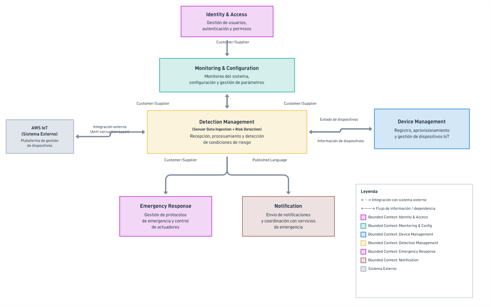

**Figura 4.1.2-1. Context Mapping de SafeCore - Opción 1.**

#### Opción 2: Unificar Sensor Data Ingestion y Risk Detection

Se propone integrar **Sensor Data Ingestion** y **Risk Detection** en un único contexto denominado **Detection Management**.

Esta alternativa reduce la comunicación entre ambos contextos, ya que la captura, procesamiento inicial y detección de condiciones de riesgo se encontrarían dentro de un mismo límite. Sin embargo, también concentra responsabilidades que actualmente se encuentran separadas.

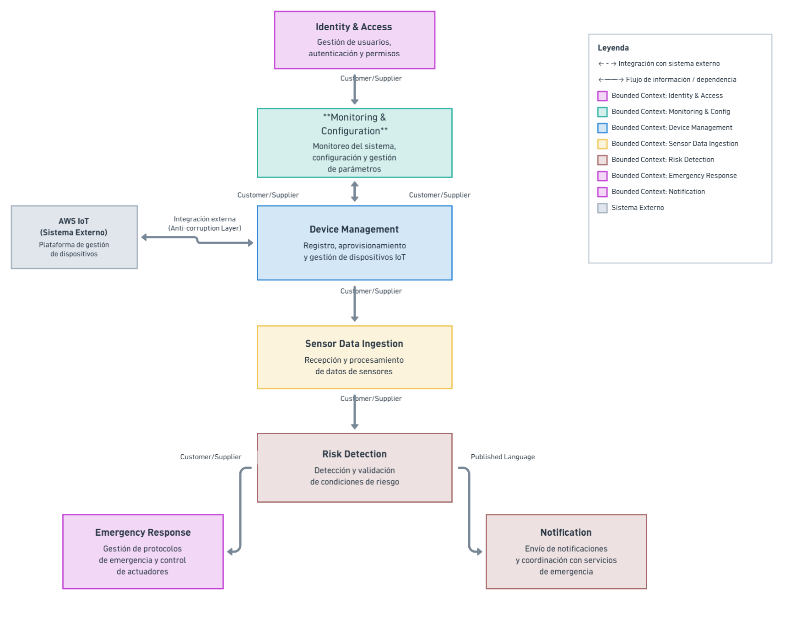

**Figura 4.1.2-2. Context Mapping de SafeCore - Opción 2.**

#### Opción 3: Separar Emergency Response y Actuator Control

Se propone separar la responsabilidad de **Emergency Response** en dos contextos: uno encargado de la coordinación de los protocolos de emergencia y otro encargado específicamente del control de los actuadores.

Esta alternativa permite diferenciar la lógica de coordinación de una emergencia de la interacción con los dispositivos físicos, aunque introduce una nueva relación entre ambos contextos.

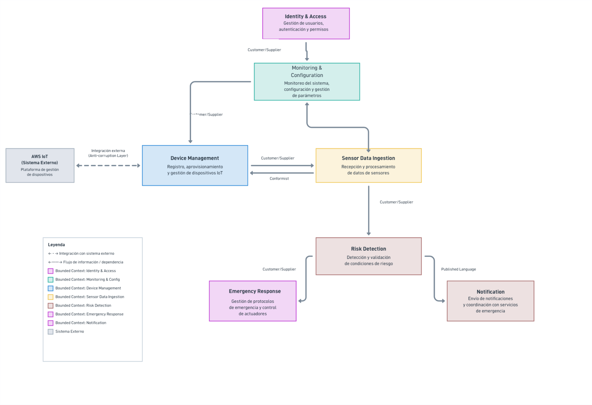

**Figura 4.1.2-3. Context Mapping de SafeCore - Opción 3.**

#### Análisis de alternativas mediante What-if

Como parte del análisis de Context Mapping se plantearon las siguientes preguntas **What-if** para evaluar posibles modificaciones de los límites y responsabilidades:

1. **¿Qué ocurriría si una capacidad de configuración se trasladara a Risk Detection?**  
   Podría reducirse una dependencia para la evaluación de riesgos, pero también se mezclarían responsabilidades de administración y detección.

2. **¿Qué ocurriría si una capacidad se descompusiera y una subcapacidad se trasladara a otro contexto?**  
   Podría lograrse una mayor especialización, aunque aumentaría la cantidad de comunicaciones entre contextos.

3. **¿Qué ocurriría si Emergency Response se dividiera en varios Bounded Contexts?**  
   La coordinación de protocolos y el control físico de actuadores podrían evolucionar de manera independiente, pero se incrementaría la complejidad de integración.

4. **¿Qué ocurriría si se creara un nuevo contexto a partir de capacidades presentes en Risk Detection, Emergency Response y Notification?**  
   Podría formarse un contexto orientado a la gestión integral de incidentes, aunque sería necesario validar que sus responsabilidades mantengan una cohesión adecuada.

5. **¿Qué ocurriría si Notification mantuviera una representación mínima de la alerta para reducir su dependencia de Risk Detection?**  
   Se podría reducir el acoplamiento entre ambos contextos, a cambio de mantener información duplicada.

6. **¿Qué ocurriría si se creara un servicio compartido para consultas de eventos e historial?**  
   Podría evitarse la duplicación de funcionalidades de consulta, aunque se introduciría una dependencia adicional sobre dicho servicio.

7. **¿Qué ocurriría si las capacidades principales de detección y respuesta se aislaran de los contextos administrativos?**  
   Se reforzaría la separación entre las capacidades operativas de emergencia y las funciones de administración, monitoreo y configuración.

#### Patrones de relación considerados

Durante el análisis se consideraron diferentes patrones de relación de **Domain-Driven Design**:

- **Customer/Supplier:** aplicable como relación candidata entre contextos donde un contexto requiere capacidades o información proporcionada por otro.
- **Published Language:** aplicable a eventos compartidos, como **Alerta Generada**, que permiten comunicar información entre contextos.
- **Anti-corruption Layer:** considerada como alternativa para aislar el modelo de SafeCore de sistemas externos, particularmente frente a servicios de infraestructura IoT como **AWS IoT**.
- **Conformist:** considerado como una posibilidad cuando un contexto depende de un modelo externo que no controla.
- **Shared Kernel:** no se establece actualmente como relación definitiva, debido a que requiere una validación adicional de las partes del modelo que podrían ser compartidas.

#### Aproximación seleccionada

Después de revisar las alternativas y las posibles modificaciones de límites, se mantiene la separación de los **siete Bounded Contexts** identificados inicialmente.

Esta aproximación permite conservar límites claros entre las responsabilidades de gestión de usuarios, administración de dispositivos, procesamiento de datos, detección de riesgos, respuesta ante emergencias, notificaciones y monitoreo/configuración. Las alternativas de unificación o división quedan como posibilidades de evolución del diseño en caso de que futuras iteraciones evidencien cambios en las responsabilidades o dependencias.

### 4.1.3. Software Architecture

La arquitectura propuesta para SafeCore se representa mediante el modelo C4, utilizando las vistas **System Landscape**, **System Context**, **Container** y **Deployment**. Estas vistas permiten describir el ecosistema de la solución, sus límites, las unidades de software que la conforman y su distribución en los entornos de ejecución. Los diagramas de componentes y código se desarrollan posteriormente en el diseño táctico de cada Bounded Context.

La solución combina procesamiento local en el inmueble (**Edge Computing**) con servicios en la nube. El nodo Edge es responsable de detectar condiciones de riesgo y ejecutar los protocolos de emergencia, incluso cuando no existe conexión a Internet. La nube permite administrar usuarios e inmuebles, consultar el historial, distribuir configuraciones y gestionar notificaciones remotas. Por tanto, la comunicación con la nube no constituye un requisito para ejecutar las acciones locales de protección.

Esta propuesta conserva los siete Bounded Contexts seleccionados en el Context Mapping. Sus límites representan responsabilidades del dominio y no implican que cada contexto deba desplegarse como un microservicio independiente. Las tecnologías y la distribución descritas constituyen decisiones de diseño propuestas, no evidencia de una implementación ya desplegada.

#### 4.1.3.1. Software Architecture System Landscape Diagram

La vista System Landscape presenta el ecosistema de SafeCore y las relaciones entre los actores y sistemas que participan en la protección de los inmuebles. Se consideran cuatro actores: el **administrador de edificio**, que supervisa inmuebles, dispositivos, umbrales y simulacros; el **propietario de vivienda**, que administra la protección de su vivienda; el **residente**, que consulta información y recibe alertas según sus permisos; y el **visitante**, que accede a la información comercial de la solución.

En esta vista general, **SafeCore** se representa como un único sistema que integra la protección y la supervisión de los inmuebles. Los administradores y propietarios gestionan la protección, los residentes consultan el estado y las alertas, y los visitantes conocen la propuesta de valor.

Como servicio externo principal se muestra el **servicio de notificaciones**, que permite entregar alertas a los usuarios. El detalle de sensores, actuadores y comunicación IoT se desarrolla en la vista de contexto. Esta selección permite presentar el propósito de SafeCore y sus usuarios de manera sencilla.

**Figura 4.1.3.1. Diagrama System Landscape de SafeCore.**

[Abrir diagrama en resolución original](assets/architecture/SafeCoreLandscape-dark.png) · [Consultar leyenda](assets/architecture/SafeCoreLandscape-dark-key.png)

#### 4.1.3.2. Software Architecture Context Level Diagrams

La vista de contexto representa a **SafeCore como un único sistema de software**, incluyendo tanto sus aplicaciones y servicios en la nube como su capacidad de procesamiento local. El administrador y el propietario utilizan el sistema para registrar inmuebles, supervisar sensores, consultar eventos y gestionar configuraciones y pruebas de acuerdo con sus permisos. El residente consulta el estado y las alertas que le corresponden, mientras que el visitante conoce los beneficios de la solución mediante la landing page.

Las relaciones con los dispositivos describen dos intercambios principales: la recepción de lecturas desde la red de sensores y el envío de órdenes hacia los actuadores, junto con la recepción de sus resultados de ejecución. AWS IoT Core transporta telemetría, eventos, configuraciones y solicitudes remotas entre la nube y los nodos Edge. El servicio de notificaciones recibe solicitudes de entrega de alertas y las distribuye por SMS o push.

El límite del sistema permite distinguir las responsabilidades propias de SafeCore de las funciones proporcionadas por dispositivos y servicios externos. Ante la pérdida de Internet, la detección y la actuación permanecen disponibles localmente; las consultas desde clientes remotos, los cambios de configuración enviados desde la nube y las notificaciones externas requieren conectividad. Los eventos pendientes se conservan en el inmueble para sincronizarlos cuando se restablece la conexión.

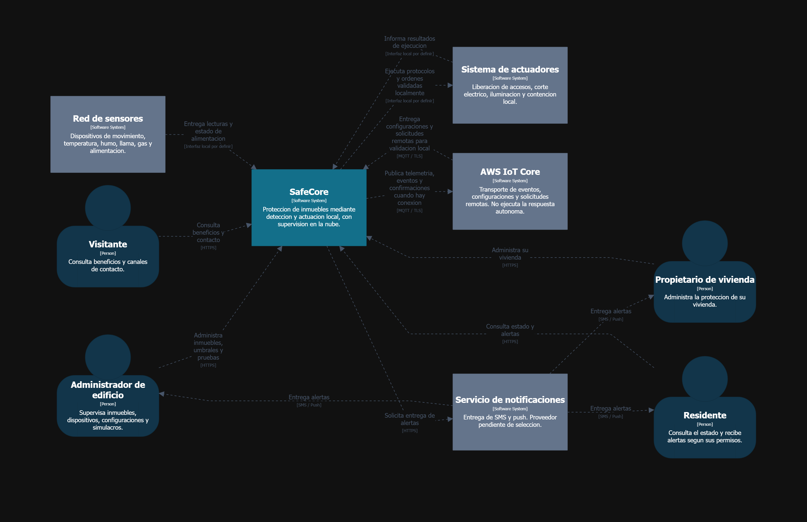

**Figura 4.1.3.2. Diagrama System Context de SafeCore.**

[Abrir diagrama en resolución original](assets/architecture/SafeCoreContext-dark.png) · [Consultar leyenda](assets/architecture/SafeCoreContext-dark-key.png)

#### 4.1.3.3. Software Architecture Container Level Diagrams

La vista de contenedores descompone SafeCore en aplicaciones y almacenes de datos con responsabilidades diferenciadas. En el modelo C4, un contenedor representa una unidad de ejecución o almacenamiento y no exige el uso de Docker. Se propone la siguiente organización:

| Contenedor | Responsabilidad |
|---|---|
| **Landing Page** | Presentar la propuesta de valor, los beneficios y los canales de contacto, y dirigir al visitante hacia el acceso a la plataforma. |
| **Aplicación Web** | Proporcionar el dashboard para la administración de inmuebles, monitoreo, configuración de umbrales, consulta del historial y solicitud de pruebas. |
| **Aplicación Móvil** | Permitir la consulta del estado y las alertas, y ofrecer operaciones de administración según el rol del usuario. |
| **API y Servicios de Aplicación** | Exponer la API REST, autenticar usuarios, aplicar permisos, administrar inmuebles y dispositivos, registrar eventos y coordinar la configuración y las notificaciones remotas. Se propone Java con Spring Boot, en coherencia con la persistencia JPA descrita en el diseño táctico. |
| **Base de Datos Central** | Persistir usuarios, inmuebles, dispositivos, configuraciones e historial de eventos y respuestas sincronizadas. El motor queda pendiente de selección. |
| **Servicio Edge** | Capturar lecturas, evaluar condiciones de riesgo, ejecutar protocolos sobre actuadores y registrar resultados localmente. También valida las solicitudes remotas y sincroniza eventos con la nube. |
| **Almacenamiento Local** | Conservar la configuración vigente, los protocolos y los eventos pendientes de sincronización, permitiendo que el Servicio Edge continúe operando sin Internet. |

Las aplicaciones Web y Móvil consumen la API mediante **HTTPS**. La API accede a la Base de Datos Central y solicita al proveedor externo la entrega de notificaciones. La integración con **AWS IoT Core** se plantea mediante MQTT sobre TLS para transportar eventos, configuraciones y solicitudes entre el Servicio Edge y los servicios de aplicación. Las interfaces físicas y protocolos locales de sensores y actuadores se definirán según el hardware seleccionado.

El recorrido crítico de una emergencia es **sensores → Servicio Edge → actuadores**. El Servicio Edge registra los resultados en el Almacenamiento Local y publica los eventos hacia la nube cuando existe conectividad. Cada evento contará con un identificador estable para evitar registros duplicados durante los reintentos de sincronización. Las configuraciones se conservarán con una versión y una confirmación de aplicación; una configuración enviada desde la nube no se considerará activa hasta que el nodo confirme su validación y almacenamiento.

Las responsabilidades de **Sensor Data Ingestion**, **Risk Detection** y la ejecución de **Emergency Response** se sitúan en el Servicio Edge para sostener la respuesta autónoma. **Identity & Access**, **Device Management**, **Notification** y la administración central de **Monitoring & Configuration** se organizan como módulos de los servicios de aplicación. El nodo mantiene la configuración operativa y los resultados de emergencia necesarios para su funcionamiento, mientras que la nube conserva su representación sincronizada para consulta y seguimiento.

La integración `ActuatorGatewayServiceImpl` con AWS IoT Core descrita en el apartado 4.2 se interpreta como el canal para solicitudes remotas dirigidas al nodo Edge. La ejecución autónoma requiere además un adaptador local hacia los actuadores. De esta manera, las pruebas y solicitudes remotas pueden utilizar la nube, mientras que una emergencia detectada en el inmueble se resuelve mediante el recorrido local. Una solicitud enviada no equivale a una acción completada: el resultado se registra a partir de la confirmación del nodo y del dispositivo correspondiente.

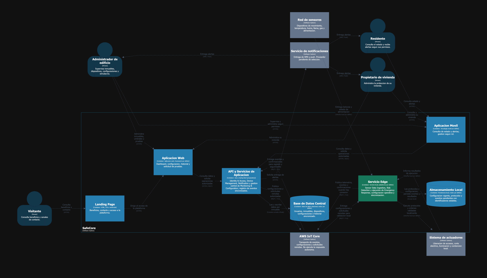

**Figura 4.1.3.3. Diagrama Container de SafeCore.**

[Abrir diagrama en resolución original](assets/architecture/SafeCoreContainers-dark.png) · [Consultar leyenda](assets/architecture/SafeCoreContainers-dark-key.png)

#### 4.1.3.4. Software Architecture Deployment Diagrams

La vista de despliegue distribuye los contenedores propuestos en los siguientes entornos:

| Entorno | Elementos desplegados |
|---|---|
| **Dispositivos de los usuarios** | Navegadores que ejecutan la Landing Page o la Aplicación Web, y dispositivos móviles que ejecutan la Aplicación Móvil. |
| **Infraestructura en la nube** | Alojamiento de los recursos web, entorno de ejecución de la API y los servicios de aplicación, y servidor de Base de Datos Central. Los servicios concretos de alojamiento quedan pendientes de selección. |
| **Servicios externos administrados** | AWS IoT Core para la comunicación con los nodos Edge y el proveedor de notificaciones SMS y push. |
| **Inmueble protegido** | Nodo Edge con el Servicio Edge y el Almacenamiento Local, red de sensores y sistema de actuadores. Se contempla alimentación de respaldo para los elementos necesarios de la operación local. |

Los navegadores obtienen los recursos de las aplicaciones desde el alojamiento web por HTTPS y ejecutan las interfaces en el dispositivo del usuario. La Aplicación Web y la Aplicación Móvil se comunican con la API mediante HTTPS. El nodo Edge establece la comunicación con AWS IoT Core mediante MQTT sobre TLS y utiliza interfaces locales para interactuar con los sensores y actuadores. La Base de Datos Central se sitúa en una red privada accesible desde los servicios de aplicación, sin acceso directo desde los clientes.

El diagrama representa un inmueble como patrón de despliegue repetible. Cada inmueble contará con identidad de dispositivo, configuración y almacenamiento local propios. La plataforma verificará los permisos por usuario e inmueble y restringirá los canales de comunicación de cada nodo a sus recursos autorizados.

Durante una interrupción de Internet, el nodo continúa evaluando lecturas y ejecutando protocolos con su última configuración válida. Ante la pérdida de energía comercial, la continuidad prevista depende de la capacidad del respaldo energético y de los componentes alimentados por este. Cuando se recupera la conectividad, el nodo sincroniza los registros pendientes sin volver a ejecutar las acciones de emergencia ya realizadas. La autonomía energética, los tiempos de respuesta y la recuperación de comunicaciones deberán validarse mediante pruebas del prototipo.

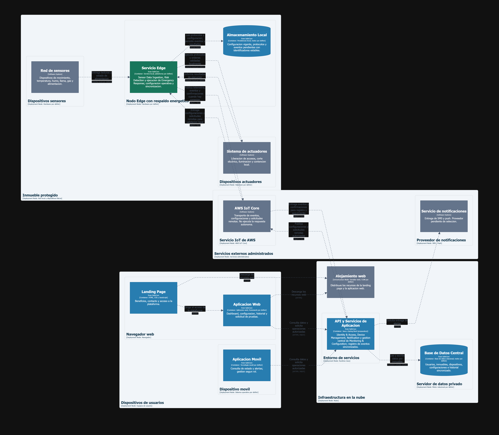

**Figura 4.1.3.4. Diagrama Deployment de SafeCore.**

[Abrir diagrama en resolución original](assets/architecture/SafeCoreDeployment-dark.png) · [Consultar leyenda](assets/architecture/SafeCoreDeployment-dark-key.png)

## 4.2. Tactical-Level Domain-Driven Design

#### 4.2.1. Bounded Context: Emergency Response

El **Emergency Response Bounded Context** es responsable de ejecutar y coordinar las acciones definidas por los protocolos de emergencia de SafeCore. Este contexto recibe las situaciones de riesgo previamente identificadas por el Risk Detection Bounded Context y coordina la ejecución de las acciones de respuesta mediante los actuadores IoT disponibles.

Su responsabilidad se centra en transformar una situación de emergencia detectada en acciones concretas de respuesta, tales como la activación de protocolos de emergencia, el envío de comandos a actuadores y la ejecución coordinada de medidas destinadas a reducir el impacto del evento.

Dentro de este contexto se consideran escenarios como la respuesta ante movimientos sísmicos, incendios y fugas de gas. Dependiendo del tipo de emergencia, el sistema puede ejecutar diferentes acciones, como activar mecanismos de seguridad, controlar dispositivos de ventilación, cerrar válvulas de gas o coordinar otros actuadores definidos por el protocolo correspondiente.

El contexto mantiene su propia lógica de dominio para determinar cómo deben ejecutarse los protocolos y acciones de emergencia, mientras que los detalles de comunicación con dispositivos IoT y otros componentes externos se mantienen en la capa de infraestructura.

De esta manera, el **Emergency Response Bounded Context** permite separar la lógica relacionada con la respuesta ante emergencias de otros contextos del sistema, como **Risk Detection**, encargado de identificar las condiciones de riesgo, y **Notification**, encargado de gestionar las comunicaciones y notificaciones asociadas a las alertas.

#### 4.2.1.1. Domain Layer

La **Domain Layer** del **Emergency Response Bounded Context** encapsula la lógica de negocio relacionada con la ejecución y coordinación de las acciones de respuesta ante una emergencia. En esta capa se definen los elementos principales del dominio, como agregados, entidades y objetos de valor, que representan los conceptos clave del contexto.

**Aggregates**

1. **EmergencyResponse**
   - **Propósito**: El agregado principal es la respuesta de emergencia (`EmergencyResponse`), que encapsula la lógica de negocio relacionada con la ejecución coordinada de las acciones frente a una situación de riesgo.
   - **Atributos**:
     - `id`: Identificador único de la respuesta de emergencia.
     - `emergencyType`: Tipo de emergencia que origina la respuesta, representado como un objeto de valor (`EmergencyType`).
     - `riskSituationReference`: Referencia inmutable a la situación de riesgo que originó la respuesta.
     - `status`: Estado actual de la respuesta, representado como un objeto de valor (`ResponseStatus`).
     - `actions`: Conjunto de acciones asociadas a la respuesta, representadas como una relación **OneToMany** con la entidad `ResponseAction`.
   - **Métodos**:
     - `addAction(ResponseAction action)`: Agrega una acción de respuesta al agregado.
     - `markActionAsExecuted(String actionId)`: Marca una acción específica como ejecutada y actualiza el estado general de la respuesta.
     - `complete()`: Marca la respuesta como completada cuando todas sus acciones han finalizado.
   - **Características**:
     - Extiende `AuditableAbstractAggregateRoot`, lo que permite auditar cambios en las respuestas de emergencia.
     - Gestiona la relación entre la respuesta y sus acciones, asegurando consistencia en el orden y estado de ejecución.

2. **EmergencyProtocol**
   - **Propósito**: El agregado `EmergencyProtocol` representa la definición reutilizable de un protocolo de emergencia, a partir del cual se instancia un `EmergencyResponse`.
   - **Atributos**:
     - `id`: Identificador único del protocolo.
     - `emergencyType`: Tipo de emergencia al que aplica el protocolo, representado como un objeto de valor (`EmergencyType`).
     - `steps`: Conjunto ordenado de pasos del protocolo, representados como una relación **OneToMany** con la entidad `ProtocolStep`.
   - **Métodos**:
     - `addStep(ProtocolStep step)`: Agrega un paso al protocolo, validando su orden de ejecución.
     - `getOrderedSteps()`: Devuelve los pasos del protocolo ordenados según su secuencia de ejecución.
   - **Características**:
     - Extiende `AuditableAbstractAggregateRoot`, lo que permite auditar cambios en los protocolos.
     - Gestiona la relación entre el protocolo y sus pasos, asegurando consistencia en su orden.

**Entities**

1. **ResponseAction**
   - **Propósito**: La entidad `ResponseAction` representa una acción concreta ejecutada dentro de una respuesta de emergencia.
   - **Atributos**:
     - `id`: Identificador único de la acción.
     - `command`: Comando enviado al actuador, representado como un objeto de valor (`ActuatorCommand`).
     - `status`: Estado de ejecución de la acción, representado como un objeto de valor (`ResponseStatus`).
   - **Métodos**:
     - `markAsExecuted()`: Marca la acción como ejecutada exitosamente.
     - `markAsFailed(String reason)`: Marca la acción como fallida, registrando el motivo.
   - **Características**:
     - Su ciclo de vida depende del agregado `EmergencyResponse`, del cual forma parte.
     - Facilita el seguimiento individual de cada acción dentro de una respuesta.

2. **ProtocolStep**
   - **Propósito**: La entidad `ProtocolStep` representa un paso individual dentro de un protocolo de emergencia.
   - **Atributos**:
     - `id`: Identificador único del paso.
     - `order`: Posición del paso dentro de la secuencia del protocolo.
     - `actuatorType`: Tipo de actuador sobre el cual debe ejecutarse el paso.
     - `actionTemplate`: Plantilla de la acción a generar cuando el paso se ejecuta.
   - **Métodos**:
     - `toResponseAction()`: Genera una instancia de `ResponseAction` a partir del paso, al momento de ejecutar el protocolo.
   - **Características**:
     - Define una relación ordenada entre los pasos y su secuencia de ejecución dentro del protocolo.
     - Facilita la generación consistente de acciones de respuesta.

**Value Objects**

1. **EmergencyType**
   - **Propósito**: El objeto de valor `EmergencyType` es una enumeración que define los tipos de emergencia soportados por el sistema.
   - **Valores**:
     - `SEISMIC_EVENT`: Movimiento sísmico.
     - `FIRE`: Incendio.
     - `GAS_LEAK`: Fuga de gas.
   - **Características**:
     - Representa los tipos de emergencia como valores inmutables, determinando qué protocolo debe activarse.

2. **ResponseStatus**
   - **Propósito**: El objeto de valor `ResponseStatus` es una enumeración que define los posibles estados de una respuesta o acción de emergencia.
   - **Valores**:
     - `INITIATED`: Respuesta o acción iniciada.
     - `IN_PROGRESS`: En ejecución.
     - `COMPLETED`: Completada exitosamente.
     - `FAILED`: Fallida.
   - **Características**:
     - Representa el ciclo de vida de ejecución como valores inmutables, asegurando consistencia en el seguimiento del estado.

3. **ActuatorCommand**
   - **Propósito**: El objeto de valor `ActuatorCommand` representa el comando enviado a un actuador IoT como parte de una acción de respuesta.
   - **Atributos**:
     - `actuatorType`: Tipo de actuador destinatario del comando (p. ej. válvula de gas, sistema de iluminación).
     - `instruction`: Instrucción específica a ejecutar por el actuador.
     - `parameters`: Parámetros adicionales requeridos para la ejecución del comando.
   - **Características**:
     - No posee identidad propia; dos comandos con los mismos datos se consideran equivalentes.
     - Encapsula la información necesaria para la comunicación con actuadores, sin exponer detalles de infraestructura.

4. **RiskSituationReference**
   - **Propósito**: El objeto de valor `RiskSituationReference` representa una referencia inmutable a la situación de riesgo que originó una respuesta de emergencia.
   - **Atributos**:
     - `riskSituationId`: Identificador de la situación de riesgo, proveniente del Risk Detection Bounded Context.
     - `detectedAt`: Fecha y hora en que fue detectada la situación de riesgo.
   - **Características**:
     - Evita acoplar el agregado `EmergencyResponse` al modelo interno de otro Bounded Context.

En conjunto, estos elementos permiten modelar de manera robusta la lógica de negocio relacionada con la ejecución de protocolos y acciones de emergencia, asegurando que las reglas del dominio se cumplan de manera consistente e independiente de los detalles de infraestructura.

#### 4.2.1.2. Interface Layer

La **Interface Layer** del **Emergency Response Bounded Context** expone los puntos de entrada al sistema a través de controladores REST. Estos controladores permiten la interacción con las entidades del dominio mediante solicitudes HTTP, facilitando la comunicación entre los clientes (u otros Bounded Contexts, como Risk Detection) y el sistema. Además, esta capa incluye recursos y transformadores que aseguran una representación adecuada de los datos y su conversión entre las capas de la aplicación.

**Controllers**

Los controladores son responsables de manejar las solicitudes HTTP y delegar la lógica de negocio a los servicios correspondientes. A continuación, se describen los principales controladores:

1. **EmergencyResponsesController**
   - **Propósito**: Gestiona las operaciones relacionadas con las respuestas de emergencia.
   - **Endpoints**:
     - `GET /api/v1/emergency-responses`: Obtiene la lista de todas las respuestas de emergencia.
     - `GET /api/v1/emergency-responses/{emergencyResponseId}`: Obtiene los detalles de una respuesta de emergencia específica, incluyendo sus acciones.
     - `POST /api/v1/emergency-responses`: Inicia una nueva respuesta de emergencia a partir de una situación de riesgo detectada.
   - **Dependencias**:
     - `EmergencyResponseQueryService`: Servicio encargado de manejar las consultas relacionadas con las respuestas de emergencia.
     - `EmergencyResponseCommandService`: Servicio encargado de manejar los comandos relacionados con la creación y actualización de respuestas de emergencia.

2. **EmergencyProtocolsController**
   - **Propósito**: Gestiona las operaciones relacionadas con los protocolos de emergencia.
   - **Endpoints**:
     - `GET /api/v1/emergency-protocols`: Obtiene la lista de todos los protocolos de emergencia disponibles.
     - `GET /api/v1/emergency-protocols/{protocolId}`: Obtiene los detalles de un protocolo específico, incluyendo sus pasos.
   - **Dependencias**:
     - `EmergencyProtocolQueryService`: Servicio encargado de manejar las consultas relacionadas con los protocolos de emergencia.

3. **ResponseActionsController**
   - **Propósito**: Gestiona las operaciones relacionadas con las acciones individuales de una respuesta de emergencia.
   - **Endpoints**:
     - `GET /api/v1/emergency-responses/{emergencyResponseId}/actions`: Obtiene la lista de acciones asociadas a una respuesta de emergencia.
     - `PATCH /api/v1/emergency-responses/{emergencyResponseId}/actions/{actionId}`: Actualiza el estado de ejecución de una acción (usado como callback tras la ejecución de un comando sobre un actuador).
   - **Dependencias**:
     - `ResponseActionCommandService`: Servicio encargado de manejar los comandos relacionados con la actualización del estado de las acciones.

**Resources**

Los recursos representan los datos que se exponen a través de la API REST. Estos recursos son utilizados para estructurar las respuestas de los controladores y asegurar una representación clara y consistente de los datos. A continuación, se describen los principales recursos:

1. **EmergencyResponseResource** Representa una respuesta de emergencia en el sistema.
   - **Atributos**:
     - `id`: Identificador único de la respuesta de emergencia.
     - `emergencyType`: Tipo de emergencia asociada.
     - `status`: Estado actual de la respuesta.
     - `riskSituationId`: Identificador de la situación de riesgo que originó la respuesta.
     - `actions`: Lista de acciones asociadas a la respuesta.

2. **EmergencyProtocolResource** Representa un protocolo de emergencia en el sistema.
   - **Atributos**:
     - `id`: Identificador único del protocolo.
     - `emergencyType`: Tipo de emergencia al que aplica el protocolo.
     - `steps`: Lista ordenada de pasos que componen el protocolo.

3. **ResponseActionResource** Representa una acción de respuesta en el sistema.
   - **Atributos**:
     - `id`: Identificador único de la acción.
     - `actuatorType`: Tipo de actuador destinatario de la acción.
     - `instruction`: Instrucción enviada al actuador.
     - `status`: Estado de ejecución de la acción.

4. **InitiateEmergencyResponseResource** Representa los datos necesarios para iniciar una nueva respuesta de emergencia.
   - **Atributos**:
     - `emergencyType`: Tipo de emergencia detectada.
     - `riskSituationId`: Identificador de la situación de riesgo asociada.
     - `detectedAt`: Fecha y hora en que fue detectada la situación de riesgo.

5. **UpdateResponseActionStatusResource** Representa los datos necesarios para actualizar el estado de una acción de respuesta.
   - **Atributos**:
     - `status`: Nuevo estado de la acción.
     - `resultDetails`: Detalles del resultado devuelto por el actuador (opcional, usado en caso de fallo).

**Transformers**

Los transformadores son responsables de convertir las entidades del dominio en recursos y viceversa. Esto asegura que los datos expuestos a través de la API REST sean consistentes y estén en el formato esperado. A continuación, se describen los principales transformadores:

1. **EmergencyResponseResourceFromEntityAssembler** Convierte una entidad `EmergencyResponse` en un recurso `EmergencyResponseResource`.
   - **Método principal**:
     - `toResourceFromEntity(EmergencyResponse entity)`: Transforma una respuesta de emergencia del dominio en un recurso.

2. **EmergencyProtocolResourceFromEntityAssembler** Convierte una entidad `EmergencyProtocol` en un recurso `EmergencyProtocolResource`.
   - **Método principal**:
     - `toResourceFromEntity(EmergencyProtocol entity)`: Transforma un protocolo de emergencia del dominio en un recurso.

3. **ResponseActionResourceFromEntityAssembler** Convierte una entidad `ResponseAction` en un recurso `ResponseActionResource`.
   - **Método principal**:
     - `toResourceFromEntity(ResponseAction entity)`: Transforma una acción de respuesta del dominio en un recurso.

4. **InitiateEmergencyResponseCommandFromResourceAssembler** Convierte un recurso `InitiateEmergencyResponseResource` en un comando `InitiateEmergencyResponseCommand`.
   - **Método principal**:
     - `toCommandFromResource(InitiateEmergencyResponseResource resource)`: Transforma los datos de inicio de una respuesta en un comando.

5. **UpdateResponseActionStatusCommandFromResourceAssembler** Convierte un recurso `UpdateResponseActionStatusResource` en un comando `UpdateResponseActionStatusCommand`.
   - **Método principal**:
     - `toCommandFromResource(UpdateResponseActionStatusResource resource)`: Transforma los datos de actualización de una acción en un comando.

**Relaciones entre componentes**

- Los controladores utilizan los servicios de consulta (`EmergencyResponseQueryService`, `EmergencyProtocolQueryService`) y de comandos (`EmergencyResponseCommandService`, `ResponseActionCommandService`) para delegar la lógica de negocio.
- Los transformadores convierten las entidades del dominio en recursos para las respuestas HTTP, y transforman los recursos entrantes en comandos para las solicitudes que modifican el estado del sistema.
- Los recursos estructuran los datos expuestos a los clientes y a otros Bounded Contexts (como Risk Detection, que consume el endpoint de inicio de respuesta), asegurando una representación clara y consistente.

Esta estructura asegura que la Interface Layer sea modular, reutilizable y fácil de mantener, facilitando la interacción entre los clientes, otros Bounded Contexts y el sistema.

#### 4.2.1.3. Application Layer

La **Application Layer** del **Emergency Response Bounded Context** actúa como un intermediario entre la Domain Layer y las capas externas, como la Interface Layer y la Infrastructure Layer. Su propósito principal es coordinar las operaciones de negocio, manejar comandos y consultas, y orquestar la lógica de aplicación —como la selección y ejecución de protocolos de emergencia— sin exponer directamente los detalles del dominio.

**Command Services**

Los servicios de comandos son responsables de ejecutar operaciones que modifican el estado del sistema. A continuación, se describen los principales servicios de comandos:

1. **EmergencyResponseCommandServiceImpl**
   - **Propósito**: Gestiona las operaciones relacionadas con las respuestas de emergencia, como su creación a partir de una situación de riesgo detectada.
   - **Métodos principales**:
     - `handle(InitiateEmergencyResponseCommand command)`: Selecciona el protocolo de emergencia correspondiente al tipo de emergencia recibido, genera las acciones de respuesta a partir de sus pasos y crea una nueva `EmergencyResponse`.
   - **Dependencias**:
     - `EmergencyResponseRepository`: Interactúa con la base de datos para guardar y recuperar respuestas de emergencia.
     - `EmergencyProtocolRepository`: Recupera el protocolo aplicable al tipo de emergencia recibido.
     - `ProtocolSelectionService`: Determina qué protocolo de emergencia corresponde activar.
     - `ProtocolExecutionService`: Orquesta la generación de las acciones de respuesta a partir de los pasos del protocolo.

2. **ResponseActionCommandServiceImpl**
   - **Propósito**: Gestiona las operaciones relacionadas con las acciones individuales de una respuesta de emergencia, como la actualización de su estado de ejecución.
   - **Métodos principales**:
     - `handle(UpdateResponseActionStatusCommand command)`: Actualiza el estado de una acción de respuesta (ejecutada o fallida) y verifica si corresponde marcar la respuesta de emergencia como completada.
   - **Dependencias**:
     - `EmergencyResponseRepository`: Interactúa con la base de datos para recuperar y actualizar la respuesta de emergencia asociada.
     - `ActuatorGatewayService`: Servicio externo utilizado para despachar los comandos de actuador correspondientes a cada acción.

**Query Services**

Los servicios de consultas son responsables de recuperar información del sistema sin modificar su estado. A continuación, se describen los principales servicios de consultas:

1. **EmergencyResponseQueryServiceImpl**
   - **Propósito**: Gestiona las consultas relacionadas con las respuestas de emergencia.
   - **Métodos principales**:
     - `handle(GetAllEmergencyResponsesQuery query)`: Recupera todas las respuestas de emergencia registradas en el sistema.
     - `handle(GetEmergencyResponseByIdQuery query)`: Recupera una respuesta de emergencia específica por su ID, incluyendo sus acciones asociadas.
   - **Dependencias**:
     - `EmergencyResponseRepository`: Interactúa con la base de datos para recuperar respuestas de emergencia.

2. **EmergencyProtocolQueryServiceImpl**
   - **Propósito**: Gestiona las consultas relacionadas con los protocolos de emergencia.
   - **Métodos principales**:
     - `handle(GetAllEmergencyProtocolsQuery query)`: Recupera todos los protocolos de emergencia disponibles en el sistema.
     - `handle(GetEmergencyProtocolByIdQuery query)`: Recupera un protocolo específico por su ID, incluyendo sus pasos.
   - **Dependencias**:
     - `EmergencyProtocolRepository`: Interactúa con la base de datos para recuperar protocolos de emergencia.

**Relaciones entre componentes**

- Los Command Services interactúan con los repositorios para modificar el estado del sistema, con los servicios de dominio (`ProtocolSelectionService`, `ProtocolExecutionService`) para aplicar las reglas de negocio, y con servicios externos, como `ActuatorGatewayService`, para el despacho de comandos hacia los actuadores IoT.
- Los Query Services interactúan únicamente con los repositorios para recuperar información del sistema.

Esta estructura asegura que la Application Layer sea modular, reutilizable y fácil de mantener, permitiendo una separación clara de responsabilidades y facilitando la evolución del sistema.

#### 4.2.1.4. Infrastructure Layer

La **Infrastructure Layer** del **Emergency Response Bounded Context** proporciona las implementaciones técnicas necesarias para soportar las operaciones del sistema. Esta capa incluye repositorios para la persistencia de datos y componentes relacionados con la comunicación hacia los actuadores IoT y la publicación de eventos de dominio hacia otros Bounded Contexts. Su objetivo principal es conectar la lógica de negocio con los recursos externos, como la base de datos, los dispositivos IoT y los servicios de mensajería.

**Persistencia (JPA Repositories)**

1. **EmergencyResponseRepository**
   - **Propósito**: Proporciona métodos para interactuar con la base de datos de respuestas de emergencia.
   - **Métodos principales**:
     - `findByStatus`: Busca respuestas de emergencia según su estado actual.
     - `findByEmergencyType`: Busca respuestas de emergencia asociadas a un tipo de emergencia específico.

2. **EmergencyProtocolRepository**
   - **Propósito**: Proporciona métodos para interactuar con la base de datos de protocolos de emergencia.
   - **Métodos principales**:
     - `findByEmergencyType`: Busca el protocolo de emergencia correspondiente a un tipo de emergencia específico.
     - `existsByEmergencyType`: Verifica si existe un protocolo definido para un tipo de emergencia.

**Servicios Externos (Gateways)**

1. **ActuatorGatewayServiceImpl**
   - **Propósito**: Implementa la comunicación con la infraestructura IoT (AWS IoT Core) para el envío de comandos hacia los actuadores físicos, actuando como Anti-Corruption Layer frente al modelo externo del proveedor.
   - **Métodos principales**:
     - `dispatch(ActuatorCommand command)`: Traduce un comando del dominio a la representación requerida por AWS IoT y lo envía al actuador correspondiente.

2. **EmergencyEventPublisherServiceImpl**
   - **Propósito**: Publica los eventos de dominio generados por el Emergency Response Bounded Context (`EmergencyResponseInitiated`, `ResponseActionExecuted`, `ResponseActionFailed`, `EmergencyResponseCompleted`) hacia el bus de eventos, permitiendo que otros Bounded Contexts, como Notification, reaccionen a ellos.
   - **Métodos principales**:
     - `publish(DomainEvent event)`: Serializa y publica un evento de dominio en el canal de mensajería correspondiente.

**Relaciones entre componentes**

- **Persistencia**: Los repositorios (`EmergencyResponseRepository`, `EmergencyProtocolRepository`) proporcionan acceso a los datos almacenados en la base de datos, permitiendo a las capas superiores interactuar con las entidades del dominio.
- **Servicios externos**: `ActuatorGatewayServiceImpl` traduce las decisiones del dominio en comandos físicos ejecutados por los actuadores, mientras que `EmergencyEventPublisherServiceImpl` desacopla al Emergency Response Bounded Context de los demás contextos que consumen sus eventos.

Esta estructura asegura que la Infrastructure Layer sea modular, reutilizable y fácil de mantener, facilitando la integración con otros sistemas y servicios externos.

#### 4.2.X.5. Bounded Context Software Architecture Component Level Diagrams

_[...]_

#### 4.2.X.6. Bounded Context Software Architecture Code Level Diagrams

##### 4.2.X.6.1. Bounded Context Domain Layer Class Diagrams

_[...]_

##### 4.2.X.6.2. Bounded Context Database Design Diagram

_[...]_

# Conclusiones

_[Avance de conclusiones para AV1]_

# Bibliografía

- SkyAlert. (2026, 8 de mayo). *Actualización: Sismos en Venezuela 2026*. SkyAlert. https://skyalert.mx/articulos/actualizacion-sismos-venezuela-2026
- Infobae. (2026, 11 de septiembre). *Un mes después del terremoto volvió a temblar en el Pacífico: sismo de 4.5 con epicentro en el Chocó se sintió en Cali, Pereira y Manizales*. Infobae. https://www.infobae.com/colombia/2026/09/11/un-mes-despues-del-terremoto-volvio-a-teblar-en-el-pacifico-sismo-de-45-con-epicentro-en-el-choco-se-sintio-en-cali-pereira-y-manizales/
- El Comercio. (2026, 22 de julio). *Perú registra 477 sismos en lo que va del 2026 y 21 superaron la magnitud 5: Las regiones con más temblores este año*. El Comercio. https://elcomercio.pe/lima/sucesos/peru-registra-477-sismos-en-lo-que-va-del-2026-y-21-superaron-la-magnitud-5-las-regiones-con-mas-temblores-noticia/
- Chequeado. (2024, 28 de junio). *Sismo de magnitud 7,2 en Perú: 5 preguntas y respuestas para entender qué pasó*. Chequeado. https://chequeado.com/el-explicador/sismo-de-magnitud-7-2-en-peru-5-preguntas-y-respuestas-para-entender-que-paso/
- Arce, J. (2026, 9 de septiembre). *¿Hoy hay más sismos en Perú que antes? Las cifras oficiales del IGP despejan la interrogante*. Infobae Perú. https://www.infobae.com/peru/2026/09/09/hoy-hay-mas-sismos-en-peru-que-antes-las-cifras-oficiales-del-igp-despejan-la-interrogante/
- Mendoza Talledo, V. (2026, 16 de agosto). *¿Qué tan preparado está Perú ante un terremoto de gran magnitud? Indeci explica las principales vulnerabilidades y qué hacer ante un sismo*. Infobae Perú. https://www.infobae.com/peru/2026/08/16/que-tan-preparado-esta-peru-ante-un-terremoto-de-gran-magnitud-indeci-explica-las-principales-vulnerabilidades-y-que-hacer-ante-un-sismo/
- Wesler. (s.f.). *La causa más común de incendios en el Perú*. Recuperado el 9 de septiembre de 2026, de https://www.wesler.com.pe/la-causa-mas-comun-de-incendios-en-el-peru/

# Anexos

## Anexo A: Links

_[URLs de videos, repositorios, herramientas, etc.]_
