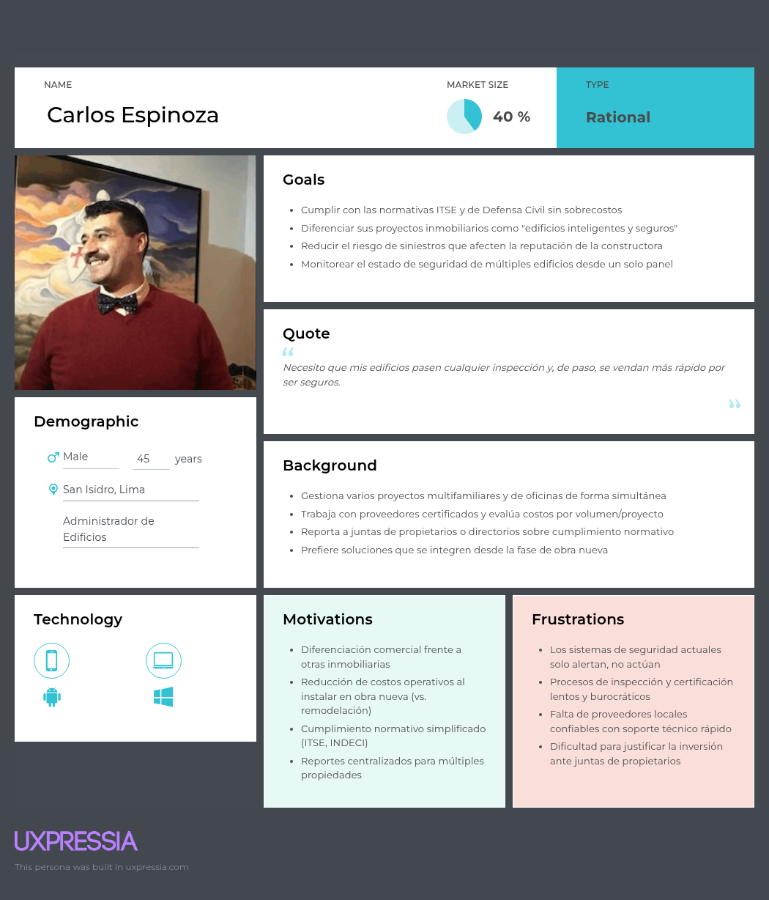
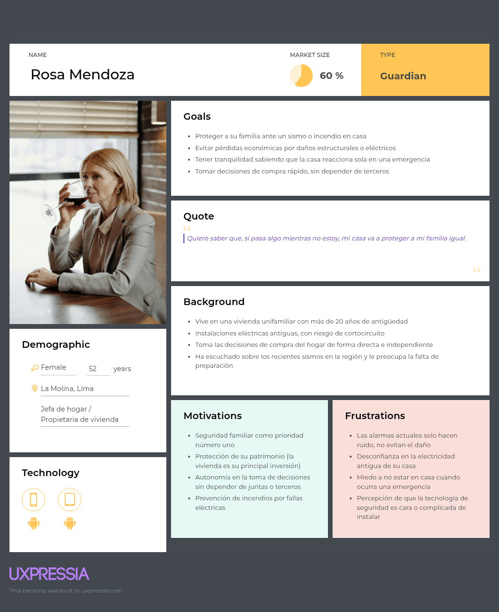
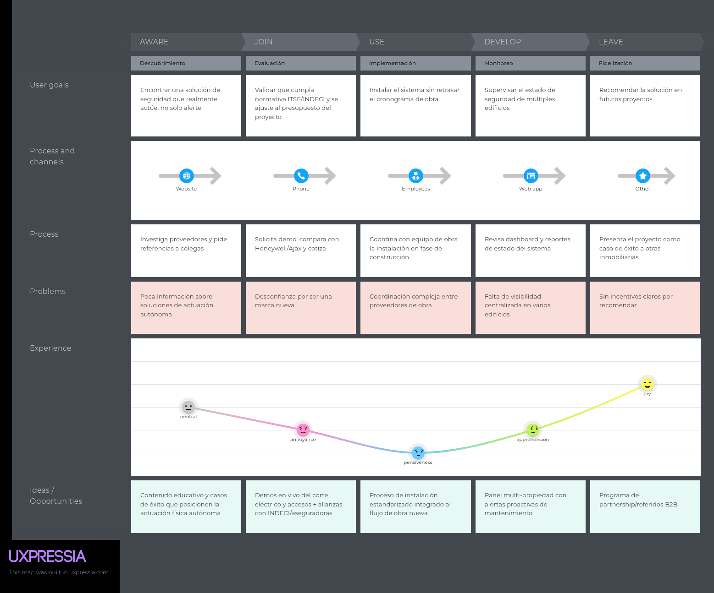
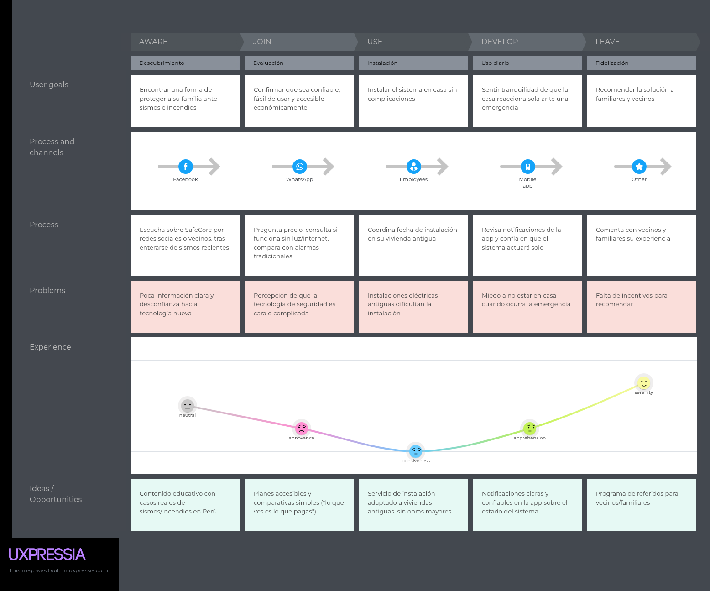
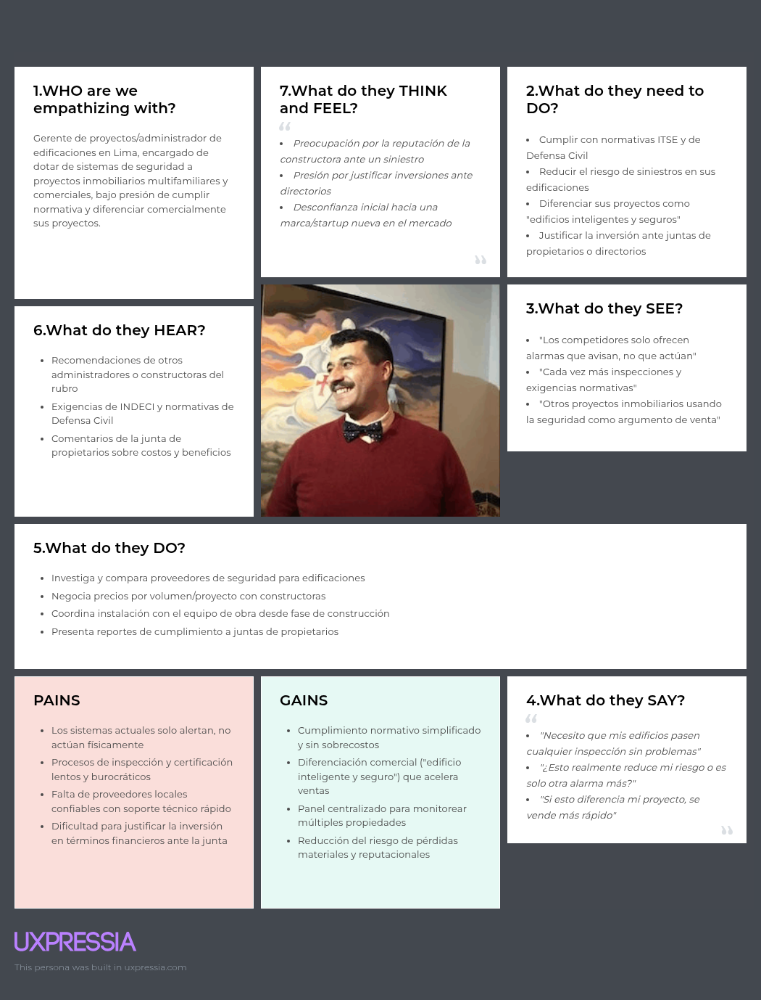
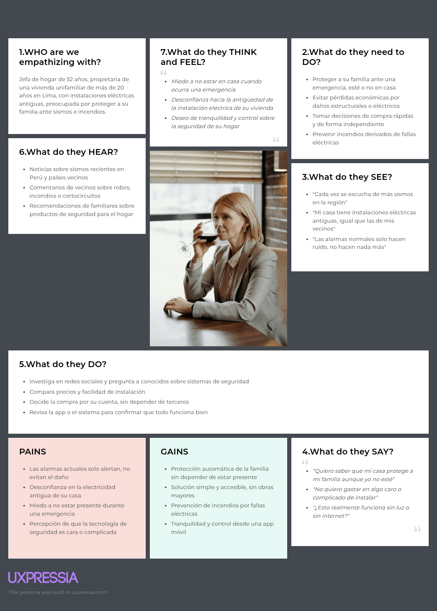
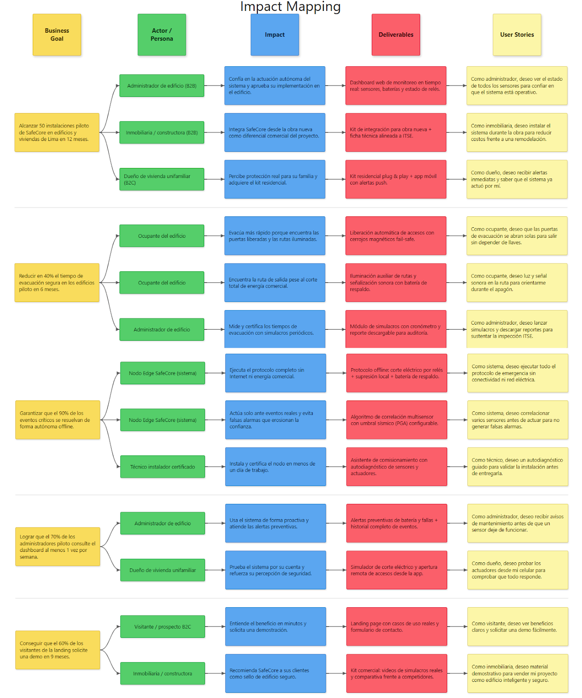

 

<h3>Universidad Peruana de Ciencias Aplicadas</h3>
 
<strong>Facultad de Ingeniería</strong> 
<strong>Carrera: Ingeniería de Software</strong> 
 
<strong>Periodo:</strong> 2026-02 
<strong>Codigo del curso:</strong> 1ASI0572 
<strong>Nombre del curso:</strong> Desarrollo de Soluciones IoT 
<strong>NRC:</strong> 8725 
 
<strong>Nombre del profesor:</strong> Marco Antonio Leon Baca 
 
 <strong>*Informe de Trabajo Final*</strong>  
 
<strong>Nombre del startup: </strong>PrimeCore Group 
<strong>Nombre del producto: </strong>SafeCore 

### Relación de Integrantes

| Apellidos y Nombres                        |   Código     |
|:-------------------------------------------:|:------------:|
| Taquiri Calderón, Jhunior Giussepe          | U20221C576   |
| Lagos Rivera, Kael Valentino                | U202210104   |
| Gonzalez Custodio, Carlos Alberto           | U202020230   |
| Tasayco Almonacid, Rafael Augusto           | U20231F226   |
| Tasayco Osorio, Raúl Hiroshi                | U202319415   |
| Inga Hernandez, Ayrton Damian               | U201924756   |
| Huaman De La Cruz, Jean Pool                | U20201E781   |

<strong> Setiembre 2026</strong> 

# Project Report Collaboration Insights

**AV1:**
_[Captura de analíticos de colaboración/commits en GitHub — assets/project collaboration/av1.png]_

# Registro de Versiones del Informe

| Versión | Fecha      | Autor        | Descripción de modificación                   |
|---------|------------|--------------|-----------------------------------------------|
| 1.0     | _[dd/mm/aaaa]_ | _[Nombre]_ | _[Descripción de lo realizado]_ |
| | | | |

## Contenido

- [Project Report Collaboration Insights](#project-report-collaboration-insights)
- [Registro de Versiones del Informe](#registro-de-versiones-del-informe)
- [Contenido](#contenido)
- [Student Outcome](#student-outcome)
- [Capítulo I: Introducción](#capítulo-i-introducción)
  - [1.1. Startup Profile](#11-startup-profile)
    - [1.1.1. Descripción de la Startup](#111-descripción-de-la-startup)
    - [1.1.2. Perfiles de integrantes del equipo](#112-perfiles-de-integrantes-del-equipo)
  - [1.2. Solution Profile](#12-solution-profile)
    - [1.2.1. Antecedentes y problemática](#121-antecedentes-y-problemática)
    - [1.2.2. Lean UX Process](#122-lean-ux-process)
      - [1.2.2.1. Lean UX Problem Statements](#1221-lean-ux-problem-statements)
      - [1.2.2.2. Lean UX Assumptions](#1222-lean-ux-assumptions)
      - [1.2.2.3. Lean UX Hypothesis Statements](#1223-lean-ux-hypothesis-statements)
      - [1.2.2.4. Lean UX Canvas](#1224-lean-ux-canvas)
  - [1.3. Segmentos objetivo](#13-segmentos-objetivo)
- [Capítulo II: Requirements Elicitation & Analysis](#capítulo-ii-requirements-elicitation--analysis)
  - [2.1. Competidores](#21-competidores)
    - [2.1.1. Análisis competitivo](#211-análisis-competitivo)
    - [2.1.2. Estrategias y tácticas frente a competidores](#212-estrategias-y-tácticas-frente-a-competidores)
  - [2.2. Entrevistas](#22-entrevistas)
    - [2.2.1. Diseño de entrevistas](#221-diseño-de-entrevistas)
    - [2.2.2. Registro de entrevistas](#222-registro-de-entrevistas)
    - [2.2.3. Análisis de entrevistas](#223-análisis-de-entrevistas)
  - [2.3. Needfinding](#23-needfinding)
    - [2.3.1. User Personas](#231-user-personas)
    - [2.3.2. User Task Matrix](#232-user-task-matrix)
    - [2.3.3. User Journey Mapping](#233-user-journey-mapping)
    - [2.3.4. Empathy Mapping](#234-empathy-mapping)
  - [2.4. Big Picture EventStorming](#24-big-picture-eventstorming)
  - [2.5. Ubiquitous Language](#25-ubiquitous-language)
- [Capítulo III: Requirements Specification](#capítulo-iii-requirements-specification)
  - [3.1. User Stories](#31-user-stories)
  - [3.2. Impact Mapping](#32-impact-mapping)
  - [3.3. Product Backlog](#33-product-backlog)
- [Capítulo IV: Solution Software Design](#capítulo-iv-solution-software-design)
  - [4.1. Strategic-Level Domain-Driven Design](#41-strategic-level-domain-driven-design)
    - [4.1.1. Design-Level EventStorming](#411-design-level-eventstorming)
      - [4.1.1.1. Candidate Context Discovery](#4111-candidate-context-discovery)
      - [4.1.1.2. Domain Message Flows Modeling](#4112-domain-message-flows-modeling)
      - [4.1.1.3. Bounded Context Canvases](#4113-bounded-context-canvases)
    - [4.1.2. Context Mapping](#412-context-mapping)
    - [4.1.3. Software Architecture](#413-software-architecture)
      - [4.1.3.1. Software Architecture System Landscape Diagram](#4131-software-architecture-system-landscape-diagram)
      - [4.1.3.2. Software Architecture Context Level Diagrams](#4132-software-architecture-context-level-diagrams)
      - [4.1.3.3. Software Architecture Container Level Diagrams](#4133-software-architecture-container-level-diagrams)
      - [4.1.3.4. Software Architecture Deployment Diagrams](#4134-software-architecture-deployment-diagrams)
  - [4.2. Tactical-Level Domain-Driven Design](#42-tactical-level-domain-driven-design)
    - [4.2.X. Bounded Context: `<Nombre>`](#42x-bounded-context-nombre)
      - [4.2.X.1. Domain Layer](#42x1-domain-layer)
      - [4.2.X.2. Interface Layer](#42x2-interface-layer)
      - [4.2.X.3. Application Layer](#42x3-application-layer)
      - [4.2.X.4. Infrastructure Layer](#42x4-infrastructure-layer)
      - [4.2.X.5. Bounded Context Software Architecture Component Level Diagrams](#42x5-bounded-context-software-architecture-component-level-diagrams)
      - [4.2.X.6. Bounded Context Software Architecture Code Level Diagrams](#42x6-bounded-context-software-architecture-code-level-diagrams)
        - [4.2.X.6.1. Bounded Context Domain Layer Class Diagrams](#42x61-bounded-context-domain-layer-class-diagrams)
        - [4.2.X.6.2. Bounded Context Database Design Diagram](#42x62-bounded-context-database-design-diagram)
- [Conclusiones](#conclusiones)
- [Bibliografía](#bibliografía)
- [Anexos](#anexos)

## Student Outcome

_[Párrafo introductorio + cuadro de Student Outcome]_

| Criterio específico | Acciones realizadas | Conclusiones |
|---|---|---|
| _[...]_ | _[Apellidos, Nombres — AV1: ...]_ | _[...]_ |

# Capítulo I: Introducción

## 1.1. Startup Profile

### 1.1.1. Descripción de la Startup

PrimeCore Group es una startup tecnológica peruana especializada en el desarrollo de soluciones innovadoras basadas en Internet de las Cosas (IoT) para la gestión inteligente de emergencias y la protección de infraestructuras críticas. Nuestra propuesta de valor se centra en transformar edificios, complejos residenciales y comerciales en entornos resilientes, capaces de responder de forma autónoma y eficiente ante desastres naturales y riesgos secundarios.

En un contexto donde los desastres naturales, como sismos e incendios, representan una amenaza constante para la vida y los bienes en el Perú, PrimeCore Group busca llenar un vacío en el mercado: la falta de sistemas integrados que no solo alerten, sino que también actúen de manera autónoma para proteger a las personas y reducir los daños colaterales. Esta amenaza no es teórica: según cifras oficiales del Instituto Geofísico del Perú (IGP), el país registró 835 temblores durante el 2025, superando los 798 sismos reportados en 2024, y el análisis de eventos de magnitud 6 o superior muestra una actividad sostenida en el tiempo 21 casos entre 2016 y 2020 y 23 entre 2021 y 2025, lo que confirma que el territorio peruano se encuentra en un estado de exposición sísmica permanente debido a su ubicación en el Cinturón de Fuego del Pacífico (Arce, 2026). A esta exposición geográfica se suma una vulnerabilidad estructural crítica: de acuerdo con una especialista del Instituto Nacional de Defensa Civil (INDECI), la mayoría de las viviendas y edificaciones en el país son autoconstruidas, lo que constituye uno de los principales factores que agravan el impacto de un sismo de gran magnitud, junto con el tipo de suelo y la calidad de los materiales empleados (Mendoza Talledo, 2026).

El riesgo de incendios sigue un patrón similar de vulnerabilidad estructural. De acuerdo con el Cuerpo General de Bomberos Voluntarios del Perú, el 70% de los incendios en el país tiene como origen fallas eléctricas, un problema prevenible pero persistente, asociado a instalaciones antiguas, desgastadas o instaladas sin supervisión profesional (Wesler, s.f.). Este panorama se agrava porque, según el Programa Casa Segura, más del 60% de las viviendas peruanas tiene más de 20 años de antigüedad, muchas de ellas con instalaciones eléctricas que ya superaron su vida útil estimada y que no cumplen con los estándares de seguridad actuales (Wesler, s.f.). A esto se suman la autoconstrucción sin supervisión técnica y la sobrecarga de tomacorrientes como factores recurrentes que elevan el riesgo de cortocircuitos y sobrecalentamiento en hogares, oficinas y comercios. Esta combinación de alta frecuencia sísmica, infraestructura eléctrica vulnerable y baja preparación estructural es precisamente el vacío que SafeCore busca cubrir: SafeCore no es una simple alarma; es un "guardián digital" que, en los segundos críticos posteriores a un evento, abre rutas de evacuación, activa iluminación de emergencia, corta riesgos eléctricos y combate focos de incendio antes de que se propaguen.

SafeCore se presenta como una respuesta concreta y realista a los riesgos sísmicos y de incendio que enfrentan las edificaciones urbanas en el Perú. No pretende cubrir todo el espectro de la gestión de riesgos, sino centrarse en la detección temprana de amenazas, la evacuación automatizada y la contención inicial de incendios en los segundos críticos tras un evento. Este enfoque especializado busca generar un impacto directo en la protección de vidas, con una implementación gradual, escalable y adaptable a distintos tipos de infraestructura.

#### Misión

Brindar soluciones tecnológicas integrales y confiables que protejan vidas y bienes ante desastres naturales y riesgos secundarios, mediante sistemas autónomos basados en IoT que permitan una respuesta inmediata, eficiente y coordinada, contribuyendo a la construcción de ciudades más seguras y resilientes en el Perú y Latinoamérica.

#### Visión

Consolidarnos como la empresa líder en Latinoamérica en soluciones inteligentes de protección y gestión de emergencias para infraestructuras urbanas, reconocida por nuestra innovación, calidad y compromiso con la seguridad de las personas, transformando los edificios del mañana en entornos autónomos y preparados para cualquier eventualidad.

### 1.1.2. Perfiles de integrantes del equipo

| Foto                                                                                                                             | Alumno                            | Descripción|
|----------------------------------------------------------------------------------------------------------------------------------|------------------------------------|-----------------------------------------------------------------------------------------------------------------------------------------------------------------------------------------------------------------------------------------------------------------------------------------------------------------------------------------------------------------------------------------------------------------------------------------------------------------------------------------------------------------------------------------------|
| Imagen aqui| Taquiri Calderón, Jhunior Giussepe | Descripción aqui |
|  | Lagos Rivera, Kael Valentino       | Me llamo Kael Lagos, estudio en la UPC de Monterrico. Tengo muchas ganas de aprender, me considero una persona responsable que busca aprender de sus errores cada vez que puede y también me considero alguien que se centra en los detalles. Me comprometo a ayudar a mis compañeros para la elaboración de nuestro trabajo que nos pueda asegurar una buena nota al final. |
| Imagen aqui      | Gonzalez Custodio, Carlos Alberto | Descripción aqui |
|  | Tasayco Almonacid, Rafael Augusto    | Descripción aqui  |
|  | Tasayco Osorio, Raúl Hiroshi    | Soy estudiante de Ingeniería de Software en la Universidad Peruana de Ciencias Aplicadas (UPC), con experiencia en C++, Python, SQL, Angular, TypeScript, HTML y CSS, además de conocimientos en buenas prácticas de desarrollo, estructuras de datos y bases de datos. He participado en proyectos universitarios y en proyectos desarrollados en entornos reales, fortaleciendo mis habilidades de desarrollo frontend y backend, trabajo en equipo y resolución de problemas. Me caracterizo por ser responsable, comprometido y orientado al aprendizaje continuo. |

| Imagen aqui| Inga Hernandez, Ayrton Damian | Descripción aqui |
| Imagen aqui|Huaman De La Cruz, Jean Pool| Descripción aqui |

## 1.2. Solution Profile

### 1.2.1. Antecedentes y problemática

En Lima Metropolitana y las principales ciudades de la región andina, la alta vulnerabilidad de las infraestructuras ante emergencias sísmicas e incendios representa una problemática crítica y en constante aumento. En el Perú, una vivienda promedio presenta un alto riesgo estructural debido a que gran parte de las edificaciones son autoconstruidas y más del 60% supera los 20 años de antigüedad. Esta situación se agrava por el deterioro de las instalaciones eléctricas, responsables del 70% de los incendios urbanos en el país.

Además, la región ha entrado en un periodo de intensa actividad geodinámica. Durante el año 2026, la placa de Nazca y la placa de Suramérica han generado eventos de gran magnitud en la franja andina, destacando los potentes sismos registrados en Venezuela (magnitudes 7.2 y 7.5 en junio), el devastador terremoto en el occidente de Colombia (magnitud 7.4 en agosto) y el sismo registrado en Ayacucho, Perú (magnitud 7.2 en agosto). Estos eventos evidencian que el riesgo no es una amenaza teórica, sino una realidad recurrente para la que las edificaciones no están preparadas.

Paralelamente, aunque en el Perú existen protocolos de Defensa Civil y normativas de seguridad, la mayoría de los inmuebles solo cuenta con sistemas de alarma pasivos (detectores de humo ruidosos o luces de emergencia manuales). Estos dispositivos dependen enteramente de la reacción humana, la cual suele bloquearse o verse imposibilitada durante los segundos críticos posteriores a un movimiento telúrico o al inicio de un amago de incendio.

Por ello, resulta necesario implementar soluciones tecnológicas basadas en el Internet de las Cosas (IoT) que no solo detecten la amenaza en tiempo real, sino que actúen de manera autónoma para desbloquear vías de evacuación, cortar suministros de riesgo y contener daños antes de que sea demasiado tarde.

#### Análisis 5W2H

- Who (¿Quién?)

Los principales actores afectados son los residentes de complejos residenciales, administradores de edificios comerciales e industriales y personal de oficinas en zonas urbanas. Estos segmentos enfrentan pérdidas de vidas humanas, lesiones graves y severos daños patrimoniales debido a la falta de respuesta automatizada durante emergencias. En los hogares, el impacto es la pérdida irreparable de familiares y bienes; en las empresas y comercios, se traduce en la paralización de operaciones, responsabilidades legales y costos millonarios de reconstrucción.

- What (¿Qué?)

El problema central radica en la falta de sistemas de respuesta activa y autónoma en edificaciones ante desastres naturales y sus riesgos secundarios (como colapsos, cortocircuitos e incendios). Actualmente, los inmuebles cuentan con alarmas convencionales que solo alertan del peligro, dejando la mitigación y la evacuación en manos de la acción humana. En momentos de pánico, colapso de energía o fallas en las comunicaciones, la respuesta manual resulta ineficaz, lo que propicia que amagos de incendio se conviertan en siniestros fatales.

- Where (¿Dónde?)

El epicentro de esta problemática se concentra en las zonas urbanas de Lima Metropolitana y principales ciudades del Perú, extendiéndose a la región andina (Colombia, Ecuador y Venezuela). Lima se ubica sobre el Cinturón de Fuego del Pacífico, con un silencio sísmico acumulado de más de 250 años y un parque inmobiliario masivamente dominado por la autoconstrucción e instalaciones eléctricas obsoletas. Esta combinación de alta densidad poblacional y fragilidad estructural convierte a las ciudades peruanas en un escenario altamente crítico para la gestión de riesgos.

- When (¿Cuándo?)

La urgencia de atender este problema se enmarca en el contexto actual del año 2026. El incremento sostenido de la actividad sísmica en la región —confirmado por eventos de gran impacto en países vecinos como Venezuela y Colombia, sumados a más de 800 sismos reportados por el IGP en territorio peruano durante el último año— demuestra que la ventana de preparación se agota. Esperar a que ocurra un evento de gran escala sin infraestructura inteligente instalada significará pérdidas irreparables.

- Why (¿Por qué?)

La causa del problema radica en una doble vulnerabilidad: por un lado, estructural y eléctrica, debido a décadas de autoconstrucción sin supervisión técnica y redes eléctricas desactualizadas que superaron su vida útil; por otro lado, tecnológica, debido a que el mercado depende de sistemas de seguridad pasivos. Resolver este problema mediante automatización no solo salva vidas humanas al garantizar rutas de escape despejadas e iluminadas, sino que evita la destrucción total de la infraestructura al cortar la energía antes de que un cortocircuito desencadene un incendio.

- How (¿Cómo?)

La solución se plantea mediante SafeCore, una plataforma IoT integral desarrollada por PrimeCore Group. El sistema conecta sensores de aceleración/sismo, temperatura y gas con un nodo central de procesamiento Edge Computing capaz de operar de forma autónoma (offline). Ante un evento sísmico o amago de incendio, SafeCore ejecuta de inmediato protocolos de actuación: activa cerrojos magnéticos para liberar puertas de evacuación, enciende iluminación auxiliar, interrumpe el flujo eléctrico mediante relés inteligentes y activa sistemas locales de supresión de incendios.

- How Much (¿Cuánto?)

En términos económicos y sociales, el impacto de no contar con prevención autónoma es devastador. Según estimaciones del Cuerpo General de Bomberos, un incendio estructural promedio en Lima puede generar pérdidas materiales de entre S/ 50,000 y S/ 300,000 en pequeñas empresas y viviendas, sin contar las indemnizaciones e interrupción de negocios. Además, un sismo de gran magnitud en Lima podría afectar a más del 70% de las viviendas, con costos de reconstrucción que superan los miles de millones de soles. La implementación de SafeCore reduce significativamente este riesgo, protegiendo inversiones patrimoniales y mitigando costos millonarios en daños colaterales.

### 1.2.2. Lean UX Process

#### 1.2.2.1. Lean UX Problem Statements

Nuestro proyecto ataca la vulnerabilidad física y la falta de respuesta inmediata en infraestructuras urbanas frente a sismos e incendios en el Perú y la región andina, enfocándose en complejos residenciales, edificios comerciales y oficinas que sufren el impacto de pérdidas materiales y riesgos humanos debido a instalaciones obsoletas y la falta de mitigación autónoma. Hemos detectado que el principal punto de dolor es la dependencia de la reacción humana en momentos de pánico: las alarmas tradicionales notifican el peligro, pero no actúan para proteger el entorno ni habilitar la evacuación en los segundos críticos posteriores a un evento.

Existe una brecha crítica en el mercado local por la ausencia de sistemas integrados que combinen la Detección Temprana con la Actuación Autónoma In situ (Edge Computing). Nuestra estrategia consiste en transformar las edificaciones en entornos resilientes mediante la integración de un ecosistema IoT (SafeCore) que libera rutas de evacuación, interrumpe el suministro eléctrico para prevenir cortocircuitos y contiene amagos de incendio de forma automática sin depender de la conectividad a Internet ni de la red de energía comercial.

#### 1.2.2.2. Lean UX Assumptions

Al iniciar este proyecto, hemos definido las siguientes hipótesis críticas que requieren validación mediante experimentación y trabajo de campo:

- Valoración de la respuesta autónoma: Postulamos que los administradores de edificaciones y propietarios valoran más una solución que ejecute acciones físicas automáticas de mitigación (desbloqueo de accesos, corte eléctrico) que un sistema pasivo que únicamente emita señales sonoras o alertas en el celular.

- Viabilidad económica de la inversión en resiliencia: Suponemos una disposición de compra y pago de suscripción/mantenimiento hacia el hardware y software IoT, condicionada a la reducción directa del riesgo de pérdidas patrimoniales y al cumplimiento de normativas de seguridad de Defensa Civil (INDECI).

- Priorización de la continuidad operativa en empresas: Asumimos que para los administradores de edificios comerciales e industriales, la prevención de riesgos secundarios (como incendios derivados de sismos) es un pilar fundamental en su plan de continuidad del negocio y en la reducción de costos de primas de seguros.

- Confianza en la ejecución offline (Edge Computing): Creemos que la adopción tecnológica se ve favorecida por la garantía de que el sistema opere de forma local y autónoma con baterías de respaldo, liberando al usuario del temor a fallas de red o cortes de energía durante una emergencia real.

#### 1.2.2.3. Lean UX Hypothesis Statements

A partir de la base de nuestros supuestos iniciales, hemos definido las siguientes hipótesis experimentales que orientarán las fases de prueba:

- Impacto en los Tiempos de Evacuación y Mitigación: Postulamos que la automatización de apertura de rutas de evacuación e iluminación auxiliar permitirá a las edificaciones reducir los tiempos de evacuación segura en un 30%. Validaremos esta hipótesis si, tras realizar simulación de simulacros en un piloto con 5 edificios, el 80% de los ocupantes logra despejar las zonas de riesgo en menos de 90 segundos.
  
- Engagement y Confianza en el Dashboard de Gestión: Proponemos que la visualización del estado de los sensores (batería, integridad de circuito, estado de relés) y las alertas preventivas es el principal motor de uso para los administradores de infraestructura. El éxito se medirá cuando el 70% de los administradores piloto consulte el panel de control semanalmente y realice las pruebas de diagnóstico del sistema.

- Adopción de Funcionalidades de Control y Prueba Preventiva: Sostenemos que el uso recurrente y la percepción de seguridad por parte de los usuarios depende de herramientas de prueba directa, como el simulador de corte eléctrico y la apertura manual/remota de accesos desde la aplicación móvil. Consideraremos validada esta premisa si más del 60% de los usuarios activos interactúa con el módulo de pruebas de emergencia al menos una vez al mes.

#### 1.2.2.4. Lean UX Canvas

  

## 1.3. Segmentos objetivo

### Empresas inmobiliarias en Lima

En Lima Metropolitana, las empresas inmobiliarias y constructoras constituyen un segmento B2B clave, ya que la capital concentra cerca del 50% de la oferta inmobiliaria y proyectos de edificación formal a nivel nacional (CAPECO, 2023). Estas organizaciones abarcan desarrolladoras residenciales y comerciales de mediana y gran escala, las cuales operan bajo normativas estrictas de seguridad e infraestructura (INDECI, 2022).

La mayoría de estas empresas gestiona proyectos multifamiliares de más de 5 pisos o complejos de oficinas que albergan a múltiples familias y trabajadores, donde la instalación de sistemas de seguridad en fase de obra nueva reduce los costos operativos frente a remodelaciones posteriores (CAPECO, 2023). Además, el cumplimiento de las Inspecciones Técnicas de Seguridad en Edificaciones (ITSE) representa un requisito obligatorio para su habilitación (MINAM, 2022).

En términos económicos y de mercado, la integración de tecnología de automatización y respuesta autónoma ante emergencias es utilizada como un diferencial comercial ("edificio inteligente y seguro"), permitiendo incrementar el valor por metro cuadrado y acelerar la velocidad de ventas (Ipsos, 2023). Asimismo, la compra en volumen por proyecto garantiza una alta escalabilidad comercial para los proveedores de tecnología IoT.

### Dueños de vivienda unifamiliar en Lima

En Lima Metropolitana, los propietarios de viviendas unifamiliares representan un segmento B2C de alta relevancia, dado que cerca del 60% de los inmuebles residenciales en la capital corresponden a casas independientes (INEI, 2022). Dentro de este grupo, las familias pertenecientes a los niveles socioeconómicos B y C destacan por su capacidad de inversión en la mejora y protección de su infraestructura propia (Ipsos, 2022; APEIM, 2023).

El jefe de hogar en este segmento suele ser un adulto de mediana edad, entre 40 y 60 años, con un nivel educativo superior al promedio y a cargo de hogares compuestas por 3.5 a 4 integrantes (INEI, 2022; APEIM, 2022). Al ser propietarios directos del inmueble, la toma de decisiones de compra no depende de juntas de propietarios, lo que agiliza el proceso de adquisición frente a emergencias físicas o fallas eléctricas (Ipsos, 2023).

En cuanto a la infraestructura física y eléctrica, estos hogares cuentan con tableros de distribución independientes cuyo consumo continuo y riesgo de cortocircuito post-símico motivan la adopción de protección autónoma (Osinergmin, 2023). La prevención de incendios secundarios y el resguardo de la integridad familiar justifican la inversión directa en dispositivos de seguridad activa para el hogar.

# Capítulo II: Requirements Elicitation & Analysis

## 2.1. Competidores

En esta sección se analiza el panorama competitivo del mercado de sistemas de seguridad y respuesta ante emergencias, identificando las principales soluciones existentes y evaluando sus fortalezas, debilidades, oportunidades y amenazas en relación con SafeCore. Este análisis permite definir estrategias y tácticas diferenciadas que posicionen a SafeCore de manera efectiva en el mercado.

### 2.1.1. Análisis competitivo

<table border="1" cellpadding="6" cellspacing="0" style="border-collapse:collapse; width:100%; font-family:Arial, sans-serif;">
  <thead>
    <tr>
      <th colspan="6" scope="col" style="background:#f2f2f2;"><strong>Competitive Analysis Landscape</strong></th>
    </tr>
    <tr>
      <th colspan="2" rowspan="2" scope="row">¿Por qué realizar este análisis?</th>
      <td colspan="4" style="">
        <strong>Escriba en el recuadro la pregunta que busca responder o el objetivo de este análisis.</strong>
      </td>
    </tr>
    <tr>
      <td colspan="4" style="">
        El objetivo del análisis es obtener una perspectiva clara sobre qué brechas estratégicas existen en el mercado que otras soluciones no estén abarcando, obteniendo así un factor diferenciador de nicho que permita posicionar a SafeCore como la solución idónea para edificaciones residenciales y comerciales en Perú y la región andina.
      </td>
    </tr>
    <tr>
      <th colspan="2" scope="row">(En la cabecera colocar por cada competidor nombre y logo)</th>
      <th scope="column" style="width:20%; text-align:center;">
        SafeCore 
        
      </th>
      <th scope="column" style="width:20%; text-align:center;">
        Honeywell Notifier 
        
      </th>
      <th scope="column" style="width:20%; text-align:center;">
        Ajax Systems 
        
      </th>
      <th scope="column" style="width:20%; text-align:center;">
        Nest Protect + Ring Alarm 
        
      </th>
    </tr>
  </thead>
  <tbody>
    <tr>
      <th scope="row" rowspan="2">Perfil</th>
      <th scope="row">Overview</th>
      <td>Startup peruana de tecnología IoT enfocada en la protección autónoma de edificaciones ante sismos e incendios mediante un ecosistema de sensores y actuación local (Edge Computing).</td>
      <td>Sistema de detección y alarma contra incendios de nivel corporativo, con más de 30 años en el mercado, enfocado en cumplimiento normativo para grandes edificaciones comerciales e industriales.</td>
      <td>Plataforma de seguridad IoT (alarmas, sensores de humo/fuga y automatización) con fuerte presencia europea y expansión en LATAM, enfocada en facilidad de instalación inalámbrica.</td>
      <td>Ecosistema de dispositivos inteligentes para el hogar (detector de humo/CO y sistema de alarma) orientado al consumidor final, con enfoque en simplicidad e integración con el hogar inteligente.</td>
    </tr>
    <tr>
      <th scope="row">Ventaja competitiva</th>
      <td>Actuación física autónoma offline (Edge Computing) que libera accesos, corta energía y contiene incendios sin depender de la red eléctrica ni de Internet, adaptado a la realidad estructural peruana.</td>
      <td>Robustez normativa, confiabilidad y soporte técnico consolidado exigido en certificaciones ITSE e inspecciones de Defensa Civil.</td>
      <td>Rapidez de instalación inalámbrica y app centralizada intuitiva, con buena reputación en el segmento residencial de gama media-alta.</td>
      <td>Diseño atractivo, ecosistema de hogar inteligente ya masificado y fuerte reconocimiento de marca a nivel consumidor.</td>
    </tr>
    <tr>
      <th scope="row" rowspan="2">Perfil de Marketing</th>
      <th scope="row">Mercado Objetivo</th>
      <td>Empresas inmobiliarias/constructoras y dueños de vivienda unifamiliar en Lima y ciudades principales del Perú; no enfocado en mercado enterprise</td>
      <td>Edificios corporativos, industriales y centros comerciales de gran escala con requerimientos normativos estrictos</td>
      <td>Hogares y pequeños negocios de nivel socioeconómico medio-alto que buscan seguridad y automatización sin instalación compleja</td>
      <td>Consumidores individuales de hogares inteligentes, principalmente en mercados desarrollados (EE.UU., Europa)</td>
    </tr>
    <tr>
      <th scope="row">Estrategias de Marketing</th>
      <td>Marketing digital móvil-first (redes sociales, WhatsApp) dirigido a administradores de edificios y jefes de hogar; alianzas con constructoras y aseguradoras</td>
      <td>Marketing B2B directo, participación en licitaciones y certificaciones técnicas; reputación basada en cumplimiento normativo</td>
      <td>Marketing por experiencia de usuario y facilidad de instalación "hazlo tú mismo"; fuerte presencia en distribuidores retail</td>
      <td>Marketing de marca y ecosistema; integración con asistentes de voz y otros dispositivos smart home</td>
    </tr>
    <tr>
      <th scope="row" rowspan="3">Perfil de Productos</th>
      <th scope="row">Productos y servicios</th>
      <td>Sensores de sismo, temperatura y gas; nodo central Edge Computing; cerrojos magnéticos automáticos; corte eléctrico por relés inteligentes; supresión local de incendios; dashboard de monitoreo</td>
      <td>Paneles de detección de incendios, sensores de humo/calor industriales, sistemas de rociadores y notificación por voz, servicio de mantenimiento certificado</td>
      <td>Sensores de humo/fuga de gas, sirenas, cerraduras inteligentes, cámaras, hub central con app móvil</td>
      <td>Detector de humo/monóxido de carbono, sistema de alarma modular (sensores de puerta/ventana, movimiento), monitoreo profesional opcional</td>
    </tr>
    <tr>
      <th scope="row">Precios y costos</th>
      <td>Suscripción de bajo costo (hardware + mantenimiento, menor a $300 instalación básica residencial)</td>
      <td>Inversión alta por proyecto (miles de dólares), según tamaño de edificación y normativa aplicable</td>
      <td>Kit inicial desde $150 – $400; suscripción opcional de monitoreo mensual</td>
      <td>Dispositivos desde $115 (Nest Protect); sistema Ring Alarm desde $200; monitoreo mensual opcional (~$20/mes)</td>
    </tr>
    <tr>
      <th scope="row">Canales de distribución</th>
      <td>Venta directa B2B a constructoras; venta directa/online B2C; app móvil y plataforma web</td>
      <td>Venta directa a través de integradores certificados e instaladores autorizados</td>
      <td>E-commerce, retail físico y distribuidores autorizados en LATAM</td>
      <td>Retail (Amazon, tiendas físicas) y venta online directa</td>
    </tr>
    <tr>
      <th scope="row" rowspan="5">Análisis SWOT</th>
      <th scope="col" colspan="5" style=" text-align:left;">
        Realice esto para su startup y sus competidores. Sus fortalezas deberían apoyar sus oportunidades y contribuir a lo que ustedes definen como su posible ventaja competitiva.
      </th>
    </tr>
    <tr>
      <th scope="row">Fortalezas</th>
      <td>Actuación autónoma offline; bajo costo relativo; adaptación al contexto estructural peruano (autoconstrucción, redes eléctricas antiguas); enfoque dual sismo-incendio</td>
      <td>Confiabilidad normativa consolidada; soporte técnico especializado; alta precisión en detección industrial</td>
      <td>Instalación rápida e inalámbrica; buena experiencia de usuario; catálogo amplio de dispositivos</td>
      <td>Marca reconocida; integración con ecosistema smart home; alta adopción de consumidor</td>
    </tr>
    <tr>
      <th scope="row">Debilidades</th>
      <td>Marca nueva y baja confianza inicial; recursos limitados (startup); cobertura geográfica aún reducida</td>
      <td>Alto costo de implementación; complejidad de instalación; poco adaptado a vivienda unifamiliar</td>
      <td>Enfoque en detección y alerta, sin actuación física autónoma (no corta energía ni libera accesos)</td>
      <td>Depende de conectividad a Internet y energía comercial; sin actuación física ante sismos ni corte eléctrico de emergencia</td>
    </tr>
    <tr>
      <th scope="row">Oportunidades</th>
      <td>Vacío de mercado en sistemas de actuación autónoma ante sismos; alta actividad sísmica regional; crecimiento de adopción IoT en LATAM</td>
      <td>Crecimiento de edificaciones corporativas que requieren cumplimiento normativo</td>
      <td>Creciente interés en automatización del hogar en Perú</td>
      <td>Expansión de mercado smart home en LATAM</td>
    </tr>
    <tr>
      <th scope="row">Amenazas</th>
      <td>Entrada de competidores globales con mayor capital; resistencia al cambio tecnológico en usuarios tradicionales</td>
      <td>Soluciones más económicas y ágiles orientadas a PYMEs y hogares</td>
      <td>Soluciones con actuación física autónoma (como SafeCore) que ofrezcan mayor valor ante emergencias reales</td>
      <td>Dependencia de infraestructura de red que falla justamente durante sismos o incendios, restando confiabilidad</td>
    </tr>
  </tbody>
</table>

### 2.1.2. Estrategias y tácticas frente a competidores

**1. Estrategia de Confianza mediante Demostración Real**
Generar confianza inicial mostrando la actuación física autónoma de SafeCore en simulacros reales, reduciendo el escepticismo hacia una marca nueva.

Tácticas:
- Realizar simulacros piloto grabados en video con edificios aliados y publicarlos como evidencia.
- Ofrecer demostraciones en vivo del corte eléctrico y liberación de accesos ante administradores e inmobiliarias.

**2. Estrategia de Accesibilidad frente a Soluciones Enterprise**
Posicionar a SafeCore como una alternativa más accesible que sistemas corporativos como Honeywell Notifier, sin sacrificar la actuación autónoma.

Tácticas:
- Diseñar planes escalonados según tamaño de edificación (vivienda unifamiliar, multifamiliar, comercial).
- Publicar comparativas abiertas frente a competidores, destacando el diferencial de actuación física offline.

**3. Estrategia de Diferenciación por Actuación Autónoma Offline**
Comunicar de forma clara que, a diferencia de Ajax Systems y Nest Protect/Ring Alarm (enfocados en detección y alerta), SafeCore actúa físicamente sin depender de Internet ni energía comercial.

Tácticas:
- Crear contenido educativo que explique por qué la conectividad falla justamente durante sismos e incendios.
- Certificar y comunicar el respaldo de baterías y funcionamiento Edge Computing como pilar de marketing.

**4. Estrategia de Adaptación al Contexto Peruano**
Diferenciar a SafeCore construyendo una solución pensada para la autoconstrucción y la infraestructura eléctrica envejecida típica del Perú.

Tácticas:
- Desarrollar contenidos de capacitación con casos de uso de edificaciones peruanas reales.
- Generar alianzas con INDECI, municipalidades y aseguradoras locales para reforzar cumplimiento normativo y confianza.
- Usar un lenguaje cercano y campañas alineadas a la realidad sísmica del país.

## 2.2. Entrevistas

### 2.2.1. Diseño de entrevistas

_[...]_

### 2.2.2. Registro de entrevistas

_[...]_

### 2.2.3. Análisis de entrevistas

_[...]_

## 2.3. Needfinding

En esta sección se consolida el análisis de las necesidades de los usuarios a partir de la información recopilada en las entrevistas. Se presentan los User Personas, el User Task Matrix, el User Journey Mapping, el Empathy Mapping, el Big Picture EventStorming y el Ubiquitous Language del dominio, herramientas que permiten construir una comprensión profunda del contexto y las motivaciones de los usuarios de SafeCore.

### 2.3.1. User Personas

Los user persona que se muestran a continuación, fueron realizados a partir de la información recopilada de la sección de entrevistas. Estos nos ayudarán a describir de forma general nuestros segmentos objetivo.

**Persona 1: Carlos Espinoza** _(Empresas inmobiliarias en Lima)_

**Persona 2: Rosa Mendoza** _(Dueños de vivienda unifamiliar en Lima)_

### 2.3.2. User Task Matrix

En esta sección se presenta el user task matrix de los segmentos objetivo, con el fin de identificar la frecuencia de las actividades realizadas por los usuarios, y de esta manera se refleja la importancia de determinadas tareas.

| Task | Empresas Inmobiliarias — Frecuencia | Empresas Inmobiliarias — Importancia | Dueños de Vivienda Unifamiliar — Frecuencia | Dueños de Vivienda Unifamiliar — Importancia |
|---|---|---|---|---|
| Investigar proveedores de seguridad | Baja | Alta | Baja | Alta |
| Comparar precios y funcionalidades | Media | Alta | Media | Alta |
| Coordinar instalación del sistema | Baja | Alta | Baja | Alta |
| Monitorear estado del sistema (batería, sensores, relés) | Alta | Alta | Media | Alta |
| Recibir y atender alertas de emergencia | Baja | Alta | Baja | Alta |
| Realizar pruebas de diagnóstico/simulacro | Media | Alta | Baja | Media |
| Gestionar mantenimiento del sistema | Media | Alta | Baja | Media |
| Reportar cumplimiento normativo (ITSE/INDECI) | Alta | Alta | Baja | Baja |
| Consultar historial de eventos/alertas | Media | Media | Baja | Media |
| Administrar accesos y usuarios de la app | Media | Media | Baja | Baja |
| Gestionar múltiples propiedades/edificios | Alta | Alta | Baja | Baja |

En base al User Task Matrix presentado, podemos destacar las siguientes tareas con mayor frecuencia e importancia para cada segmento de usuarios:

**Empresas Inmobiliarias:**

- Monitorear estado del sistema (batería, sensores, relés)
  - Explicación: Al administrar múltiples edificaciones, la supervisión constante del sistema es clave para garantizar que todas las propiedades estén protegidas.
- Gestionar múltiples propiedades/edificios
  - Explicación: La escalabilidad y visibilidad centralizada es fundamental para su rol de administrador de varios proyectos.

**Dueños de Vivienda Unifamiliar:**

- Monitorear estado del sistema (batería, sensores, relés)
  - Explicación: Necesitan confiar en que el sistema está operativo en todo momento, ya que no siempre están en casa.
- Comparar precios y funcionalidades
  - Explicación: Al ser una decisión de compra personal, evalúan cuidadosamente el costo-beneficio antes de invertir en su hogar.

### 2.3.3. User Journey Mapping

En esta sección se presentan los User Journey Mapping de los segmentos objetivos, que realizamos con el fin de dar a entender cómo se siente nuestro usuario en cada momento, detallando cada paso que realiza y las emociones que experimenta.

**Journey Map 1: Carlos Espinoza** _(Empresas inmobiliarias en Lima)_

**Journey Map 2: Rosa Mendoza** _(Dueños de vivienda unifamiliar en Lima)_

### 2.3.4. Empathy Mapping

En esta sección mostramos los empathy mapping de los segmentos objetivos realizados con la información recopilada de componentes anteriores.

**Empathy Map 1: Carlos Espinoza** _(Empresas inmobiliarias en Lima)_

**Empathy Map 2: Rosa Mendoza** _(Dueños de vivienda unifamiliar en Lima)_

## 2.4. Big Picture EventStorming

_[...]_

## 2.5. Ubiquitous Language

_[...]_

# Capítulo III: Requirements Specification

## 3.1. User Stories

## Tabla de Epics

| Epic ID | Título                              | Descripción                                                                                                                  |
| ------- | ----------------------------------- | ---------------------------------------------------------------------------------------------------------------------------- |
| E1      | Gestión de Usuarios y Perfiles      | Administración de cuentas, autenticación y roles (administrador de edificio, propietario de vivienda, residente).             |
| E2      | Monitoreo de Sensores IoT           | Visualización en tiempo real del estado de sensores sísmicos, de temperatura, gas y batería de respaldo.                     |
| E3      | Actuación Autónoma de Emergencia    | Ejecución automática de protocolos offline: liberación de accesos, corte eléctrico, iluminación de emergencia y contención de incendios. |
| E4      | Dashboard de Gestión                | Panel centralizado para administradores con estado del sistema, historial de eventos y pruebas de diagnóstico.               |
| E5      | Alertas y Notificaciones            | Envío de alertas en tiempo real (app, SMS, push) ante sismos, amagos de incendio o fallas del sistema.                       |
| E6      | Funcionamiento Offline (Edge)       | Capacidad del nodo central de operar de forma autónoma sin Internet ni energía comercial mediante Edge Computing y baterías. |
| E7      | Pruebas y Simulacros                | Módulo para realizar pruebas manuales y simulacros de emergencia desde la app o dashboard.                                   |
| E8      | Landing Page e Información Comercial| Presentación de la propuesta de valor de SafeCore, beneficios, casos de uso y canales de contacto/compra.                    |
| E9      | Infraestructura Técnica Base        | Configuración de arquitectura móvil, backend, comunicación con nodos Edge y seguridad de la plataforma.                      |

## Tabla de User Stories

| US ID | Título                              | Descripción                                                                                                                                                                                       | Criterios de Aceptación (Gherkin)                                                                                                                                                                                                                                                                                                                                                                                          | Epic Relacionada |
| ----- | ----------------------------------- | ------------------------------------------------------------------------------------------------------------------------------------------------------------------------------------------------- | -------------------------------------------------------------------------------------------------------------------------------------------------------------------------------------------------------------------------------------------------------------------------------------------------------------------------------------------------------------------------------------------------------------------------- | ---------------- |
| US1   | Registro de administrador           | Como administrador de edificio, quiero registrarme con correo o celular para gestionar uno o varios inmuebles en SafeCore.                                                                         | Scenario 1: Given un administrador no registrado When ingresa datos válidos Then el sistema crea la cuenta y confirma el registro. Scenario 2: Given datos inválidos When intenta registrarse Then el sistema rechaza y muestra el motivo.                                                                                                                                                                             | E1               |
| US2   | Creación de perfiles de inmueble    | Como administrador, quiero agregar varios edificios o viviendas bajo mi cuenta para gestionarlos de forma centralizada.                                                                            | Scenario 1: Given un administrador autenticado When agrega un nuevo inmueble Then el sistema lo vincula a su cuenta. Scenario 2: Given se excede el límite de inmuebles When intenta agregar otro Then el sistema rechaza con mensaje.                                                                                                                                                                                   | E1               |
| US3   | Visualización de estado de sensores | Como administrador, quiero ver en tiempo real el estado de los sensores sísmicos, de temperatura, gas y batería de cada inmueble.                                                                  | Scenario 1: Given un administrador autenticado When ingresa al dashboard Then visualiza el estado actual de todos los sensores. Scenario 2: Given un sensor offline When el sistema lo detecta Then muestra alerta visual de desconexión.                                                                                                                                                                                 | E2               |
| US4   | Detección automática de sismo       | Como sistema, quiero detectar un movimiento sísmico por encima del umbral configurado y activar el protocolo de emergencia de forma autónoma.                                                      | Scenario 1: Given un sismo superior al umbral When el sensor lo registra Then el nodo Edge ejecuta el protocolo completo offline. Scenario 2: Given un sismo menor al umbral When se detecta Then el sistema solo registra el evento sin actuar.                                                                                                                                                                          | E3               |
| US5   | Liberación automática de accesos    | Como sistema, quiero abrir cerrojos magnéticos de puertas de evacuación automáticamente ante una emergencia sísmica o de incendio.                                                                 | Scenario 1: Given un evento de emergencia When se activa el protocolo Then los cerrojos magnéticos se liberan en menos de 3 segundos. Scenario 2: Given el sistema en modo prueba When se ejecuta simulacro Then los accesos se liberan y se registran.                                                                                                                                                                    | E3               |
| US6   | Corte eléctrico de emergencia       | Como sistema, quiero interrumpir el suministro eléctrico mediante relés inteligentes para evitar cortocircuitos e incendios secundarios.                                                           | Scenario 1: Given un sismo o detección de gas When se activa el protocolo Then los relés cortan la energía en las zonas configuradas. Scenario 2: Given el sistema offline When ocurre el evento Then el corte se ejecuta localmente sin depender de Internet.                                                                                                                                                            | E3               |
| US7   | Activación de iluminación auxiliar  | Como sistema, quiero encender iluminación de emergencia automáticamente cuando se detecte un evento crítico.                                                                                      | Scenario 1: Given un evento de emergencia When se activa el protocolo Then las luces de emergencia se encienden de inmediato. Scenario 2: Given falla de energía comercial When el sistema detecta el evento Then las luces se alimentan desde la batería de respaldo.                                                                                                                                                     | E3               |
| US8   | Contención inicial de incendio      | Como sistema, quiero activar sistemas locales de supresión (extintores automáticos o rociadores de zona) ante detección de temperatura o gas elevada.                                              | Scenario 1: Given temperatura o gas por encima del umbral When se detecta Then se activa la contención local en la zona afectada. Scenario 2: Given el sistema en modo offline When ocurre el evento Then la contención se ejecuta sin conexión a la nube.                                                                                                                                                                 | E3               |
| US9   | Dashboard de monitoreo              | Como administrador, quiero consultar un panel centralizado con el estado de sensores, historial de eventos y estado de baterías.                                                                   | Scenario 1: Given un administrador autenticado When ingresa al dashboard Then visualiza el estado general del sistema. Scenario 2: Given un evento reciente When consulta el historial Then se muestran fecha, tipo de evento y acciones ejecutadas.                                                                                                                                                                       | E4               |
| US10  | Alerta push de emergencia           | Como residente o administrador, quiero recibir una notificación push inmediata cuando se active un protocolo de emergencia.                                                                       | Scenario 1: Given un evento crítico When el sistema lo detecta Then envía push notification a todos los usuarios vinculados. Scenario 2: Given el dispositivo sin Internet When ocurre el evento Then la alerta se envía por SMS de respaldo (si está configurado).                                                                                                                                                        | E5               |
| US11  | Alerta de falla del sistema         | Como administrador, quiero recibir una alerta cuando un sensor, batería o relé presente falla o bajo nivel de carga.                                                                               | Scenario 1: Given batería por debajo del 20% When el sistema lo detecta Then envía alerta preventiva al administrador. Scenario 2: Given un sensor desconectado When se detecta la falla Then se genera notificación y se registra en el dashboard.                                                                                                                                                                        | E5               |
| US12  | Funcionamiento offline              | Como usuario, quiero que el sistema continúe protegiendo el inmueble aunque no haya Internet ni energía comercial.                                                                                 | Scenario 1: Given pérdida de Internet y energía When ocurre un sismo Then el nodo Edge ejecuta el protocolo completo con batería de respaldo. Scenario 2: Given el sistema offline When el usuario intenta acciones que requieren nube Then se informa que solo están disponibles las funciones locales.                                                                                                                    | E6               |
| US13  | Ejecución de simulacro              | Como administrador, quiero lanzar un simulacro completo desde la app o dashboard para verificar que todos los actuadores funcionan correctamente.                                                  | Scenario 1: Given un administrador autenticado When inicia un simulacro Then se liberan accesos, se activa iluminación y se registra el resultado. Scenario 2: Given un simulacro en curso When finaliza Then el sistema genera un reporte de éxito o fallas detectadas.                                                                                                                                                   | E7               |
| US14  | Prueba individual de actuadores     | Como administrador, quiero probar de forma individual el corte eléctrico, la liberación de puertas o la iluminación desde la app.                                                                  | Scenario 1: Given un administrador autenticado When selecciona “Probar corte eléctrico” Then el relé se activa y se confirma la acción. Scenario 2: Given el sistema en modo prueba When se ejecuta una acción Then se registra en el historial sin generar alerta real a residentes.                                                                                                                                     | E7               |
| US15  | Información de beneficios           | Como visitante, quiero ver en la landing page los beneficios principales de SafeCore (actuación autónoma, offline, protección sísmica e incendio).                                                 | Scenario 1: Given un visitante accede a la landing When navega a la sección de beneficios Then visualiza la propuesta de valor clara. Scenario 2: Given un visitante explora la página When busca casos de uso Then encuentra ejemplos de edificios residenciales y comerciales.                                                                                                                                          | E8               |
| US16  | Acceso a descarga / contacto        | Como visitante, quiero encontrar fácilmente los canales para solicitar una demo o contactar a ventas desde la landing page.                                                                        | Scenario 1: Given un visitante en la landing When hace clic en “Solicitar demo” Then se muestra un formulario de contacto. Scenario 2: Given un visitante registrado When hace clic en “Ingresar” Then es redirigido al login de la plataforma.                                                                                                                                                                           | E8               |
| US17  | API de autenticación                | Como developer, quiero consumir un endpoint de autenticación para validar credenciales de administradores y residentes.                                                                            | Scenario 1: Given credenciales válidas When se envía al endpoint de login Then el sistema responde con un token JWT. Scenario 2: Given credenciales inválidas When se procesa Then el sistema devuelve error 401 Unauthorized.                                                                                                                                                                                            | E9               |
| US18  | API de eventos de emergencia        | Como developer, quiero consumir un endpoint para registrar y consultar eventos de emergencia detectados por los nodos Edge.                                                                        | Scenario 1: Given un evento válido enviado por el nodo When se procesa Then el sistema lo almacena y notifica. Scenario 2: Given una consulta con ID de evento válido When se procesa Then el sistema devuelve el detalle completo del evento.                                                                                                                                                                             | E9               |
| US19  | Configuración de umbrales           | Como administrador, quiero configurar los umbrales de activación de sismo, temperatura y gas según las características de mi edificio.                                                             | Scenario 1: Given un administrador autenticado When modifica un umbral y guarda Then el nodo Edge actualiza la configuración. Scenario 2: Given un umbral inválido When intenta guardarlo Then el sistema rechaza y muestra el rango permitido.                                                                                                                                                                           | E2               |
| US20  | Historial de eventos                | Como administrador, quiero consultar el historial completo de eventos (sismos, incendios, fallas y pruebas) de mis inmuebles.                                                                      | Scenario 1: Given un administrador autenticado When accede al historial Then visualiza la lista ordenada por fecha. Scenario 2: Given filtros de fecha o tipo de evento When los aplica Then el sistema muestra solo los resultados correspondientes.                                                                                                                                                                     | E4               |
| US21  | Notificación de mantenimiento       | Como administrador, quiero recibir recordatorios cuando un componente del sistema requiera mantenimiento preventivo.                                                                               | Scenario 1: Given un sensor o batería próximo a su vida útil When el sistema lo detecta Then envía notificación de mantenimiento. Scenario 2: Given el administrador confirma el mantenimiento When lo registra Then el contador de vida útil se reinicia.                                                                                                                                                                 | E5               |

---
## 3.2. Impact Mapping

## 3.3. Product Backlog

| Order | US ID | Título                              | Descripción                                                                                                                                           | Story Points |
| ----- | ----- | ----------------------------------- | ----------------------------------------------------------------------------------------------------------------------------------------------------- | ------------ |
| 1     | US15  | Información de beneficios           | Como visitante, quiero ver en la landing page los beneficios principales de SafeCore (actuación autónoma, offline, protección sísmica e incendio).    | 3            |
| 2     | US16  | Acceso a descarga / contacto        | Como visitante, quiero encontrar fácilmente los canales para solicitar una demo o contactar a ventas desde la landing page.                           | 2            |
| 3     | US1   | Registro de administrador           | Como administrador de edificio, quiero registrarme con correo o celular para gestionar uno o varios inmuebles en SafeCore.                            | 5            |
| 4     | US2   | Creación de perfiles de inmueble    | Como administrador, quiero agregar varios edificios o viviendas bajo mi cuenta para gestionarlos de forma centralizada.                               | 3            |
| 5     | US17  | API de autenticación                | Como developer, quiero consumir un endpoint de autenticación para validar credenciales de administradores y residentes.                               | 5            |
| 6     | US3   | Visualización de estado de sensores | Como administrador, quiero ver en tiempo real el estado de los sensores sísmicos, de temperatura, gas y batería de cada inmueble.                     | 5            |
| 7     | US19  | Configuración de umbrales           | Como administrador, quiero configurar los umbrales de activación de sismo, temperatura y gas según las características de mi edificio.                | 3            |
| 8     | US4   | Detección automática de sismo       | Como sistema, quiero detectar un movimiento sísmico por encima del umbral configurado y activar el protocolo de emergencia de forma autónoma.         | 8            |
| 9     | US5   | Liberación automática de accesos    | Como sistema, quiero abrir cerrojos magnéticos de puertas de evacuación automáticamente ante una emergencia sísmica o de incendio.                    | 5            |
| 10    | US6   | Corte eléctrico de emergencia       | Como sistema, quiero interrumpir el suministro eléctrico mediante relés inteligentes para evitar cortocircuitos e incendios secundarios.              | 5            |
| 11    | US7   | Activación de iluminación auxiliar  | Como sistema, quiero encender iluminación de emergencia automáticamente cuando se detecte un evento crítico.                                         | 3            |
| 12    | US8   | Contención inicial de incendio      | Como sistema, quiero activar sistemas locales de supresión ante detección de temperatura o gas elevada.                                               | 8            |
| 13    | US12  | Funcionamiento offline              | Como usuario, quiero que el sistema continúe protegiendo el inmueble aunque no haya Internet ni energía comercial.                                    | 8            |
| 14    | US9   | Dashboard de monitoreo              | Como administrador, quiero consultar un panel centralizado con el estado de sensores, historial de eventos y estado de baterías.                      | 5            |
| 15    | US20  | Historial de eventos                | Como administrador, quiero consultar el historial completo de eventos de mis inmuebles.                                                               | 3            |
| 16    | US10  | Alerta push de emergencia           | Como residente o administrador, quiero recibir una notificación push inmediata cuando se active un protocolo de emergencia.                           | 5            |
| 17    | US11  | Alerta de falla del sistema         | Como administrador, quiero recibir una alerta cuando un sensor, batería o relé presente falla o bajo nivel de carga.                                  | 3            |
| 18    | US13  | Ejecución de simulacro              | Como administrador, quiero lanzar un simulacro completo desde la app o dashboard para verificar que todos los actuadores funcionan.                   | 5            |
| 19    | US14  | Prueba individual de actuadores     | Como administrador, quiero probar de forma individual el corte eléctrico, la liberación de puertas o la iluminación desde la app.                     | 3            |
| 20    | US18  | API de eventos de emergencia        | Como developer, quiero consumir un endpoint para registrar y consultar eventos de emergencia detectados por los nodos Edge.                           | 5            |
| 21    | US21  | Notificación de mantenimiento       | Como administrador, quiero recibir recordatorios cuando un componente del sistema requiera mantenimiento preventivo.                                  | 2            |

# Capítulo IV: Solution Software Design

## 4.1. Strategic-Level Domain-Driven Design

### 4.1.1. Design-Level EventStorming

_[...]_

#### 4.1.1.1. Candidate Context Discovery

_[...]_

#### 4.1.1.2. Domain Message Flows Modeling

_[...]_

#### 4.1.1.3. Bounded Context Canvases

_[...]_

### 4.1.2. Context Mapping

_[...]_

### 4.1.3. Software Architecture

#### 4.1.3.1. Software Architecture System Landscape Diagram

_[...]_

#### 4.1.3.2. Software Architecture Context Level Diagrams

_[...]_

#### 4.1.3.3. Software Architecture Container Level Diagrams

_[...]_

#### 4.1.3.4. Software Architecture Deployment Diagrams

_[...]_

## 4.2. Tactical-Level Domain-Driven Design

### 4.2.X. Bounded Context: `<Nombre>`

#### 4.2.X.1. Domain Layer

_[...]_

#### 4.2.X.2. Interface Layer

_[...]_

#### 4.2.X.3. Application Layer

_[...]_

#### 4.2.X.4. Infrastructure Layer

_[...]_

#### 4.2.X.5. Bounded Context Software Architecture Component Level Diagrams

_[...]_

#### 4.2.X.6. Bounded Context Software Architecture Code Level Diagrams

##### 4.2.X.6.1. Bounded Context Domain Layer Class Diagrams

_[...]_

##### 4.2.X.6.2. Bounded Context Database Design Diagram

_[...]_

# Conclusiones

_[Avance de conclusiones para AV1]_

# Bibliografía

- SkyAlert. (2026, 8 de mayo). *Actualización: Sismos en Venezuela 2026*. SkyAlert. https://skyalert.mx/articulos/actualizacion-sismos-venezuela-2026
- Infobae. (2026, 11 de septiembre). *Un mes después del terremoto volvió a temblar en el Pacífico: sismo de 4.5 con epicentro en el Chocó se sintió en Cali, Pereira y Manizales*. Infobae. https://www.infobae.com/colombia/2026/09/11/un-mes-despues-del-terremoto-volvio-a-teblar-en-el-pacifico-sismo-de-45-con-epicentro-en-el-choco-se-sintio-en-cali-pereira-y-manizales/
- El Comercio. (2026, 22 de julio). *Perú registra 477 sismos en lo que va del 2026 y 21 superaron la magnitud 5: Las regiones con más temblores este año*. El Comercio. https://elcomercio.pe/lima/sucesos/peru-registra-477-sismos-en-lo-que-va-del-2026-y-21-superaron-la-magnitud-5-las-regiones-con-mas-temblores-noticia/
- Chequeado. (2024, 28 de junio). *Sismo de magnitud 7,2 en Perú: 5 preguntas y respuestas para entender qué pasó*. Chequeado. https://chequeado.com/el-explicador/sismo-de-magnitud-7-2-en-peru-5-preguntas-y-respuestas-para-entender-que-paso/
- Arce, J. (2026, 9 de septiembre). *¿Hoy hay más sismos en Perú que antes? Las cifras oficiales del IGP despejan la interrogante*. Infobae Perú. https://www.infobae.com/peru/2026/09/09/hoy-hay-mas-sismos-en-peru-que-antes-las-cifras-oficiales-del-igp-despejan-la-interrogante/
- Mendoza Talledo, V. (2026, 16 de agosto). *¿Qué tan preparado está Perú ante un terremoto de gran magnitud? Indeci explica las principales vulnerabilidades y qué hacer ante un sismo*. Infobae Perú. https://www.infobae.com/peru/2026/08/16/que-tan-preparado-esta-peru-ante-un-terremoto-de-gran-magnitud-indeci-explica-las-principales-vulnerabilidades-y-que-hacer-ante-un-sismo/
- Wesler. (s.f.). *La causa más común de incendios en el Perú*. Recuperado el 9 de septiembre de 2026, de https://www.wesler.com.pe/la-causa-mas-comun-de-incendios-en-el-peru/

# Anexos

## Anexo A: Links

_[URLs de videos, repositorios, herramientas, etc.]_
